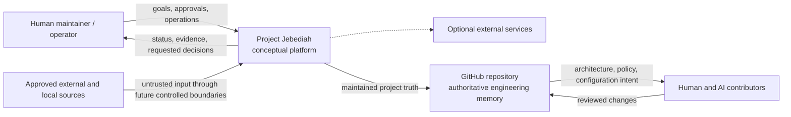
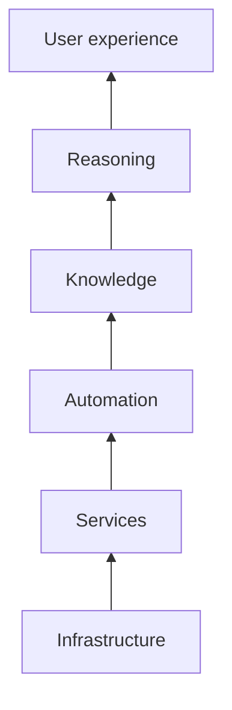
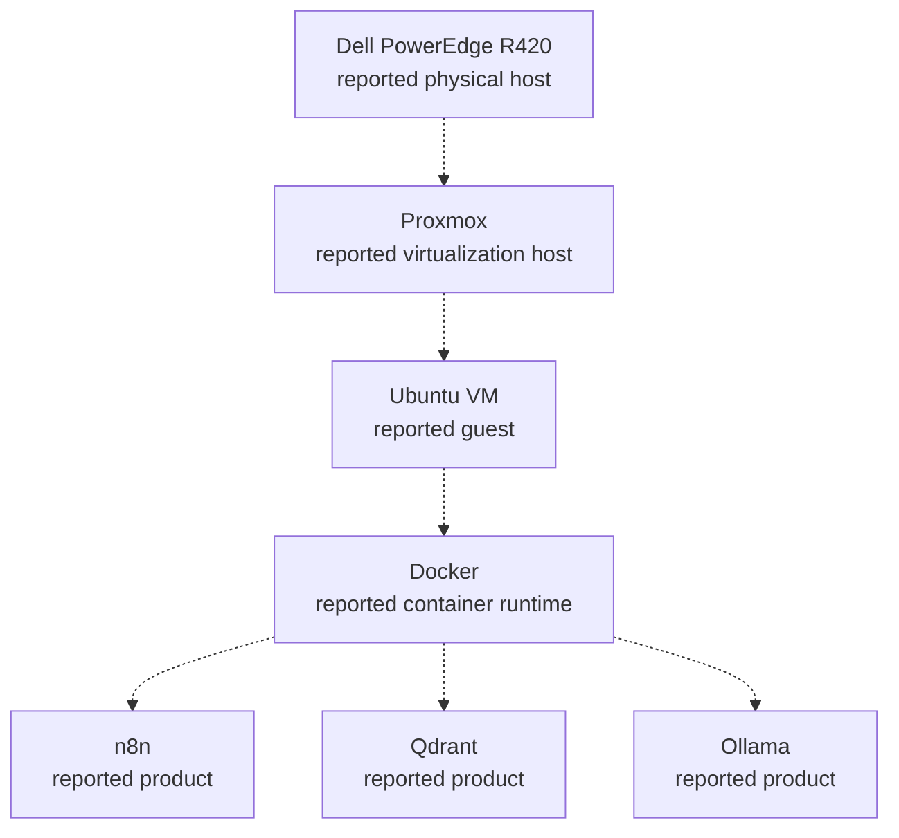

# Project Jebediah Architecture

**Status:** Active conceptual baseline

## Purpose

This document describes the approved conceptual architecture and current
repository implementation evidence for Project Jebediah. It records layers,
system context, known boundaries, implemented candidates, named future
subsystems, and unresolved decisions without presenting deployment as
verified.

The [Architecture Principles](ARCHITECTURE_PRINCIPLES.md) constrain decisions.
The [component registry](reference/COMPONENT_REGISTRY.md) tracks named
components and their maturity. ADRs in [`docs/adr/`](adr/README.md) record why
lasting choices are made.

## Scope and non-goals

This baseline covers the project as an intended local-first platform. It does
not:

- Verify the home-lab inventory
- Define JCS, Knowledge Graph, Digital Twin, Automation, or Reasoning Engine
  contracts
- Approve a production network layout or deployment composition
- Treat a reported product as a permanent architecture choice

## Evidence and uncertainty

### Verified facts

- The GitHub repository is the authoritative engineering record.
- The repository contains a Python Collector package, automated tests, and a
  Dockerized semantic memory-service candidate.
- JCS was deferred after Milestone C1, and the Collector and memory service
  have no JCS dependency.
- The project has approved six conceptual layers and named future subsystems.

### Reported facts

Bootstrap materials report:

- A Dell PowerEdge R420 physical server
- A Proxmox host
- An Ubuntu virtual machine
- Docker
- n8n
- Qdrant
- Ollama

This is not a verified inventory. Versions, health, configuration, data,
networking, persistence, backups, and ownership remain unknown. No sensitive
topology belongs in this public document.

### Working assumptions

- The initial platform remains local-first and single-site.
- The reported environment is a candidate execution context, not an approved
  target architecture.
- The conceptual layers describe responsibilities, not required processes,
  containers, repositories, or teams.
- Human approval remains available for sensitive or irreversible actions.

### Open questions

| Question | Architectural impact | Resolution gate |
| --- | --- | --- |
| What does JCS stand for, own, and guarantee? | The authoritative information boundary and downstream dependencies cannot be assigned. | Phase 1 JCS specification and review |
| Which reported infrastructure is actually running? | Deployment, operations, recovery, and capacity claims cannot be verified. | Sanitized infrastructure audit |
| Which future component owns each concrete information item? | Categories are approved, but component authority and consistency behavior remain unassigned. | JCS and component specifications under [Data Ownership](DATA_OWNERSHIP.md) |
| What subject and use case will the first Digital Twin support? | The conceptual position is approved, but concrete scope and source mappings remain intentionally undefined. | Future Digital Twin specification under the [Digital Twin Position](design/DIGITAL_TWIN_POSITION.md) |
| What data classifications apply? | Trust boundaries, retention, model access, and repository exposure cannot be finalized. | Security and data-classification work |
| Which interfaces connect future subsystems? | Compatibility, failure, and deployment decisions remain open. | Subsystem specifications and ADRs |

## System context

Project Jebediah is the governed platform boundary. People and future
integrations interact across explicit trust boundaries.

The dotted external-service relationship exists only when a dependency is
explicitly approved. The diagram expresses authority and interaction, not a
runtime protocol. GitHub is authoritative for engineering memory; it is not
automatically the authoritative store for future runtime data.

## Conceptual layers

The layers order responsibilities from physical execution to human-facing
experience. A layer may contain zero, one, or several future components. A
component may support adjacent layers only when its primary responsibility and
interfaces remain clear.

| Layer | Responsibility | Current state |
| --- | --- | --- |
| Infrastructure | Compute, storage, networking, virtualization, and physical availability | Reported environment only; not inventoried |
| Services | Reusable runtime capabilities such as model execution, data services, and workflow runtime | Memory-service, Ollama, and Qdrant adapter candidates exist; deployment guarantees remain unverified |
| Automation | Controlled orchestration and actions with policy, idempotency, approval, and rollback | Named future capability; no tracked workflows |
| Knowledge | Ingestion, provenance, identity, representation, retrieval, and knowledge-state responsibilities | Bounded Collector and semantic memory candidates are implemented; later knowledge contracts remain unapproved |
| Reasoning | Bounded inference over trusted context with validation and tool authority | Named future capability; no engine implemented |
| User experience | Human interaction, explanation, approval, feedback, and operational visibility | Requirements and interface unapproved |

The arrows preserve the approved presentation order from foundational
execution concerns toward human-facing concerns. They do not require every
higher layer to depend on every lower layer and do not mandate a request or
data flow. Architecture proposals may refine cross-layer interactions through
ADRs without collapsing responsibility ownership.

## Reported deployment context

The following view preserves the bootstrap report without promoting it to
verified architecture:

No node in this diagram implies verified health, configuration, persistence,
security, compatibility, or permanent selection.

## Named future subsystems

| Name | Preserved design intent | Approved now | Explicitly unresolved |
| --- | --- | --- | --- |
| JCS | A named foundational subsystem whose C1 outcome is **DEFER JCS** | Collector and memory work have no JCS dependency | Name expansion, purpose, responsibilities, interfaces, data authority, deployment |
| Collector Engine | Controlled ingestion from approved sources | A bounded Python contract and repository implementation candidate exist | Source authorization, full contract conformance, deployment, and operational ownership |
| Memory Service | Governed semantic memory over approved Collector inputs | API, pipeline, intelligence, embedding, Qdrant, provenance, lifecycle, and retrieval candidates exist in the repository | Deployment, live data, verification authority, lifecycle automation, and multi-factor ranking |
| Knowledge Graph | Traceable entities and relationships | It follows stable collector outputs and knowledge contracts | Model, storage, identity, query interface, relationship to Qdrant |
| Digital Twin | A bounded, time-aware, provenance-rich representation of selected relevant state | Its conceptual position, exclusions, derived-information default, and implementation gates are approved | First subject and use case, entities, sources, freshness thresholds, interfaces, implementation |
| Automation | Controlled action from trusted state and policy | Approval, idempotency, rollback, and auditability are required | Workflow boundaries, n8n role, triggers, tools, deployment |
| Reasoning Engine | Bounded reasoning over trusted project knowledge and state | Evidence, evaluation, permissions, and failure behavior are required | Models, prompts, orchestration, interfaces, deployment |

Names are not contracts. The
[Glossary](reference/GLOSSARY.md) defines their current limited meanings, and
the component registry records their maturity without inventing ownership.

## Architectural boundaries

### Engineering-memory boundary

Reviewed GitHub `main` owns current architecture, decisions, standards, plans,
and safe configuration intent. Chats, local scratch files, and model memory are
ephemeral. Runtime data may have a different authoritative owner once
documented.

### Human-authority boundary

The maintainer retains final project authority. Sensitive or irreversible
actions require human approval unless an accepted decision defines a narrower
safe automated boundary. AI output cannot grant itself authority.

### External-input boundary

Future collectors and integrations must treat source content, metadata,
documents, web responses, model output, and tool results as untrusted. They
must validate identity, authorization, format, size, provenance, and
classification according to the eventual contract.

### Secret and administrative boundary

Credentials and administrative control remain outside public repository
content and ordinary data flows. Future services receive only the privileges
required for their responsibilities. Sanitized public conclusions must not
reveal exploitable topology.

### Component boundary

Every implemented component must eventually own a coherent responsibility,
state boundary, lifecycle, configuration, operational signals, and recovery
expectation. Repository-path ownership and runtime component ownership are
separate concepts.

## Conceptual information lifecycle

The implemented Collector and memory candidate refine the first controlled
runtime path. Later capabilities still follow this safe contract order:

1. Apply the categories and responsibilities in
   [Data Ownership](DATA_OWNERSHIP.md).
2. Resolve any JCS dependency through an approved contract or an explicit
   no-dependency decision.
3. Authorize and validate sources.
4. Collect with provenance and bounded failure behavior.
5. Build knowledge representations from owned information.
6. Define a bounded Digital Twin from relevant state.
7. Permit controlled automation.
8. Add reasoning over trusted context.
9. Present explanations, approvals, and operational state to people.

Later stages must not retroactively decide the authority of earlier data.

## Failure and recovery posture

At this phase, the architecture approves requirements rather than mechanisms:

- A local dependency failure must not silently corrupt authoritative state.
- Partial success and stale state must be represented honestly.
- Retried actions must avoid unintended duplicate effects.
- Durable state requires backup, restore, migration, and rollback ownership.
- Degraded operation must be observable without disclosing protected data.
- An unavailable external service must have an explicit impact and recovery
  path.
- Human operators must be able to identify what is safe to retry, restore, or
  stop.

The future operations philosophy and component specifications will turn these
requirements into tested procedures.

## Interface governance

The memory service currently exposes bounded store, context, and health API
routes. New or changed interfaces must follow the
[Engineering Standards](ENGINEERING_STANDARDS.md) and identify:

- Owning component and consumers
- Meaning of inputs, outputs, identifiers, time, and missing values
- Validation and authorization boundary
- Side effects and idempotency
- Failure classes, timeouts, retry, and partial success
- Compatibility, versioning, migration, and rollback
- Data authority, provenance, classification, and retention impact
- Observability and test evidence

Interfaces that materially affect system boundaries, data ownership, security,
or compatibility require the appropriate ADR before dependent implementation.

## Architecture governance

- The [Architecture Principles](ARCHITECTURE_PRINCIPLES.md) own enduring
  constraints.
- This document owns approved current conceptual structure.
- The [ADR process](adr/README.md) owns decision history and levels.
- The [Glossary](reference/GLOSSARY.md) owns shared term meanings.
- The [Component Registry](reference/COMPONENT_REGISTRY.md) owns component
  identity, maturity, and component ownership.
- [Data Ownership](DATA_OWNERSHIP.md) owns information categories and
  responsibility.
- The [Digital Twin Position](design/DIGITAL_TWIN_POSITION.md) owns Digital
  Twin intent, exclusions, and implementation gates.

When an accepted ADR changes current architecture, update this document in the
same pull request. When evidence invalidates a reported fact or assumption,
update the relevant evidence section and dependent documents together.
