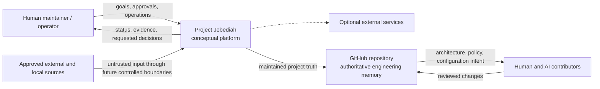
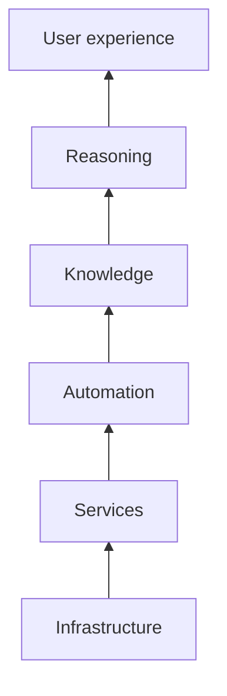
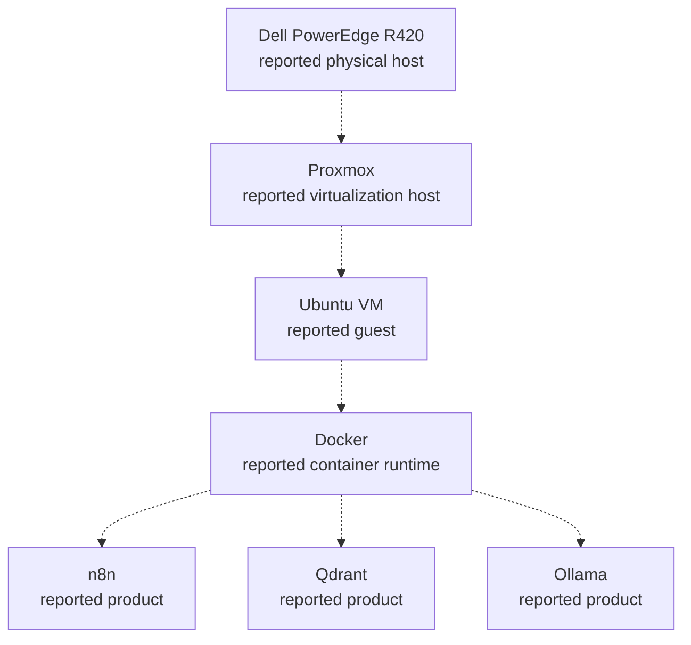
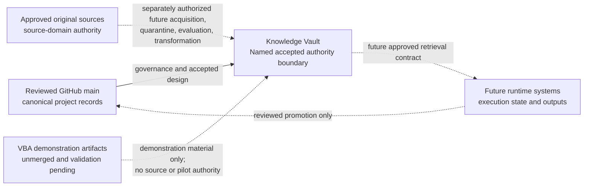
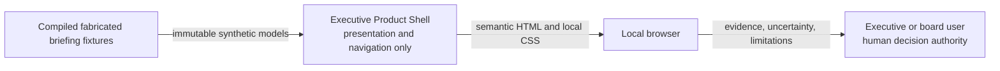

# Project Jebediah Architecture

**Status:** Active conceptual baseline

## Purpose

This document describes the approved conceptual architecture and current
repository implementation evidence for Project Jebediah. It records layers,
system context, known boundaries, implemented candidates, named future
subsystems, and unresolved decisions without presenting deployment as
verified.

The [Architecture Principles](ARCHITECTURE_PRINCIPLES.md) constrain decisions.
The [component registry](reference/COMPONENT_REGISTRY.md) tracks named
components and their maturity. ADRs in [`docs/adr/`](adr/README.md) record why
lasting choices are made.

## Scope and non-goals

This baseline covers the project as an intended local-first platform. It does
not:

- Verify the home-lab inventory
- Define JCS, Knowledge Graph, Digital Twin, Automation, or Reasoning Engine
  contracts
- Treat the accepted Knowledge Vault or Knowledge Registry boundaries as a
  deployed component or as authorization for external information use
- Treat the accepted executive read-model or document-admission boundaries as
  implemented or authorized for live information use
- Approve a production network layout or deployment composition
- Treat a reported product as a permanent architecture choice

## Evidence and uncertainty

### Verified facts

- The GitHub repository is the authoritative engineering record.
- The repository contains a Python Collector package, automated tests, and a
  Dockerized semantic memory-service candidate.
- JCS was deferred after Milestone C1, and the Collector and memory service
  have no JCS dependency.
- ADR 0011 is an Accepted System decision for a Knowledge Vault authority
  boundary. No Knowledge Vault implementation or deployment exists on reviewed
  `main`.
- ADRs 0012 and 0013 are Accepted System decisions for an executive read model
  and governed document admission. Pull request #52 separately activated only a
  disconnected, standard-library synthetic document-inspection repository
  candidate. Pull request #53 merged its immutable contracts, process-local
  adapters, injected evaluation boundaries, and deterministic tests as
  `ccba7951f280f2b09e932db3979034dc6c2e5b68`. The package has **Implemented**
  repository maturity, remains non-operational, and grants no live-information
  use.
- ADR 0014 is an Accepted System decision for a metadata-only Knowledge
  Registry library. Its bounded Phase 1 implementation is complete and has
  **Implemented** repository maturity: immutable domain models, lifecycle
  representation, a storage-neutral repository abstraction, and an in-memory
  reference implementation. The Knowledge Vault remains **Named**. The bounded
  Phase 2 repository package does not inspect real files and implements no
  parser, scanner, sandbox, ingestion service, organizational-information
  authorization, durable storage, Qdrant or memory integration, retrieval,
  service, or deployment.
- ADR 0015 is an Accepted System decision for the Executive Product Shell. The
  component is **Specified** as a presentation-only, compiled-synthetic,
  loopback local preview and is not Implemented or Operational.
- The project has approved six conceptual layers and named future subsystems.

### Reported facts

Bootstrap materials report:

- A Dell PowerEdge R420 physical server
- A Proxmox host
- An Ubuntu virtual machine
- Docker
- n8n
- Qdrant
- Ollama

This is not a verified inventory. Versions, health, configuration, data,
networking, persistence, backups, and ownership remain unknown. No sensitive
topology belongs in this public document.

### Working assumptions

- The initial platform remains local-first and single-site.
- The reported environment is a candidate execution context, not an approved
  target architecture.
- The conceptual layers describe responsibilities, not required processes,
  containers, repositories, or teams.
- Human approval remains available for sensitive or irreversible actions.

### Open questions

| Question | Architectural impact | Resolution gate |
| --- | --- | --- |
| What does JCS stand for, own, and guarantee? | The authoritative information boundary and downstream dependencies cannot be assigned. | Phase 1 JCS specification and review |
| Which reported infrastructure is actually running? | Deployment, operations, recovery, and capacity claims cannot be verified. | Sanitized infrastructure audit |
| Which future component owns each concrete information item? | Categories are approved, but component authority and consistency behavior remain unassigned. | JCS and component specifications under [Data Ownership](DATA_OWNERSHIP.md) |
| How will a future Knowledge Vault relate to the Memory Service, Knowledge Graph, and reasoning components? | ADR 0014 separates the metadata-only registry foundation from memory, but later component, interface, persistence, and runtime relationships remain unassigned. | Separately reviewed component and relationship decisions |
| What subject and use case will the first Digital Twin support? | The conceptual position is approved, but concrete scope and source mappings remain intentionally undefined. | Future Digital Twin specification under the [Digital Twin Position](design/DIGITAL_TWIN_POSITION.md) |
| What data classifications apply? | Trust boundaries, retention, model access, and repository exposure cannot be finalized. | Security and data-classification work |
| Which interfaces connect future subsystems? | Compatibility, failure, and deployment decisions remain open. | Subsystem specifications and ADRs |

## System context

Project Jebediah is the governed platform boundary. People and future
integrations interact across explicit trust boundaries.

The dotted external-service relationship exists only when a dependency is
explicitly approved. The diagram expresses authority and interaction, not a
runtime protocol. GitHub is authoritative for engineering memory; it is not
automatically the authoritative store for future runtime data.

## Conceptual layers

The layers order responsibilities from physical execution to human-facing
experience. A layer may contain zero, one, or several future components. A
component may support adjacent layers only when its primary responsibility and
interfaces remain clear.

| Layer | Responsibility | Current state |
| --- | --- | --- |
| Infrastructure | Compute, storage, networking, virtualization, and physical availability | Reported environment only; not inventoried |
| Services | Reusable runtime capabilities such as model execution, data services, and workflow runtime | Memory-service, Ollama, and Qdrant adapter candidates exist; deployment guarantees remain unverified |
| Automation | Controlled orchestration and actions with policy, idempotency, approval, and rollback | Named future capability; no tracked workflows |
| Knowledge | Ingestion, provenance, identity, representation, retrieval, and knowledge-state responsibilities | Bounded Collector, semantic memory, and metadata-only Knowledge Registry libraries are implemented; Knowledge Vault and organizational-intelligence authority boundaries are accepted; no registry runtime consumer or external information is authorized |
| Reasoning | Bounded inference over trusted context with validation and tool authority | Named future capability; no engine implemented |
| User experience | Human interaction, explanation, approval, feedback, and operational visibility | The read-only executive-interface and synthetic Executive Product Shell boundaries are accepted; the shell is **Specified** but not implemented |

The arrows preserve the approved presentation order from foundational
execution concerns toward human-facing concerns. They do not require every
higher layer to depend on every lower layer and do not mandate a request or
data flow. Architecture proposals may refine cross-layer interactions through
ADRs without collapsing responsibility ownership.

## Reported deployment context

The following view preserves the bootstrap report without promoting it to
verified architecture:

No node in this diagram implies verified health, configuration, persistence,
security, compatibility, or permanent selection.

## Named future subsystems

| Name | Preserved design intent | Approved now | Explicitly unresolved |
| --- | --- | --- | --- |
| JCS | A named foundational subsystem whose C1 outcome is **DEFER JCS** | Collector and memory work have no JCS dependency | Name expansion, purpose, responsibilities, interfaces, data authority, deployment |
| Collector Engine | Controlled ingestion from approved sources | A bounded Python contract and repository implementation candidate exist | Source authorization, full contract conformance, deployment, and operational ownership |
| Memory Service | Governed semantic memory over approved Collector inputs | API, pipeline, intelligence, embedding, Qdrant, provenance, lifecycle, and retrieval candidates exist in the repository | Deployment, live data, verification authority, lifecycle automation, and multi-factor ranking |
| Knowledge Vault | A derived governed knowledge repository boundary | ADR 0011 accepts its authority boundary; ADR 0014 accepts a separate metadata-only registry library foundation; the bounded Phase 1 library is implemented while component maturity remains **Named** | Information domains, component and operational ownership, real producers and consumers, durable interfaces, relationship to existing memory, operations, recovery, component implementation, deployment |
| Knowledge Graph | Traceable entities and relationships | It follows stable collector outputs and knowledge contracts | Model, storage, identity, query interface, relationship to Qdrant |
| Digital Twin | A bounded, time-aware, provenance-rich representation of selected relevant state | Its conceptual position, exclusions, derived-information default, and implementation gates are approved | First subject and use case, entities, sources, freshness thresholds, interfaces, implementation |
| Automation | Controlled action from trusted state and policy | Approval, idempotency, rollback, and auditability are required | Workflow boundaries, n8n role, triggers, tools, deployment |
| Reasoning Engine | Bounded reasoning over trusted project knowledge and state | Evidence, evaluation, permissions, and failure behavior are required | Models, prompts, orchestration, interfaces, deployment |

Names are not contracts. The
[Glossary](reference/GLOSSARY.md) defines their current limited meanings, and
the component registry records their maturity without inventing ownership.

## Accepted Knowledge Vault boundary

This section records the accepted authority boundary established by
[ADR 0011](adr/0011-knowledge-vault-authority-and-boundary-model.md). The
Knowledge Vault remains **Named**. ADR 0014 authorizes only a metadata-only
registry library foundation; no Knowledge Vault component implementation,
content storage, durable store, API, deployment, migration, live data use, or
external information authorization exists.

The Knowledge Vault is defined as a **derived governed knowledge repository**
boundary. A derived representation is produced from one or more
source records by a documented transformation for a bounded knowledge use,
retains sufficient source and transformation provenance, and does not become
authoritative for the represented source facts through curation, persistence,
embedding, summarization, indexing, or retrieval.

The accepted authority order is:

1. Reviewed GitHub `main` owns canonical project records within each canonical
   document's subject.
2. Approved original authoritative sources own facts within their defined
   domains.
3. The Knowledge Vault governs derived representations and their provenance.
4. Future runtime systems own only approved execution state and operational
   outputs.

Authority remains scoped. GitHub does not become authoritative for external
facts or live runtime state, and a runtime observation does not become a
canonical project record without normal evidence classification and repository
review.

The dotted relationships are not implemented data flows. Candidate information
must remain quarantined, non-authoritative, and unavailable to ordinary
retrieval consumers until a separately approved evaluation establishes
admissibility. Evaluation does not verify source truth. The VBA artifacts in
open pull request #44 remain unmerged demonstration material; their evidence
validation is pending, and no live organizational pilot is authorized.

## Accepted Knowledge Registry foundation

[ADR 0014](adr/0014-knowledge-registry-domain-boundary.md) accepts a
metadata-only `collector.knowledge.registry` domain library as a bounded
foundation for future Knowledge Vault work. The package path is repository
organization only; it does not assign Collector Engine component authority,
information authority, or operational ownership.

The accepted registry record represents only fixed governance metadata:

- Stable object, source, transformation, evidence, owner, consumer, use, and
  policy identifiers
- Explicit freshness and qualitative evidence-linked uncertainty
- Human-review state and required decision evidence
- Registry lifecycle state, actor, time, reason, and supersession evidence

The registry record has authority only over the integrity of the metadata it
acknowledges. It does not contain source or derived content and does not make a
claim true, current, generally authorized, retrievable, actionable, or
authoritative. Human review does not grant source or action authority.

Phase 1 implemented immutable models, a three-method storage-neutral repository
interface, an in-memory reference adapter, and synthetic tests at canonical
merge `4ed2ac283e4df6aec30b67f7c4aa50338924c435`. The library imports no Memory
Service, Collector pipeline, Qdrant, Ollama, embedding, service, or runtime
module, and no existing source module consumes the registry.

Durable persistence, real producers and consumers, external information,
identifier generation, policy enforcement, mutation, retrieval, operations,
and deployment remain separately gated.

## Accepted organizational-intelligence boundaries

This section records the accepted architecture boundaries in
[ADR 0012](adr/0012-executive-organizational-intelligence-interface-boundary.md)
and
[ADR 0013](adr/0013-governed-organizational-document-admission-boundary.md).
Neither decision authorizes implementation, live information use, deployment,
or external action.

The accepted document flow preserves separate responsibilities:

```mermaid
flowchart LR
    Source["Approved original source\ndomain authority"]
    Admission["Collector document admission\nquarantine and validation"]
    Derived["Knowledge Vault\nderived records boundary"]
    ReadModel["Organizational-intelligence read model\neligible evidence"]
    Interface["Executive interface\nread-only presentation"]
    Human["Authorized human\ndecision authority"]

    Source -.->|"separately authorized submission"| Admission
    Admission -.->|"accepted source representation"| Derived
    Derived -.->|"eligible derived evidence"| ReadModel
    Source -.->|"approved direct facts"| ReadModel
    ReadModel -.->|"happening, attention, Jebediah knowledge, next"| Interface
    Interface -.->|"evidence and bounded options"| Human
```

Every dotted edge is unimplemented and separately gated. The Collector boundary
owns untrusted-input admission, not factual truth. The Knowledge Vault boundary
governs eligible derived representations and lineage.
The read-model assembly component, concrete interfaces, information domains,
and operational owners remain unassigned. The executive interface would own
presentation and navigation, not ingestion, verification, derivation,
authoritative state, approval, or action execution.

## Accepted Phase 3A Executive Product Shell refinement

The Organizational Intelligence Product Program Phase 3A package accepts System
[ADR 0015](adr/0015-executive-product-shell-and-local-preview-boundary.md)
and one **Specified** component, the **Executive Product Shell**.

The component refines only the final presentation edge above:

The accepted decision selects Python standard-library server rendering, literal
`127.0.0.1` local preview, fixed allowlisted GET and HEAD routes, no JavaScript,
and no new dependency. It has no edge to a source, Collector, registry, memory,
Qdrant, Ollama, model, retrieval, workflow, action, or deployment system.

Work Mode approved and the Chief Architect adopted exact planning head
`5aa79d0d8f8aeab89d4a0acc4056a8f94ce329d7`. The component is **Specified**, not
Implemented or Operational. Product Program Phase 3A does not activate or rename
canonical Roadmap Phase 3 - Knowledge Graph.

## Architectural boundaries

### Engineering-memory boundary

Reviewed GitHub `main` owns current architecture, decisions, standards, plans,
and safe configuration intent. Chats, local scratch files, and model memory are
ephemeral. Runtime data may have a different authoritative owner once
documented.

### Human-authority boundary

The human maintainer retains repository custody, access, licensing, legal
control, and approval of sensitive or irreversible external actions. The Chief
Architect role holds final strategy, architecture, scope, ADR, sprint, merge,
and roadmap authority under the
[Project Coordination Protocol](governance/JEBEDIAH_PROJECT_COORDINATION_PROTOCOL.md).
A person occupying both roles must state which authority is being exercised.
AI output and tool capability cannot grant themselves authority.

### External-input boundary

Future collectors and integrations must treat source content, metadata,
documents, web responses, model output, and tool results as untrusted. They
must validate identity, authorization, format, size, provenance, and
classification according to the eventual contract.

### Secret and administrative boundary

Credentials and administrative control remain outside public repository
content and ordinary data flows. Future services receive only the privileges
required for their responsibilities. Sanitized public conclusions must not
reveal exploitable topology.

### Component boundary

Every implemented component must eventually own a coherent responsibility,
state boundary, lifecycle, configuration, operational signals, and recovery
expectation. Repository-path ownership and runtime component ownership are
separate concepts.

## Conceptual information lifecycle

The implemented Collector and memory candidate refine the first controlled
runtime path. Later capabilities still follow this safe contract order:

1. Apply the categories and responsibilities in
   [Data Ownership](DATA_OWNERSHIP.md).
2. Resolve any JCS dependency through an approved contract or an explicit
   no-dependency decision.
3. Authorize and validate sources.
4. Collect with provenance and bounded failure behavior.
5. Build knowledge representations from owned information.
6. Define a bounded Digital Twin from relevant state.
7. Permit controlled automation.
8. Add reasoning over trusted context.
9. Present explanations, approvals, and operational state to people.

Later stages must not retroactively decide the authority of earlier data.

## Failure and recovery posture

At this phase, the architecture approves requirements rather than mechanisms:

- A local dependency failure must not silently corrupt authoritative state.
- Partial success and stale state must be represented honestly.
- Retried actions must avoid unintended duplicate effects.
- Durable state requires backup, restore, migration, and rollback ownership.
- Degraded operation must be observable without disclosing protected data.
- An unavailable external service must have an explicit impact and recovery
  path.
- Human operators must be able to identify what is safe to retry, restore, or
  stop.

The future operations philosophy and component specifications will turn these
requirements into tested procedures.

## Interface governance

The memory service currently exposes bounded store, context, and health API
routes. New or changed interfaces must follow the
[Engineering Standards](ENGINEERING_STANDARDS.md) and identify:

- Owning component and consumers
- Meaning of inputs, outputs, identifiers, time, and missing values
- Validation and authorization boundary
- Side effects and idempotency
- Failure classes, timeouts, retry, and partial success
- Compatibility, versioning, migration, and rollback
- Data authority, provenance, classification, and retention impact
- Observability and test evidence

Interfaces that materially affect system boundaries, data ownership, security,
or compatibility require the appropriate ADR before dependent implementation.

## Architecture governance

- The [Architecture Principles](ARCHITECTURE_PRINCIPLES.md) own enduring
  constraints.
- This document owns approved current conceptual structure.
- The [ADR process](adr/README.md) owns decision history and levels.
- The [Glossary](reference/GLOSSARY.md) owns shared term meanings.
- The [Component Registry](reference/COMPONENT_REGISTRY.md) owns component
  identity, maturity, and component ownership.
- [Data Ownership](DATA_OWNERSHIP.md) owns information categories and
  responsibility.
- Accepted [ADR 0011](adr/0011-knowledge-vault-authority-and-boundary-model.md)
  owns the Knowledge Vault authority-boundary decision rationale.
- Accepted [ADR 0012](adr/0012-executive-organizational-intelligence-interface-boundary.md)
  and [ADR 0013](adr/0013-governed-organizational-document-admission-boundary.md)
  own the executive-interface and document-admission decision rationale.
- Accepted [ADR 0014](adr/0014-knowledge-registry-domain-boundary.md) owns the
  metadata-only Knowledge Registry domain and package-boundary decision.
- Accepted
  [ADR 0015](adr/0015-executive-product-shell-and-local-preview-boundary.md)
  owns the synthetic Executive Product Shell and loopback preview boundary.
- The [Digital Twin Position](design/DIGITAL_TWIN_POSITION.md) owns Digital
  Twin intent, exclusions, and implementation gates.

When an accepted ADR changes current architecture, update this document in the
same pull request. When evidence invalidates a reported fact or assumption,
update the relevant evidence section and dependent documents together.
