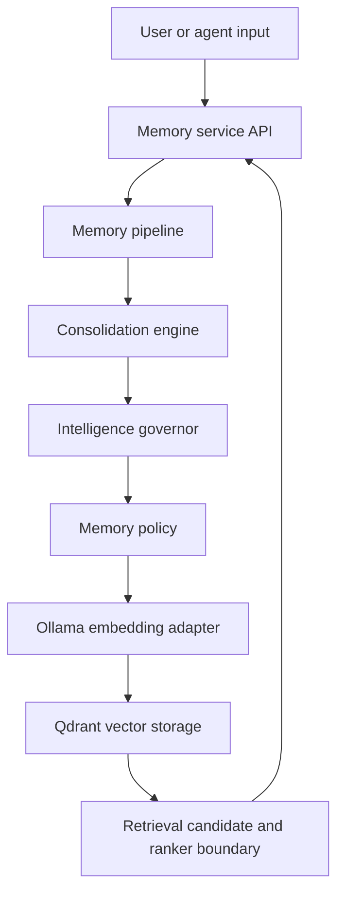

# Jebediah Memory Architecture

**Status:** Implemented repository candidate; deployment unverified

## Purpose

The Jebediah memory system provides governed semantic memory for the local-first
platform. It stores, retrieves, classifies, and evaluates memory candidates
while keeping probabilistic embedding behavior behind deterministic policy and
metadata boundaries.

## Current system



The repository verifies this implementation exists. It does not verify that
the service, Qdrant, Ollama, or the reported home-lab environment is currently
deployed or operational.

## Components

### Collector memory domain

Locations:

- `src/collector/memory/`
- `services/jebediah-memory/app/collector/memory/`

Responsibilities:

- Represent memory candidates
- Apply promotion and consolidation policy
- Evaluate importance, retention, confidence, and duplicates
- Attach provenance and lifecycle governance
- Coordinate persistence through a repository boundary

The two source trees are an existing repository constraint. Sprint 004 keeps
equivalent governance contracts in both trees; consolidating them is a
separate refactor.

### Memory API

Location: `services/jebediah-memory/app/main.py`

Responsibilities:

- Accept store and context requests
- Preserve existing API response fields
- Invoke the governed memory pipeline
- Generate embeddings after policy acceptance
- Persist derived vectors and approved payload metadata
- Convert search results into retrieval candidates

### Embedding adapter

Location: `services/jebediah-memory/app/embeddings/`

The current candidate uses Ollama with `nomic-embed-text:latest` and expects
768-dimensional vectors. The adapter converts approved text into a derived
vector. It does not determine memory identity, provenance, verification, or
lifecycle.

### Vector database

The current candidate uses the `jebediah_memory` Qdrant collection. Qdrant
stores derived vectors and payload metadata for semantic retrieval. It is not
automatically authoritative for the source information represented by a
memory.

### Retrieval boundary

Locations:

- `src/collector/memory/retrieval/`
- `services/jebediah-memory/app/collector/memory/retrieval/`

The boundary represents retrieval candidates independently from Qdrant result
objects. It exposes semantic relevance, confidence, importance, creation time,
and lifecycle state. The current ranker uses semantic relevance only, which
preserves existing context-search behavior.

## Memory model

### Existing identity and content

`MemoryItem` retains:

- application memory identifier
- stable source identity
- content
- memory type
- importance
- creation time
- general metadata

Sprint 004 adds defaulted governance fields and does not change identity.

### Provenance

`MemoryProvenance` records:

- source category
- optional creator
- optional creation context
- optional confidence basis
- verification state
- supporting-evidence references

Provenance explains origin and confidence; it does not make a claim true.
New and legacy memories default to `unverified` unless an authorized future
process records another state.

### Lifecycle

`MemoryLifecycle` records one of:

- `active`
- `reinforced`
- `superseded`
- `archived`

It also provides minimal reinforcement count, supersession reference, and
transition-time fields. Sprint 004 represents these states but does not decide
or execute transitions.

## Store flow

1. The API constructs a `MemoryItem` without changing existing required
   request fields.
2. The consolidation engine evaluates importance, confidence, and duplicate
   evidence.
3. The intelligence governor produces retention and explainable confidence
   metadata.
4. The governance layer fills missing provenance and the active lifecycle
   default.
5. The memory policy decides whether persistence is allowed.
6. The embedding adapter generates a vector only after acceptance.
7. Qdrant receives the existing payload plus additive `provenance` and
   `lifecycle` objects.

## Retrieval flow

1. The API embeds the context query.
2. Qdrant returns semantic matches and payloads.
3. The API maps each match to a storage-independent retrieval candidate.
4. The semantic ranker orders candidates by Qdrant relevance score.
5. The API renders the existing `score`, `content`, and `metadata` fields.

Future ranking may evaluate additional candidate signals only after a reviewed
policy defines weights, missing-value behavior, lifecycle treatment, and
compatibility.

## Persistence compatibility

Existing Qdrant payload fields remain unchanged. New payloads add:

```text
provenance
lifecycle
```

Readers use safe defaults for payloads created before Sprint 004:

- `source` derives from `source_identity`
- verification is `unverified`
- lifecycle is `active`
- optional evidence and transition fields remain empty

This avoids a destructive collection migration or mandatory backfill.

## Data ownership

- Submitted source content retains the authority of its actual source; the
  memory service does not declare it true.
- Memory metadata, confidence, embeddings, and vector indexes are derived
  information.
- Verification state is explicit and defaults to unverified.
- Lifecycle state does not grant action authority.
- Deletion, archival automation, retention periods, and restoration behavior
  require later owned policies.

The project-wide requirements in [Data Ownership](DATA_OWNERSHIP.md) remain
authoritative.

## Compatibility and failure posture

- Existing constructors and API request fields remain valid.
- Existing response fields are retained.
- Unknown legacy governance fields use safe defaults.
- Invalid stored enum values fail visibly rather than being presented as a
  valid state.
- Embedding or persistence failure must not be reported as successful storage.
- Provenance and lifecycle metadata must not contain credentials, personal
  data, private endpoints, or raw sensitive evidence.

## Deferred work

- Authorized verification workflows
- Confidence history and evidence-quality evaluation
- Lifecycle transition policy and APIs
- Reinforcement and supersession detection
- Archived-memory filtering
- Multi-factor ranking formula and evaluation
- Qdrant backfill or schema migration, if later required
- Package-tree consolidation
- Deployment, live health, backup, restore, and operations verification

## Design principle

Jebediah should not simply remember more. It should preserve enough origin,
state, and ranking context to remember better without claiming intelligence it
has not yet earned.
