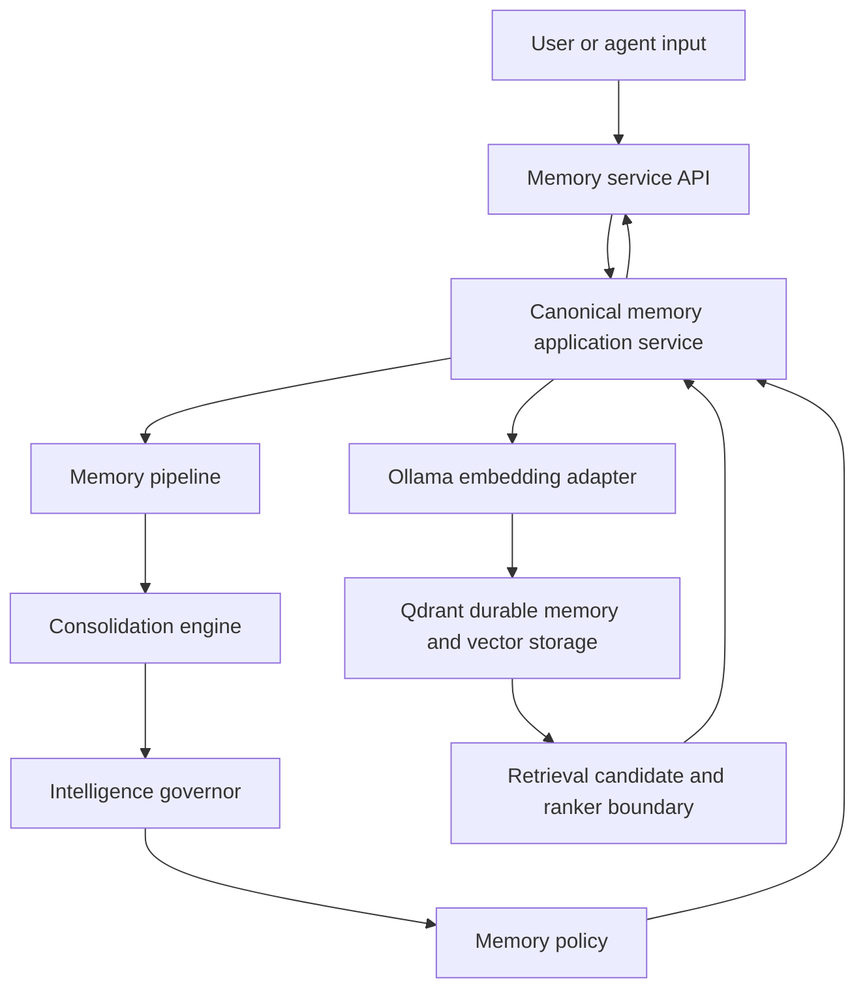

# Jebediah Memory Architecture

**Status:** Implemented repository candidate; deployment unverified

## Purpose

The Jebediah memory system provides governed semantic memory for the local-first
platform. It stores, retrieves, classifies, and evaluates memory candidates
while keeping probabilistic embedding behavior behind deterministic policy and
metadata boundaries.

## Current system



The repository verifies this implementation exists. It does not verify that
the service, Qdrant, Ollama, or the reported home-lab environment is currently
deployed or operational.

## Components

### Collector memory domain

Location: `src/collector/memory/`

Responsibilities:

- Represent memory candidates
- Apply promotion and consolidation policy
- Evaluate importance, retention, confidence, and duplicates
- Attach provenance and lifecycle governance
- Coordinate evaluation, embedding, persistence, and retrieval through owned
  boundaries

This is the sole `collector.memory` implementation. The service installs the
root package and contains no copied domain tree.

### Memory API

Location: `services/jebediah-memory/app/main.py`

Responsibilities:

- Accept store and context requests
- Preserve existing API response fields
- Compose the canonical application service, embedding provider, and Qdrant
  repository
- Translate HTTP requests and responses without owning domain decisions

### Embedding adapter

Location: `src/collector/embeddings/`

The canonical provider uses Ollama with `nomic-embed-text:v1.5`, verifies the
accepted immutable manifest digest, and requires 768 finite values with no
application normalization. It does not determine memory identity, provenance,
verification, or lifecycle.

### Vector database

The current candidate uses the `jebediah_memory` Qdrant collection. Under ADR
0003, each acknowledged point temporarily owns the durable operational record
of what the Memory Service stored and its derived semantic vector. Qdrant is
not authoritative for the truth of the source information represented by a
memory.

### Retrieval boundary

Location: `src/collector/memory/retrieval/`

The boundary represents retrieval candidates independently from Qdrant result
objects. It exposes semantic relevance, confidence, importance, creation time,
and lifecycle state. The current ranker uses semantic relevance only, which
preserves existing context-search behavior.

## Memory model

### Existing identity and content

`MemoryItem` retains:

- application memory identifier
- stable source identity
- content
- memory type
- importance
- creation time
- general metadata

Sprint 004 adds defaulted governance fields and does not change identity.

### Provenance

`MemoryProvenance` records:

- source category
- optional creator
- optional creation context
- optional confidence basis
- verification state
- supporting-evidence references

Provenance explains origin and confidence; it does not make a claim true.
New and legacy memories default to `unverified` unless an authorized future
process records another state.

### Lifecycle

`MemoryLifecycle` records one of:

- `active`
- `reinforced`
- `superseded`
- `archived`

It also provides minimal reinforcement count, supersession reference, and
transition-time fields. Sprint 004 represents these states but does not decide
or execute transitions.

## Store flow

1. The API constructs a `MemoryItem` without changing existing required
   request fields.
2. The consolidation engine evaluates importance, confidence, and duplicate
   evidence.
3. The intelligence governor produces retention and explainable confidence
   metadata.
4. The governance layer fills missing provenance and the active lifecycle
   default.
5. The memory policy decides whether persistence is allowed.
6. The embedding adapter generates a vector only after acceptance.
7. Qdrant receives the existing payload plus additive `provenance` and
   `lifecycle` objects.

## Retrieval flow

1. The API embeds the context query.
2. The canonical Qdrant adapter returns semantic matches as
   storage-independent retrieval candidates.
3. The semantic ranker orders candidates by Qdrant relevance score.
4. The API renders the existing `score`, `content`, and `metadata` fields.

Future ranking may evaluate additional candidate signals only after a reviewed
policy defines weights, missing-value behavior, lifecycle treatment, and
compatibility.

### Proposed read-only interaction consumer

**Future Design:** [Sprint 006 Proposal v2](SPRINT_006_SPECIFICATION.md)
proposes `src/collector/interaction/` as a separate canonical client of the
memory retrieval boundary. It may receive only storage-independent semantic
retrieval candidates through a minimal read-only query protocol. It must not
receive `MemoryApplicationService`, a repository with write methods, a Qdrant
client, the embedding adapter, or any other object capable of memory mutation.

The proposed client will preserve semantic-only ranking, Sprint 004 provenance,
verification, and lifecycle boundaries, and all Sprint 005 Qdrant and embedding
contracts. It will perform deterministic context assembly outside the memory
domain and will not change, verify, reinforce, supersede, archive, consolidate,
or persist a memory. The proposal remains unauthorized for implementation.

## Persistence compatibility

Existing Qdrant payload fields remain compatible. New payloads include:

```text
provenance
lifecycle
embedding_identity
```

Readers use safe defaults for payloads created before Sprint 004:

- `source` derives from `source_identity`
- verification is `unverified`
- lifecycle is `active`
- optional evidence and transition fields remain empty

This avoids a destructive collection migration or mandatory backfill.

## Data ownership

- Submitted source content retains the authority of its actual source; the
  memory service does not declare it true.
- Memory metadata, confidence, embeddings, and vector indexes are derived
  information.
- Verification state is explicit and defaults to unverified.
- Lifecycle state does not grant action authority.
- Deletion, archival automation, retention periods, and restoration behavior
  require later owned policies.

The project-wide requirements in [Data Ownership](DATA_OWNERSHIP.md) remain
authoritative.

## Compatibility and failure posture

- Existing constructors and API request fields remain valid.
- Existing response fields are retained.
- Unknown legacy governance fields use safe defaults.
- Invalid stored enum values fail visibly rather than being presented as a
  valid state.
- Embedding or persistence failure must not be reported as successful storage.
- Provenance and lifecycle metadata must not contain credentials, personal
  data, private endpoints, or raw sensitive evidence.

## Sprint 005 consolidation architecture

The repository implementation follows accepted
[ADR 0002](adr/0002-canonical-memory-domain-and-dependency-direction.md),
[ADR 0003](adr/0003-qdrant-repository-collection-and-payload-consolidation.md), and
[ADR 0004](adr/0004-embedding-model-identity-and-vector-compatibility.md).
Deployment and live collection compatibility remain unverified.

### Canonical domain and service boundary

`src/collector/memory/` is the only implementation of
`collector.memory`. It owns memory models, governance, policy, intelligence,
pipeline behavior, persistence boundaries, retrieval candidates, and
semantic-only ranking.

`services/jebediah-memory/` is the composition, HTTP, process, packaging,
and deployment boundary. It installs the canonical package and must not retain
a copied `app/collector/` tree, a second embedding adapter, direct Qdrant
domain logic, or duplicate intelligence evaluation after cutover.

Dependencies point from the FastAPI service to the canonical package. The
canonical domain never imports the service or its deployment configuration.

### Temporary Qdrant authority

Sprint 005 selects Qdrant option A. Until a separate durable record store is
approved, one Qdrant point temporarily contains both:

- The authoritative operational record of what the Memory Service accepted
- The derived semantic vector used to search that record

This does not make Qdrant authoritative for the truth of a source claim. The
originating source retains that authority, and verification remains explicit
metadata.

The canonical adapter under `src/collector/memory/persistence/` owns the
single write, lookup, and semantic-search path. An accepted memory is reported
as stored only after Qdrant acknowledges completed application of the point
operation. Policy rejection, embedding failure, collection incompatibility,
or Qdrant rejection returns no stored success. A lost acknowledgement is an
unknown outcome that must be reconciled by application `memory_id` before an
operator-authorized retry. No distributed transaction or second durable write
is introduced.

The adapter does not permanently cache vector-space approval. Each index and
search operation rescans the current collection identity and vector contract.
Search also requests and validates the vector and exact non-null
`embedding_identity` of every returned candidate. This closes both later-write
and scan-to-query race windows without assuming exclusive collection
ownership. A missing identity, different digest, different normalization
policy, wrong dimension, or placeholder vector fails visibly before a
candidate is returned.

The canonical collection contract is:

- Configurable name with default `jebediah_memory`
- One unnamed dense vector
- 768 dimensions
- Cosine distance
- Adapter-generated point UUID
- Application memory ID in payload `memory_id`

An existing collection is inspected and never silently recreated or resized.
A supported deployment requires sanitized Qdrant persistence, snapshot, and
restore evidence because Qdrant temporarily owns the only durable Memory
Service record.

### Exact embedding identity

The embedding persistence contract is:

| Property | Required value |
| --- | --- |
| Provider | `ollama` |
| Model | `nomic-embed-text:v1.5` |
| Manifest digest | `sha256:0a109f422b47e3a30ba2b10eca18548e944e8a23073ee3f3e947efcf3c45e59f` |
| Dimensions | 768 |
| Application normalization | `none` |
| Qdrant distance | `cosine` |

Mutable tags such as `:latest` are not permitted as configured or persisted
compatibility identities. The service must verify the local full manifest
digest before declaring embedding readiness or accepting a write. New points
persist an additive `embedding_identity` object containing the provider,
versioned model reference, full digest, dimensions, and normalization.

Ollama's `/api/tags` inventory represents the digest as 64 hexadecimal
characters without the `sha256:` prefix used by the persistence contract. The
adapter validates that exact SHA-256 shape and canonicalizes it to lowercase
`sha256:<hex>` before comparison. Missing, malformed, incorrectly sized, or
different digests fail. Readiness is checked before every embedding operation;
a successful startup check does not authorize a later tag resolution after
the installed artifact changes.

Compatibility requires the complete identity tuple to match. Equal dimensions
or related model names alone are insufficient.

### Legacy payloads and vector geometry

Legacy payload compatibility and vector migration are separate concerns.

Compatible payload readers may default missing Sprint 004 governance fields,
derive a legacy application ID from a root-adapter point ID, and preserve
unknown additive fields. Missing embedding identity remains legacy/unknown.
These rules do not make a stored vector compatible.

A one-dimensional collection cannot be queried with a 768-dimensional query
vector. Zero vectors and other placeholders are not semantic embeddings.
One-dimensional, zero, wrong-dimension, differently normalized, or
model-incompatible vectors require an isolated future migration using
approved source content, a separate collection, backup, validation, cutover,
and rollback. Sprint 005 performs no live vector migration.

### Validation ownership

Implementation and future deployment gates are defined in the
[Sprint 005 Validation Requirements](SPRINT_005_VALIDATION_REQUIREMENTS.md).

## Deferred work

- Authorized verification workflows
- Confidence history and evidence-quality evaluation
- Lifecycle transition policy and APIs
- Reinforcement and supersession detection
- Archived-memory filtering
- Multi-factor ranking formula and evaluation
- Qdrant backfill or schema migration, if later required
- Deployment, live health, backup, restore, and operations verification

## Design principle

Jebediah should not simply remember more. It should preserve enough origin,
state, and ranking context to remember better without claiming intelligence it
has not yet earned.
