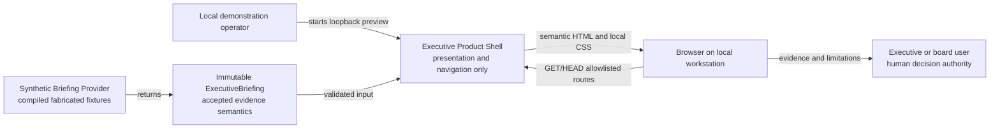

# Organizational Intelligence Phase 3A Executive Product Shell Plan

**Status:** Accepted; bounded implementation authorized after canonical
architecture activation merge

**Program:** Organizational Intelligence Product Program

**Program phase:** 3A - Executive Dashboard and Product Shell

**Canonical roadmap relationship:** Cross-phase human-experience foundation;
does not activate or rename canonical Roadmap Phase 3 - Knowledge Graph

**Planning date:** 2026-08-05

**Canonical planning base:**
`58f40054faba1167c25d828186e74d66e6c0681b`

**Decision owner:** Chief Architect

**Component owner:** Maintainer accountable for the repository candidate

**Operational owner:** Unassigned; no operation or deployment is authorized

**Implementation owner:** Lead Product Engineer acting only in the canonical
Implementation Engineer role under exact authorization

**Independent reviewer:** Work Mode

## Purpose

This plan defines the smallest complete implementation that can demonstrate a
calm, evidence-first executive command center without using real organizational
information or connecting to a current runtime candidate.

It converts accepted ADR 0012 and the Organizational Intelligence Interface
Specification into one runnable, synthetic-only product shell with an exact
component, technology, source, test, documentation, validation, rollback, and
authority boundary.

## Intended outcome

An authorized demonstration operator can start a local preview and show a
nonprofit executive or board member:

1. what is happening;
2. what needs attention;
3. what Jebediah knows; and
4. what should happen next.

The experience is polished, responsive, keyboard-usable, plain-language, and
honest about coverage, evidence, uncertainty, limitations, state, and human
authority.

The implementation proves only that this experience can be delivered over
compiled synthetic briefing data. It does not prove organizational usefulness,
live compatibility, production security, operations, or deployment.

## Authority state

One independent read-only Work Mode reviewer approved exact planning head
`5aa79d0d8f8aeab89d4a0acc4056a8f94ce329d7` with no findings. On 2026-08-05,
the Chief Architect accepted ADR 0015, this plan, the validation requirements,
threat model, dependency assessment, component specification, and bounded
implementation authorization for that exact head.

The Chief Architect authorized only this status-and-decision-evidence activation
edit. Implementation begins only when:

1. the same Work Mode reviewer freshly approves the exact activation head;
2. the Chief Architect separately approves that exact head for architecture
   merge;
3. the accepted architecture package merges to canonical `main`; and
4. the implementation owner verifies the canonical base and clean test baseline.

Architecture approval is not implementation merge, deployment, live-information,
or Phase 3B authority.

## Repository Verified

- Canonical `main` is
  `58f40054faba1167c25d828186e74d66e6c0681b`.
- Knowledge Manager Phase 2 is terminally closed. Its implementation remains
  synthetic-only and non-operational.
- ADR 0012 and the Organizational Intelligence Interface Specification are
  accepted architecture contracts.
- The repository has no executive-interface source, browser framework,
  JavaScript package manifest, frontend build chain, or dashboard tests.
- The existing Python requirement is 3.12 or newer.
- The current Python test suite contains 461 passing tests at the Phase 2
  implementation source-of-truth boundary.
- No active implementation sprint, live organizational information,
  deployment, or Phase 3 implementation is authorized.

## Reported facts

- No production browser support policy, identity provider, hosting target,
  operational owner, or representative executive usability result is verified.
- Reported local infrastructure is not an approved Phase 3A target.

## Working assumptions

- A server-rendered local preview can meet the bounded synthetic demonstration
  goal.
- The four accepted executive questions are sufficient for a first product
  shell and will be tested through synthetic executive tasks.
- The implementation can remain useful without client JavaScript or a model.
- A fixed synthetic clock and obviously fabricated scenario prevent misleading
  freshness and deadline claims.

## Open questions and gates

| Open question | Effect on Phase 3A | Future owner or gate |
| --- | --- | --- |
| Which live organizational domain is first? | Not applicable; compiled synthetic scenario only | Chief Architect and information owner before Phase 3B or any live adapter |
| Who may access organizational information? | Not applicable; no organizational information | Security, identity, and information-owner decision |
| Which component assembles production read models? | Synthetic provider only; no live assembler selected | Separate System/component decision |
| Which deployment environment is supported? | Local loopback preview only | Deployment and operations authorization |
| Should a model generate assistance? | No model; preset synthetic response only | Separate interaction and model decision |
| Which accessibility audit tool is required? | Repository checks and browser smoke only | Dependency decision if a gap remains |

None of these questions permits a live shortcut. Any becomes blocking if
implementation would cross its stated boundary.

## Scope

### Product areas

1. Executive overview
2. Needs attention
3. What Jebediah knows
4. What should happen next
5. Knowledge workspace
6. Ask Jebediah synthetic surface
7. Board view
8. State gallery and disconnected behavior
9. Local preview entry point and operator guide
10. Deterministic models, fixtures, rendering, routes, and tests

### Included behavior

- Polished global navigation and responsive layout
- Executive status, priority, unresolved-decision, deadline, evidence-update,
  knowledge-coverage, and limitation summaries
- Evidence-bearing attention cards
- Coverage, gap, conflict, stale, held, and source-reference views
- Bounded next-step cards with explicit kind and human authority
- Synthetic source, document, quarantine, review, lineage, knowledge-object, and
  activity status
- Preset synthetic Ask questions with grounded, insufficient, and failed
  responses
- Simplified board presentation and print styling
- Ready, loading, empty, partial, stale, insufficient-evidence, held, failed,
  unauthorized, unavailable, and disconnected states
- Keyboard navigation, focus, semantic structure, plain language, non-color
  cues, text resizing, and reduced-motion support

## Explicit non-goals

- Real document or organizational-information access, entry, display, or use
- Uploads, file pickers, drag and drop, paste ingestion, or free-form prompts
- PDF, DOCX, TXT, Markdown, archive, OCR, scanner, or parser behavior
- Collector, document-admission, Knowledge Registry, Memory Service, Qdrant,
  Ollama, embedding, retrieval, n8n, Open WebUI, or model integration
- A production read-model producer or transport
- Database, durable fixture store, session, cookie, preference, saved view,
  export, or analytics
- Authentication, authorization, user administration, or multi-tenant behavior
- External links, fonts, images, scripts, styles, or network calls
- API, production service, container, infrastructure, TLS, or deployment
- Recording decisions, clearing gates, approving work, mutating records, or
  executing actions
- Canonical Roadmap Phase 3 - Knowledge Graph implementation
- Product Program Phase 3B, 3C, or 3D implementation

## Component architecture

ADR 0015 proposes one new component: **Executive Product Shell**.



There is no edge to a source document, Collector, registry, memory, vector
store, model, workflow, service, or external action.

## Frontend and application architecture

### Runtime

- Python 3.12 or newer
- Python standard library only
- WSGI application served by `wsgiref.simple_server`
- Literal loopback bind `127.0.0.1`
- Server-rendered semantic HTML
- One reviewed local CSS resource
- No JavaScript
- No runtime or build dependency addition

### Entry point

```text
python -m apps.jebediah_executive
```

The command accepts only an integer port from 1024 through 65535. It has no
host, environment, source, file, service, or credential option.

The exact route forms are:

```text
/
/attention
/knowledge
/next
/workspace
/ask
/ask/<allowlisted-preset-id>
/board
/states
/states/<allowlisted-state-id>
/static/styles.css
```

No route has a trailing-slash alias. Every query string is rejected.

The allowlisted preset IDs are:

```text
grounded-priorities
insufficient-program-outcomes
failed-source-review
```

The allowlisted state IDs are:

```text
ready
loading
empty
partial
stale
insufficient-evidence
held
failed
unauthorized
unavailable
disconnected
```

### Source responsibility

| Module | Responsibility |
| --- | --- |
| `models.py` | Frozen enums, records, validation, and derived summary counts |
| `fixtures.py` | Compiled synthetic scenario and preset Ask response provider |
| `routes.py` | Fixed route, scenario, state, and preset-question dispatch |
| `rendering.py` | Escaped semantic HTML, evidence components, layouts, and pages |
| `app.py` | WSGI request validation, response headers, error mapping, and app factory |
| `__main__.py` | Loopback preview startup and clean shutdown |
| `styles.css` | Responsive visual system, focus, print, and state presentation |

Rendering does not manufacture domain values. Models and fixtures do not know
HTTP. The app does not know source, registry, memory, or model systems.

## Product information architecture

### Global shell

- Skip link
- Product title and persistent **Synthetic demonstration** status
- Clear local/disconnected indicator
- Primary navigation with current-page state
- Fixed synthetic scenario clock and coverage scope
- Main landmark
- Evidence and limitations disclosure
- Footer repeating non-operational and no-action boundaries

### Executive overview

- Calm status banner using text and icon, never color alone
- Summary counts derived from briefing items
- Four-question preview sections
- Upcoming synthetic deadlines
- Recent evidence updates
- Coverage summary and visible missing domains
- Direct links to supporting detail

### Needs attention

Every attention item shows:

- title and concise explanation;
- its informational-attention role and any related `next` item's accepted kind;
- visible rule or urgency basis;
- evidence classification and safe references;
- qualitative uncertainty and explanation;
- freshness or explicit not-applicable state;
- limitations;
- human authority requirement;
- current state; and
- timestamp when relevant.

An `attention` item never carries `next_kind`. When attention requires a
decision, gate, or possible action, `related_item_ids` links it to a distinct
`next` item whose kind and authority fields are displayed without merging the
two records.

### What Jebediah knows

- Covered synthetic subjects and evidence counts
- Missing information
- Conflicting information
- Stale information
- Held or unapproved information
- Safe synthetic source references
- Qualitative uncertainty
- Explicit statement that coverage is bounded and not omniscience

Held, unauthorized, archived, and otherwise ineligible information is shown only
as sanitized coverage or workspace status. Its content cannot appear as
ordinary evidence.

### What should happen next

Items use exactly one accepted kind:

- `decision_required`
- `organizational_gate`
- `action_candidate`
- `informational_attention`

Each shows owner when known, separate authority requirement, evidence,
limitations, and permitted navigation or review behavior. No button indicates
approval, execution, completion, send, submit, or apply.

Each also has exactly one visible context:

- `approved_plan`
- `unresolved_gate`
- `decision_request`
- `possible_action_candidate`
- `information_gathering_need`

Context and next-item kind must be a permitted pair and cannot increase
authority.

| `next_context` | Required `next_kind` |
| --- | --- |
| `approved_plan` | `informational_attention` |
| `unresolved_gate` | `organizational_gate` |
| `decision_request` | `decision_required` |
| `possible_action_candidate` | `action_candidate` |
| `information_gathering_need` | `informational_attention` |

### Knowledge workspace

Shows synthetic metadata only:

- source record identity and classification;
- document admission and quarantine status;
- human review status;
- evidence lineage;
- knowledge-object eligibility status; and
- recent synthetic activity.

It has no upload control, source-content viewer, filesystem locator, raw
document, registry write, or memory action.

### Ask Jebediah

The Phase 3A surface provides preset synthetic question links only. Each
response has:

- `grounded`, `insufficient`, or `failed` state;
- exact synthetic evidence references;
- coverage;
- uncertainty;
- limitations;
- a visible **Synthetic response** label; and
- no tool, model, mutation, or action.

No text input is present.

`grounded` means only that the preset response is supported by cited eligible
records inside the fabricated fixture. It does not mean verified, true in a real
organization, complete, model-generated, or safe for action.

### Board view

- Organizational status
- Key priorities
- Evidence coverage
- Risks and opportunities
- Upcoming decisions
- Source-backed explanations
- Presentation and print styling

It excludes technical diagnostics and uses only the same eligible synthetic
briefing. Risks and opportunities come only from `know` items with the
corresponding `knowledge_kind`.

## View-model contract

All domain records are frozen dataclasses. Collections are tuples. Enums reject
unknown values. Timestamps are timezone-aware and rendered with UTC or an
unambiguous offset.

### Closed vocabularies

| Enum | Exact values |
| --- | --- |
| `BriefingState` | `ready`, `loading`, `empty`, `partial`, `stale`, `insufficient_evidence`, `held`, `failed`, `unauthorized`, `unavailable`, `disconnected` |
| `BriefingSection` | `happening`, `attention`, `know`, `next` |
| `EvidenceClassification` | `verified_fact`, `reported_fact`, `working_assumption`, `open_question`, `derived_summary` |
| `FreshnessState` | `current`, `aging`, `stale`, `unknown`, `not_applicable` |
| `UncertaintyState` | `bounded`, `incomplete`, `conflicting`, `unknown`, `not_applicable` |
| `LifecycleState` | `active`, `superseded`, `archived` |
| `KnowledgeKind` | `material_change`, `decision`, `risk`, `opportunity`, `knowledge_gap` |
| `NextItemKind` | `decision_required`, `organizational_gate`, `action_candidate`, `informational_attention` |
| `NextContext` | `approved_plan`, `unresolved_gate`, `decision_request`, `possible_action_candidate`, `information_gathering_need` |
| `PermittedNextStep` | `navigate`, `human_review` |
| `AskState` | `grounded`, `insufficient`, `failed` |
| `WorkspaceKind` | `source_record`, `document`, `quarantine`, `review`, `lineage`, `knowledge_object` |
| `WorkspaceState` | `received`, `quarantined`, `validating`, `accepted`, `rejected`, `held`, `evaluation_failed`, `processing`, `ready`, `processing_failed`, `review_pending`, `review_approved`, `review_rejected`, `eligible`, `ineligible`, `unauthorized`, `unavailable`, `deleted`, `superseded`, `archived` |
| `ActivityKind` | `evidence_added`, `review_state_changed`, `lineage_recorded`, `knowledge_status_changed` |

### `ExecutiveBriefing`

| Field | Meaning |
| --- | --- |
| `briefing_id` | Stable synthetic briefing identity |
| `scenario_id` | Allowlisted compiled scenario |
| `scenario_label` | Visible fabricated-scenario label |
| `state` | One top-level `BriefingState` |
| `assembled_at` | Fixed synthetic timezone-aware assembly time |
| `coverage` | `CoverageSummary` |
| `items` | Tuple of `BriefingItem` |
| `workspace_records` | Tuple of synthetic `WorkspaceRecord` |
| `activities` | Tuple of synthetic `ActivityEntry` |
| `ask_responses` | Tuple of the three preset `AskResponse` records |
| `summary_counts` | Derived `SummaryCounts` |
| `limitations` | Non-empty tuple of material limitations |

`items` contains ordinary eligible items only. Every item must be `active`.
Superseded, archived, held, rejected, failed, unauthorized, and unavailable
records may affect sanitized coverage or workspace status but cannot enter
ordinary item rendering.

### `BriefingItem`

| Field | Rule |
| --- | --- |
| `item_id` | Stable non-empty synthetic identity |
| `section` | Exactly `happening`, `attention`, `know`, or `next` |
| `display_order` | Positive, unique order within the section under a visible rule |
| `title` and `statement` | Plain language, non-empty |
| `evidence_classification` | Accepted evidence category |
| `source_references` | One or more safe synthetic references where evidence is claimed |
| `source_observed_at` | Timezone-aware or explicit missing |
| `assembled_at` | Timezone-aware |
| `freshness` | Current, aging, stale, unknown, or not applicable |
| `evidence_basis` | Non-empty sufficiency explanation; never a score |
| `priority_basis` | Required visible urgency or ordering rule for `attention` and `next`; not applicable elsewhere |
| `review_due_at` | Optional timezone-aware synthetic review deadline |
| `uncertainty` | Bounded, incomplete, conflicting, unknown, or not applicable |
| `uncertainty_explanation` | Non-empty and evidence-linked |
| `lifecycle` | Active for ordinary items; superseded and archived values exist only for rejection tests and non-ordinary records |
| `transformation_id` | Required for derived summaries; absent for direct fixture facts |
| `limitations` | Explicit material limits |
| `knowledge_kind` | Required only for `know`; exact `KnowledgeKind` |
| `next_kind` | Required only for `next`; accepted four-value enum |
| `next_context` | Required only for `next`; exact `NextContext` consistent with `next_kind` |
| `decision_owner` | Optional human or governed role; missing is rendered as not yet assigned |
| `authority_requirement` | Required for every `attention` and `next` item |
| `permitted_next_step` | Required only for `attention` and `next`; navigation or human review |
| `related_item_ids` | Existing same-briefing identities; no self-reference, duplicates, or cycles |

### Supporting contracts

#### `CoverageSummary`

| Field | Rule |
| --- | --- |
| `scope_statement` | Explicit fabricated scenario and bounded coverage |
| `covered_subjects` | Sorted unique synthetic subject labels with eligible evidence |
| `missing_subjects` | Sorted unique required subjects without eligible evidence |
| `conflicting_subjects` | Sorted unique subjects with visible conflict evidence |
| `stale_subjects` | Sorted unique subjects beyond the synthetic freshness rule |
| `held_subjects` | Sanitized subject labels only; no held content |
| `eligible_item_count` | Derived from active ordinary items |
| `source_reference_count` | Derived unique safe-reference count |
| `limitations` | Non-empty material coverage limits |

#### `SourceReference`

| Field | Rule |
| --- | --- |
| `source_id` | Stable `demo-` identity |
| `label` | Plain synthetic label; no path, URL, or locator |
| `evidence_classification` | Exact accepted evidence category |
| `authority_scope` | Bounded synthetic domain statement; never general truth |
| `observed_at` | Timezone-aware or explicit missing |

#### `WorkspaceRecord`

| Field | Rule |
| --- | --- |
| `record_id` | Stable `demo-` identity |
| `kind` | Exact `WorkspaceKind` |
| `title` | Sanitized synthetic metadata label, not source content |
| `state` | Exact `WorkspaceState` valid for the record kind |
| `source_references` | Safe synthetic lineage references |
| `last_changed_at` | Timezone-aware synthetic time |
| `eligible_for_briefing` | Explicit Boolean; false for held, failed, rejected, unauthorized, superseded, or archived state |
| `limitations` | Explicit state and content-visibility limits |

The exact kind-to-state matrix is:

| `WorkspaceKind` | Permitted `WorkspaceState` values |
| --- | --- |
| `source_record` | `eligible`, `ineligible`, `held`, `unauthorized`, `unavailable`, `deleted`, `superseded`, `archived` |
| `document` | `received`, `quarantined`, `validating`, `accepted`, `rejected`, `held`, `evaluation_failed`, `deleted` |
| `quarantine` | `quarantined`, `validating`, `accepted`, `rejected`, `held`, `evaluation_failed`, `deleted` |
| `review` | `review_pending`, `review_approved`, `review_rejected`, `held`, `unavailable`, `archived` |
| `lineage` | `processing`, `ready`, `processing_failed`, `unavailable`, `deleted`, `superseded`, `archived` |
| `knowledge_object` | `processing`, `ready`, `processing_failed`, `review_pending`, `review_approved`, `review_rejected`, `eligible`, `ineligible`, `held`, `unauthorized`, `unavailable`, `deleted`, `superseded`, `archived` |

`eligible_for_briefing` may be true only for `(source_record, eligible)` or
`(knowledge_object, eligible)`. Every other pair requires false. `accepted`,
`ready`, or `review_approved` records do not establish truth, general
eligibility, or action authority. Phase 2 state names are rendered as synthetic
metadata only; the shell owns no transition or workflow behavior.

#### `ActivityEntry`

| Field | Rule |
| --- | --- |
| `activity_id` | Stable `demo-` identity |
| `kind` | Exact `ActivityKind` |
| `summary` | Plain synthetic metadata event |
| `occurred_at` | Timezone-aware synthetic time |
| `actor_label` | Fabricated governed-role label, never a person |
| `source_references` | Exact safe synthetic references |
| `result_state` | Exact resulting `WorkspaceState` |

#### `AskResponse`

| Field | Rule |
| --- | --- |
| `question_id` | One of the three allowlisted preset IDs |
| `question` | Fixed synthetic plain-language question |
| `state` | `grounded`, `insufficient`, or `failed` |
| `statement` | Non-empty only when grounded; no fabricated answer for insufficient or failed |
| `source_references` | Required for grounded; absent for failed; exact available basis for insufficient |
| `coverage_statement` | Explicit bounded coverage |
| `uncertainty` and `uncertainty_explanation` | Accepted qualitative contract |
| `limitations` | Non-empty |

#### `SummaryCounts`

| Field | Derivation |
| --- | --- |
| `priority_count` | Number of active `attention` items |
| `unresolved_decision_count` | Number of active `next` items with `decision_required` |
| `organizational_gate_count` | Number of active `next` items with `organizational_gate` |
| `upcoming_deadline_count` | Attention and next deadlines from `assembled_at` through 30 synthetic days later |
| `recent_evidence_update_count` | Evidence-added activities from 30 synthetic days before `assembled_at` through `assembled_at` |
| `eligible_source_count` | Unique source references across active ordinary items |

No contract contains a truth probability, model confidence, retrieval score,
file path, source content, executable action, external URL, or mutable approval.

## Synthetic fixture boundary

The implementation contains one clearly labeled fictional scenario:
`synthetic-nonprofit-demo-v1`.

Fixture rules:

- fixed clock and explicit synthetic timestamps;
- identities prefixed `demo-`;
- no real organization, person, address, account, grant, donor, client, case,
  patient, employee, document, URL, or locator;
- a balanced set of current, stale, conflicting, missing, held, and bounded
  evidence;
- all four next-item kinds;
- every `know` kind and every permitted next context;
- linked attention and next items without putting `next_kind` on attention;
- every visible count derived from the fixture;
- preset Ask responses linked to exact fixture items; and
- immutable construction at process start.

The source comment and every rendered page identify the data as fabricated.

## State handling

| State | Required presentation |
| --- | --- |
| Ready | Eligible synthetic evidence and limitations |
| Loading | Skeleton structure plus statement that no fetch is occurring in the demo |
| Empty | Covered scope and zero eligible items; never “nothing is happening” |
| Partial | Affected sections and unavailable inputs |
| Stale | Capture time, stale evidence, and limitation |
| Insufficient evidence | Missing evidence requirements and no fabricated answer |
| Held | Human or policy gate and no ordinary eligibility |
| Failed | Sanitized failure and retained boundary |
| Unauthorized | Access would be required in a future live system; no data shown |
| Unavailable | Briefing cannot be assembled safely |
| Disconnected | No service connection exists by design in Phase 3A |

State selectors are allowlisted synthetic route identifiers and do not modify
the underlying fixture.

## Evidence and uncertainty rendering

- Evidence classification appears as text.
- Source references open progressive disclosure within the page and are not
  external links.
- Freshness includes absolute timestamp and state.
- Uncertainty includes one qualitative label and explanation.
- Conflicts show each competing synthetic reference.
- Missing evidence names what is absent.
- Limitations remain visible at summary and item level.
- No color, order, fluent wording, or card prominence changes authority.

## Visual and interaction design

- Fixed reviewed tokens: text `#1f2933`, background `#f7f4ed`, surface
  `#ffffff`, accent `#0b5c5d`, attention `#7a4b00`, failure `#8b1e2d`, and
  focus `#005fcc`
- Text, accent, attention, failure, and focus tokens each exceed 4.5:1 against
  both background and surface under the WCAG relative-luminance formula
- System font stack; no remote font
- Minimum 16-pixel equivalent body text and generous line height
- Responsive single-column small-screen layout and bounded wide-screen grid
- Minimum 44-by-44-CSS-pixel target for non-inline interactive controls
- Three-CSS-pixel visible focus ring with a contrasting offset
- Consistent card and disclosure patterns
- Reduced-motion preference respected
- Print stylesheet for board view
- No animation required to understand state
- Technical terms replaced or defined in plain language

## Accessibility requirements

- WCAG-oriented semantic landmarks and heading hierarchy
- Skip link and logical keyboard order
- Visible `:focus-visible`
- Current navigation indicated programmatically and visually
- Every control and disclosure has a meaningful accessible name
- Status uses text and symbol, not color alone
- Normal text has at least 4.5:1 contrast; large text and non-text interface
  indicators have at least 3:1 contrast
- Error and limitation headings are programmatically connected to content
- Tables have captions or descriptive headings where used
- Text remains usable at 200 percent zoom and narrow viewport
- Print view retains labels, evidence, and limitations
- No auto-refresh, focus theft, time limit, autoplay, or motion dependency

Repository-owned checks and browser smoke evidence do not claim formal
accessibility certification.

## Security and privacy

The
[Phase 3A Threat Model](ORGANIZATIONAL_INTELLIGENCE_PHASE_3A_THREAT_MODEL.md)
is binding. The implementation:

- accepts GET and HEAD only;
- validates route, scenario, state, question, and port allowlists;
- replaces the standard server's raw request logging with a sanitized handler
  that records only method, normalized allowlisted route identity or
  `unrecognized`, and status;
- escapes every dynamic value;
- serves only local reviewed CSS;
- uses restrictive headers;
- stores no state;
- logs no content;
- has no free-form input; and
- imports no current runtime component.

## Dependency decision

The
[Phase 3A Dependency Assessment](ORGANIZATIONAL_INTELLIGENCE_PHASE_3A_DEPENDENCY_ASSESSMENT.md)
selects the existing Python interpreter, Python standard library, existing
`pytest`, and documentation validator only.

No dependency, lock, build, workflow, container, or generated-artifact change is
authorized.

## Operations and local preview

The implementation will add an operator guide for:

- environment prerequisite;
- exact start command;
- loopback URL;
- synthetic-only warning;
- approved demonstration routes;
- clean shutdown;
- deterministic smoke check;
- troubleshooting without private topology; and
- stop conditions.

The guide must state that the preview:

- has no authentication or TLS;
- is unsuitable for network exposure;
- accepts no real information;
- provides no availability or recovery commitment;
- is not a deployment; and
- is not Operational.

## Test strategy

The
[Phase 3A Validation Requirements](ORGANIZATIONAL_INTELLIGENCE_PHASE_3A_VALIDATION_REQUIREMENTS.md)
define exact evidence.

Required layers:

- model invariant tests;
- fixture contract tests;
- summary and ordering tests;
- escaped renderer tests;
- route and WSGI component tests;
- security-header and unsupported-method tests;
- state matrix tests;
- accessibility structure tests;
- package, import, dependency, content, and capability-negative tests;
- local browser route, responsive, keyboard, and network smoke evidence; and
- complete existing Python regression suite.

## Exact architecture-package manifest

This documentation-only architecture package may create or modify only these 19
Markdown files:

```text
CHANGELOG.md
CURRENT_SPRINT.md
PROJECT_STATUS.md
README.md
ROADMAP.md
docs/ARCHITECTURE.md
docs/DATA_OWNERSHIP.md
docs/KNOWLEDGE_MANAGER_1_PHASE_2_CLOSEOUT.md
docs/ORGANIZATIONAL_INTELLIGENCE_PHASE_3A_DEPENDENCY_ASSESSMENT.md
docs/ORGANIZATIONAL_INTELLIGENCE_PHASE_3A_PRODUCT_SHELL_PLAN.md
docs/ORGANIZATIONAL_INTELLIGENCE_PHASE_3A_THREAT_MODEL.md
docs/ORGANIZATIONAL_INTELLIGENCE_PHASE_3A_VALIDATION_REQUIREMENTS.md
docs/README.md
docs/REPOSITORY_STANDARDS.md
docs/adr/0015-executive-product-shell-and-local-preview-boundary.md
docs/adr/README.md
docs/governance/ORGANIZATIONAL_INTELLIGENCE_PHASE_3A_IMPLEMENTATION_AUTHORIZATION.md
docs/reference/COMPONENT_REGISTRY.md
docs/reference/GLOSSARY.md
```

No source, test, dependency, lock, service, workflow, container,
infrastructure, deployment, or generated file belongs to this architecture
package.

## Exact implementation manifest

After exact approval, implementation may create or modify only these files.

### Application source - 9 files

```text
apps/__init__.py
apps/jebediah_executive/__init__.py
apps/jebediah_executive/__main__.py
apps/jebediah_executive/app.py
apps/jebediah_executive/fixtures.py
apps/jebediah_executive/models.py
apps/jebediah_executive/rendering.py
apps/jebediah_executive/routes.py
apps/jebediah_executive/static/styles.css
```

### Tests - 9 files

```text
tests/apps/__init__.py
tests/apps/jebediah_executive/__init__.py
tests/apps/jebediah_executive/test_accessibility.py
tests/apps/jebediah_executive/test_app.py
tests/apps/jebediah_executive/test_fixtures.py
tests/apps/jebediah_executive/test_models.py
tests/apps/jebediah_executive/test_package_boundaries.py
tests/apps/jebediah_executive/test_rendering.py
tests/apps/jebediah_executive/test_routes.py
```

### Direct implementation documentation - 13 files

```text
CHANGELOG.md
CURRENT_SPRINT.md
PROJECT_STATUS.md
README.md
ROADMAP.md
docs/ARCHITECTURE.md
docs/ORGANIZATIONAL_INTELLIGENCE_PHASE_3A_LOCAL_PREVIEW.md
docs/ORGANIZATIONAL_INTELLIGENCE_PHASE_3A_PRODUCT_SHELL_PLAN.md
docs/ORGANIZATIONAL_INTELLIGENCE_PHASE_3A_VALIDATION_REQUIREMENTS.md
docs/README.md
docs/REPOSITORY_STANDARDS.md
docs/reference/COMPONENT_REGISTRY.md
docs/reference/GLOSSARY.md
```

No dependency, lock, service, memory, Collector, workflow, container,
infrastructure, deployment, or existing test file may change.

Accepted plan and validation files may record bounded execution evidence and
factual reconciliation only. Changing a contract, route, model, state,
capability, dependency, authority, or manifest reopens architecture review.

If another file is required, implementation stops for revised architecture and
exact review.

## Implementation sequence

### Checkpoint 0 - baseline

- Verify accepted architecture merge and clean `main`.
- Record exact base.
- Confirm the app package is absent.
- Run documentation validation, frozen-lock verification, and the full Python
  suite.
- Confirm no real information exists in the implementation inputs.

### Checkpoint 1 - view models and fixtures

- Implement frozen contracts and explicit failures.
- Implement one immutable synthetic scenario and preset Ask responses.
- Complete model and fixture tests.

### Checkpoint 2 - routes and renderer

- Implement semantic layouts and all product routes.
- Implement every required state.
- Complete rendering, route, escaping, header, and accessibility tests.

### Checkpoint 3 - local preview and product verification

- Implement loopback-only entry point and clean shutdown.
- Complete operator documentation.
- Run browser smoke tasks for navigation, keyboard use, responsive layout,
  board view, Ask presets, states, and network isolation.

### Checkpoint 4 - publication

- Run targeted and full validation.
- Verify exact 31-file implementation manifest.
- Verify dependency, lock, protected package, capability, and sensitive-value
  boundaries.
- Reconcile documentation without claiming operation.
- Publish one exact remote head and stop for independent review.

## Acceptance criteria

Phase 3A implementation is review-ready only when:

1. Every named page and state is present and locally runnable.
2. The four executive questions are visible and linked to evidence.
3. Every item satisfies the accepted evidence and authority contract.
4. The overview, attention, knowledge, next, workspace, Ask, board, and state
   workflows operate end to end with compiled synthetic data.
5. No free-form content, file, service, network, persistence, model, retrieval,
   registry, memory, or action path exists.
6. Keyboard, focus, semantic, contrast, text-resize, responsive, reduced-motion,
   and print requirements have evidence.
7. Loading, empty, partial, stale, insufficient, held, failed, unauthorized,
   unavailable, and disconnected states fail visibly.
8. All targeted tests and the full existing suite pass.
9. Documentation, lock, compile, whitespace, sensitive-value, dependency,
   package, capability, and exact-manifest checks pass.
10. Work Mode approves the exact implementation head with no unresolved
    Blocking, High, or Medium finding.
11. The Chief Architect approves that exact head for merge.
12. Post-merge validation and one terminal closeout complete.

## Rollback

Before merge, abandon the implementation branch. After merge, use a reviewed
revert of the Phase 3A implementation commit, rerun the complete validation set,
and reconcile canonical status.

No data migration, backup restore, credential rotation, external deletion,
service shutdown, registry cleanup, memory cleanup, Qdrant cleanup, or deployment
action applies.

## Stop conditions

Implementation stops if:

- architecture or authorization is not accepted at the exact reviewed head;
- any real document or organizational information is requested;
- any free-form prompt or upload input becomes necessary;
- any source, parser, scanner, model, retrieval, registry, memory, service,
  network, persistence, authentication, export, analytics, or deployment
  boundary becomes necessary;
- a dependency, lock file, existing runtime package, workflow, container, or
  infrastructure file must change;
- the exact model, state, authority, route, or file scope must expand;
- accessibility or security failure cannot be corrected within the accepted
  boundary; or
- validation cannot reproduce without private information or external systems.

## Review and decision sequence

```text
documentation-only architecture branch
-> documentation validation and exact manifest
-> one independent Work Mode exact-head architecture review
-> Chief Architect exact-head adoption and status-activation decision
-> status and decision-evidence activation commit only
-> fresh exact-head confirmation by the same Work Mode reviewer
-> Chief Architect exact activation-head architecture merge decision
-> architecture merge and canonical acceptance reconciliation
-> clean implementation branch
-> bounded implementation and tests
-> one independent Work Mode exact-head implementation review
-> Chief Architect exact-head merge decision
-> squash merge and post-merge validation
-> one terminal documentation closeout
```

Changed heads reopen the applicable review. Status activation reuses the same
independent reviewer and does not assign a second reviewer.

## Adoption record and remaining decision

The Chief Architect adopted exact planning head
`5aa79d0d8f8aeab89d4a0acc4056a8f94ce329d7` and authorized this bounded
activation edit. The remaining architecture decision is approval of the freshly
reviewed exact activation head for merge.

Adoption does not include deployment, real information, Phase 3B, or
implementation merge authority.

## Execution evidence

This section records factual implementation-branch execution evidence only. It
does not change any contract, route, model, state, capability, dependency,
authority, or manifest above.

The exact accepted 31-file manifest was implemented on branch
`feature/phase3a-executive-product-shell` from canonical base
`35d5bafc63a904868012944f792f64e0d4456793`:

- nine application files under `apps/` and `apps/jebediah_executive/`,
  including the standard-library WSGI application, single compiled
  `synthetic-nonprofit-demo-v1` scenario, escaped semantic-HTML renderer, fixed
  allowlisted routes, and one local stylesheet;
- nine test files under `tests/apps/jebediah_executive/` covering the model,
  fixture, rendering, route, WSGI, workflow, accessibility, and package-boundary
  layers; and
- thirteen direct documentation files, including this plan, the validation
  requirements, and a new local preview operator guide.

Recorded automated results: 324 targeted tests and 785 full-suite tests passed;
compilation, `uv lock --check`, `scripts/validate_docs.py`, and
`git diff --check` were clean; and the change set matched the exact 31 files with
no untracked extras. A bounded corrective pass within the same 31-file manifest
strengthened attention-to-next topic coherence, substantive per-state
presentations, evidence and coverage disclosure, responsive workspace-table
readability, and model invariants; it changed no contract, route, model, state
vocabulary, fixture boundary, authority boundary, dependency, or manifest.

Only fabricated synthetic content was used and no real organizational or VBA
information was accessed. The component has **Implemented** repository maturity
and is not Operational. On 2026-08-05, Chrome 150 on Windows completed the six
executive workflows, all three Ask presets, board and state views, all eleven
state presentations, keyboard and visible-focus navigation, accessibility-tree
landmarks, 320- and 1280-CSS-pixel layouts, 200 percent zoom, reduced motion,
board print rendering, safe `404` and `400` paths, and clean browser-storage and
loopback-only network checks. The preview and browser were then stopped and
their temporary artifacts removed. Independent implementation review and the
merge decision remain outstanding and gated; this evidence asserts neither
merge nor terminal completion.
