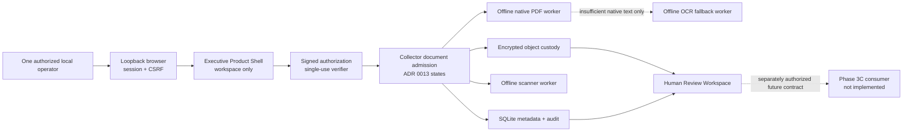

# Organizational Intelligence Phase 3B Governed Intake Plan

**Status:** Proposed; documentation-only architecture package; implementation,
deployment, and real-information use remain unauthorized

**Program phase:** Organizational Intelligence Product Program Phase 3B -
Governed Real-Document Intake and Inspection

**Prepared:** 2026-08-05

**Required decision:** Independent Work Mode exact-head review followed by Chief
Architect adoption of ADR 0016 and the bounded implementation activation

## Purpose

Phase 3B turns the disconnected synthetic admission contracts accepted by ADR
0013 into a locally runnable, durable, reviewable PDF intake path. It does not
create organizational knowledge or make the dashboard answer from uploaded
content.

The first implementation may use only generated synthetic PDF fixtures.
Processing one real document remains a later exact-source authorization gate.

## Outcome

The bounded implementation will let one authorized local operator:

1. start the Executive Product Shell on literal loopback;
2. see an honest insufficient-approved-evidence answer before intake;
3. open the Knowledge Workspace;
4. activate one signed, single-use authorization receipt;
5. push one browser-selected PDF byte stream without giving the server a
   filesystem path;
6. preserve source, submission, content, custody, processing, and transformation
   identities;
7. scan and inspect the PDF in isolated offline workers;
8. use native PDF text extraction first and bounded local OCR only when the
   native result is insufficient;
9. review extracted Source Document Evidence, limitations, warnings, omissions,
   and page references;
10. approve, reject, request correction, supersede, delete, or reset the local
    evidence; and
11. inspect safe audit and lifecycle evidence.

Approval in Phase 3B means only that the authorized human accepts the extracted
representation as a candidate for a later governed consumer. It does not verify
the source claims, write the Knowledge Registry, create Knowledge Objects,
generate embeddings, index Qdrant, enable retrieval, or change an Ask answer.

## Canonical context ledger

This ledger is the Phase 3B working context and should be reused rather than
rediscovered:

- Reviewed GitHub `main` is project-record authority.
- The originating organization record remains authoritative for its scoped
  facts.
- ADR 0013 accepts quarantine-first admission, distinct submission and content
  identities, append-only attempts, and non-authoritative derived output.
- The Phase 2 package implements only generated-byte contracts, in-memory
  adapters, and deterministic tests.
- The Executive Product Shell is Implemented but synthetic, loopback-only,
  non-operational, and disconnected from document admission.
- No real information, deployment, live source, parser, scanner, OCR, durable
  custody, downstream consumer, or operational use is currently authorized.
- No filename, directory path, organization document, personal information,
  credential, or private topology may enter the public repository.
- Information authority does not grant action authority.
- Human approval does not establish truth.
- Phase 3C owns Source Document Evidence promotion, Knowledge Objects, memory
  eligibility, embeddings, Qdrant, retrieval, and grounded response.
- Phase 3D owns the complete presentation workflow after Phase 3C is terminally
  closed.

## Decision-complete first release

### 1. Named information domain

The first domain is **Virginia B. Andes board-governance roster records**.

The domain is limited to an explicitly selected, non-clinical PDF whose approved
purpose is to evidence current board-member names and board roles. Patient,
clinical, credential, banking, personnel-case, donor, and unrelated personal
information are prohibited.

The domain name defines a future authorization target. It does not authorize a
document, discover a source, or establish that a suitable record exists.

### 2. Source authority

The authoritative source is the official board roster or governing record
maintained by the organization's designated corporate secretary, records
custodian, or equivalent information-owner role.

The operator, Jebediah, the uploaded snapshot, extracted text, OCR text, review
decision, and dashboard are not source authority. The exact role holder,
document, content digest, issue/version date, and authority evidence must be
named in the later real-source authorization.

### 3. Producer and consumer contracts

The Phase 3B producer contract is:

- one versioned Ed25519-signed `SourceAuthorizationReceipt`;
- one exact browser-pushed PDF byte stream;
- operator attestation that the selected bytes are the receipt-authorized,
  non-clinical board-governance record; and
- optional expected SHA-256 identity, mandatory when the receipt issuer knows
  the exact bytes.

The Phase 3B consumer is the local **Human Review Workspace** only. It may read
admission metadata and decrypt one bounded inspection artifact for display to
the authenticated local operator. It cannot publish, export, index, retrieve,
summarize with a model, or answer a question.

The receipt includes a unique identifier, organization/domain identifier,
source-record identifier, source-authority role, principal, purpose,
classification, allowed operation, retention-profile identifier, issued and
expiry times, signer key identifier, and single-use rule. SQLite records the
receipt identifier before accepting bytes, so replay fails closed.

### 4. Classification and permitted use

The initial classification is
`internal-governance-limited-personal-data`.

Permitted Phase 3B use is local admission, malware scanning, structural
validation, native extraction, bounded OCR fallback, human review, lifecycle
management, and validation of the evidence chain. Names and board roles may be
displayed only to the authorized local operator.

No public release, contact enrichment, inference, profiling, external model
transfer, action, or reuse for another organization or purpose is permitted.
Unknown or broader classification fails closed to `held`.

### 5. Privacy and legal treatment

Board-member names and roles are treated as personal information even when they
may also be public elsewhere. Data minimization applies:

- do not collect contact details, signatures, addresses, dates of birth,
  identifiers, clinical facts, financial facts, credentials, or unrelated
  narrative;
- do not log source names, filenames, excerpts, locators, or content;
- use opaque identifiers in metadata and audit records;
- encrypt source bytes, authorization receipts, and inspection artifacts at
  rest; and
- keep every runtime artifact outside Git.

The later real-source decision must confirm that the designated information
owner permits this use and that no legal/privacy restriction prevents it.

### 6. Retention and deletion

Phase 3B selects `phase3b-board-roster-pilot-v1`:

| Material | Normal retention |
| --- | --- |
| `received` without completed quarantine | Delete immediately after failed attempt reconciliation |
| `rejected` or `evaluation_failed` source and derived objects | Seven days |
| `held`, `accepted`, `processing`, `processing_failed`, or `ready` source and derived objects | Thirty days from receipt |
| Reviewable Source Document Evidence artifact | Thirty days from receipt or earlier reset |
| Safe audit metadata and deletion tombstones | 365 days |
| Encrypted backup copies | Thirty days, then verified expiry |

Reset or authorized deletion immediately removes online answerability and
reviewability, cryptographically deletes the applicable DEKs, deletes the
encrypted objects, records tombstones, and prevents backup restoration from
reactivating deleted material. Every backup set is registered with an opaque
object inventory in both SQLite and the independently retained signed
recovery-authority ledger. Before local deletion, the ledger records a
monotonic deletion intent and revokes every applicable backup set. Deletion is
not complete until each such set is physically purged and verified; a missing
or unavailable set remains `cleanup_failed`. Backups otherwise expire within
thirty days. Restore requires the current signed ledger checkpoint and applies
its revocations and tombstones before activation.

Cleanup is explicit and also runs at local startup. No unattended scheduler is
authorized. Every review, display, decryption, download-equivalent internal
read, and mutation checks the fixed deadline before content access. Expired
content is denied before decryption or display regardless of hold state, and the
same request atomically marks it ineligible and records an audit event. Without
a hold it also records a cleanup obligation and attempts synchronous cleanup;
with a hold it preserves encrypted material but cannot display or otherwise
consume it. Failed deletion becomes visible `cleanup_failed` evidence and blocks
claims of completed reset.

### 7. Legal hold

No legal hold exists by default. A hold or lift requires a separately signed
record from the designated information owner or legal/privacy authority,
identifying scope, reason, effective time, signer, and optional expiry.

An active hold blocks source, derived-artifact, and applicable backup deletion.
It does not make content admissible, approved, true, or consumable. The local
operator cannot self-declare or self-lift a hold. Phase 3B provides deletion
suppression and evidence only, not a records-management or e-discovery system.

### 8. Access control

The runtime serves literal `127.0.0.1` only. One OS account owns the runtime
directory and is the process principal boundary.

Each launch creates a random 256-bit bootstrap token. The browser exchanges it
once for an `HttpOnly`, `SameSite=Strict` session cookie and a per-session CSRF
token, then the URL is redirected without the token. Every mutation requires
the session and CSRF token. Origin and Host are allowlisted. Cookies, responses,
uploads, and workspace pages use `no-store`; referrers are disabled.

Loopback is not authorization by itself. Missing key material, trust registry,
session state, receipt authority, or CSRF evidence fails closed.

### 9. Durable custody

The runtime uses:

- SQLite in WAL mode for opaque identities, states, policy references, safe
  reason codes, timestamps, review decisions, tombstones, and audit records;
- an encrypted local object directory for source bytes, signed authorization
  receipts, inspection artifacts, and backup manifests; and
- a content-free, monotonic recovery-authority ledger retained at a separately
  controlled local path outside both the runtime directory and backup sets, with
  checkpoints signed by a trusted key whose private key is never available to
  the runtime or included in a backup; the authority separately retains the
  latest generation and head hash and freshly attests them for restore; and
- one encrypted object per submission or output, with no physical
  content-digest deduplication.

Each object has a self-describing authenticated header, random DEK, unique
nonce sequence, ciphertext chunks, and final authentication record. A random
stable content master key wraps DEKs. The master key is itself wrapped by a
passphrase-derived KEK using Argon2id. Passphrase rotation rewraps only the
stable master key and never rewrites content or audit history.

AES-256-GCM provides content confidentiality and integrity. HKDF derives a
stable audit-integrity key from the master key with a distinct context label.
The event hash/HMAC chain detects accidental corruption and offline tampering by
an actor without the unlocked master key. It is explicitly not non-repudiation
against the authorized operator. Authorization and legal-hold records retain
external Ed25519 signatures for authority evidence.

Object writes use same-filesystem temporary files, flush, `fsync`, atomic
replace, directory `fsync`, and then a SQLite transaction. Self-describing
headers make a durable pre-commit orphan decryptable for reconciliation.
Missing, corrupt, or inconsistent objects fail closed to hold or failure
evidence.

### 10. Parser and OCR strategy

PDF is the only Phase 3B format. DOCX, TXT, and Markdown remain valid ADR 0013
candidate families but are not activated.

The native worker:

- verifies the PDF signature;
- runs qpdf structural checking with recovery/repair disabled;
- rejects encrypted PDFs and unsupported profiles;
- inventories and rejects JavaScript, launch actions, XFA, AcroForm, embedded
  files, portfolios, rich media, and executable attachments;
- never follows links or external references;
- uses pinned `pypdf` in strict mode for bounded page text extraction; and
- emits bounded page-numbered text units, warnings, omissions, and extraction
  quality as canonical JSON.

The OCR worker is invoked only when native extraction yields no meaningful text
or the human explicitly confirms that an eligible page is image-only. It uses
pinned Poppler rendering and Tesseract language data inside a separate offline
container. OCR output is labeled `ocr`, never silently merged with native text,
and records engine, language pack, page, confidence evidence, omissions, and
limits. OCR is never verification and low-quality output remains held.

### 11. Isolation strategy

Scanning, native inspection, and OCR run in three separate immutable OCI worker
images under rootless Podman on Linux with cgroups v2.

Every worker has:

- no network namespace;
- no host mounts or runtime secrets;
- source bytes streamed on standard input;
- read-only root filesystem and bounded tmpfs scratch;
- non-root UID/GID;
- all Linux capabilities dropped;
- no-new-privileges;
- pinned seccomp profile;
- immutable image digest;
- explicit memory, CPU, PID, wall-clock, temporary-space, and output limits; and
- bounded canonical JSON on stdout with sanitized stderr.

The host validates worker output as untrusted input. It never sends SQLite,
object-store, key, trust-registry, or authorization paths into a worker.

Rootless cgroup controller delegation is a verified host prerequisite.
Native Windows is not an accepted isolation environment; Windows development
uses a Linux Podman machine or WSL2 backend and makes no native-Windows
production claim.

### 12. Malware and active-content treatment

ClamAV runs as a short-lived offline scanner worker with a pinned engine image
and separately supplied read-only signature bundle. The bundle identity and
freshness are recorded. Missing, invalid, or policy-stale signatures produce
`evaluation_failed`; a clean result is evidence, not proof of safety.

The synthetic positive fixture is the standard EICAR test string and is labeled
non-malicious test data. Active-content rejection is independent of malware
scanning. A scanner result cannot override structural, authority, classification,
or resource-policy failure.

### 13. Resource limits

`phase3b-pdf-pilot-limits-v1` fixes:

| Resource | Limit |
| --- | --- |
| Upload bytes | 20 MiB |
| PDF pages | 50 |
| PDF objects | 100,000 |
| Object nesting | 64 |
| One decoded page content stream | 8 MiB |
| Total decoded page content | 64 MiB |
| Native extracted characters | 2,000,000 |
| Persisted inspection artifact | 8 MiB |
| Worker stdout | 10 MiB |
| Scanner memory / CPU / wall / PIDs | 1 GiB / 2 CPUs / 5 minutes / 128 |
| Native worker memory / CPU / wall / PIDs | 1 GiB / 2 CPUs / 5 minutes / 128 |
| OCR pages | 20 |
| OCR render resolution | 300 DPI |
| OCR worker memory / CPU / wall / PIDs | 2 GiB / 2 CPUs / 15 minutes / 128 |
| Worker scratch | 1 GiB |
| Findings or warnings | 256 each |

Any exceeded or unverifiable limit fails closed and records the exact reached
limit. The implementation may tighten but not raise a limit without a reviewed
architecture change.

### 14. Duplicate and version handling

SHA-256 identifies exact submitted bytes. Equal bytes still create distinct
submission occurrences, authorization evidence, and lifecycle attempts. The
object store does not physically deduplicate them.

An exact duplicate of the same source-record identity is linked and shown to the
reviewer. Changed bytes create a new content identity and version candidate.
Only explicit review can mark one record as superseding another. Superseded or
deleted versions never reactivate automatically if a newer version is reset.

### 15. Human review workflow

Review disposition is a separate append-only annotation layer and does not
change ADR 0013 admission or transformation state vocabulary.

Allowed review dispositions are:

- `pending_review`;
- `approved_for_phase3c_candidate`;
- `rejected_by_reviewer`;
- `correction_required`; and
- `superseded_by_review`.

The workspace shows source and content identities, detected format, extraction
method, page references, bounded excerpts, warnings, omissions, quality,
scanner identity, parser identity, freshness, classification, purpose,
retention deadline, and limitations. Approval requires an explicit confirmation
that no prohibited information is visible and that the extraction corresponds
to the intended record.

No disposition verifies facts or makes an output eligible for a consumer not
yet accepted.

### 16. Audit evidence

Append-only events cover receipt verification and replay denial, session
activation, upload, quarantine, integrity verification, scanning, format
detection, active-content evaluation, extraction, OCR decision, every state
transition, review, supersession, cleanup, legal hold, backup, restore,
reconciliation, key rotation, and failure.

Each event records opaque subject and correlation identities, actor/component,
prior and next state where applicable, safe reason code, policy/version, time,
and safe evidence references. No content, filename, source locator, private
identifier, excerpt, key, or passphrase enters SQLite or ordinary logs.

Every durable state mutation and its audit event commit in one SQLite
transaction. No committed mutation may exist without its corresponding event.
Audit events are immutable within bounded epochs. An eligible closed epoch is
removed only as one authenticated lifecycle operation after all contained
records and tombstones have reached their retention deadline and no hold
applies. The successor epoch retains a subject-free closure anchor containing
the prior epoch identity, terminal hash/HMAC, time bounds, event count, pruning
policy, and pruning result.

### 17. Backup and recovery

An operator-triggered backup contains:

- a consistent SQLite snapshot;
- encrypted objects;
- versioned configuration and trust-registry identity;
- a registered backup-set identity and opaque object inventory;
- deletion tombstones;
- an HMAC-authenticated manifest; and
- no plaintext key or passphrase.

The wrapped master-key file is backed up separately from the passphrase.
Recovery requires both. Restore occurs into an isolated staging directory and
must verify the database, event chain, manifest, every object, tombstones,
policy versions, current independently retained signed recovery-authority
checkpoint, a fresh challenge-bound authority attestation of its latest
generation and head hash, and reconciliation before an atomic activation. A
restore cannot bypass expired retention, ledger revocation, or deletion. A
copied pre-deletion backup or older signed ledger prefix remains revoked by the
fresh external attestation. A reset or deletion cannot be reported complete
while any registered backup set containing the scope remains; that set must be
physically purged and its absence verified rather than merely waiting for
restore-time reconciliation.

Every normal startup also obtains a new challenge-bound attestation and verifies
the external ledger head before enabling content access or mutation. Startup
fails closed if the ledger and local projection were rolled back together or
otherwise do not reconcile to the freshly attested head.

Phase 3B backup, restore, cleanup, rotation, and reconciliation are
operator-triggered and interactive. Unattended key access and scheduling require
a later operations decision.

### 18. Operations ownership

- **Repository/component owner:** Maintainer accountable for the Collector
  document-admission and Executive Product Shell repository candidates.
- **Implementation owner:** Assigned Implementation Engineer after activation.
- **Local runtime operator:** One designated pilot operator, assigned only in the
  real-source decision, responsible for startup, receipt activation, review,
  cleanup, backup, restore, capacity, and incident stop.
- **Information owner:** The designated Virginia B. Andes board-governance
  records authority, assigned only in the real-source decision.
- **Legal/privacy authority:** A distinct designated role for hold/lift and
  privacy confirmation.
- **Security review:** Work Mode plus the accepted project security process.

There is no availability promise, background service, remote support, or
production operator.

### 19. Rollback

Before implementation merge, abandon or revert the branch. After implementation
merge but before real use, stop the local process, remove generated synthetic
runtime state, revert through normal review, and rebuild the worker images.

After an authorized pilot, rollback first creates required evidence, executes
authorized reset unless a hold blocks it, verifies deletion, removes runtime
state and images, and only then reverts code. Schema downgrade is unsupported;
restore uses the last compatible reviewed version or a reviewed forward
migration.

### 20. Exact implementation file scope

The exact authorized manifest is in [Appendix A](#appendix-a-exact-implementation-manifest).
Files outside it require a changed architecture head and fresh review.

### 21. Exact validation inventory

The complete test, container, browser, lifecycle, repository, and negative-
capability inventory is in the
[Phase 3B Validation Requirements](ORGANIZATIONAL_INTELLIGENCE_PHASE_3B_VALIDATION_REQUIREMENTS.md).

### 22. Later real-source authorization gate

The implementation may use only generated synthetic PDFs until one decision
names:

- the exact Virginia B. Andes board-roster PDF by sanitized source-record
  identity and expected SHA-256;
- the source-authority and information-owner roles and exact authorized
  principals or role holders;
- the source record's issue/version date and signed or otherwise independently
  verifiable authority evidence;
- the trust-registry binding from each authorization signer to the permitted
  role, organization, information domain, document scope, and effective period;
- the one authorized operator;
- the permitted local environment and runtime directory;
- classification and confirmation that the file is non-clinical and excludes
  PHI, credentials, banking information, and unrelated personal information;
- the exact permitted operations and purpose;
- the retention profile and no-hold or signed-hold state;
- key/passphrase custody and recovery owner;
- scanner-signature and worker-image identities;
- backup location class and deletion obligation;
- recovery-authority principal, trusted public key, independently controlled
  ledger location and custodian, non-rollback latest-generation register,
  current signed checkpoint generation, and fresh-attestation procedure;
- review and incident-stop owner;
- effective and expiry times; and
- explicit permission to open, hash, quarantine, scan, parse, optionally OCR,
  store, display for review, and delete only those exact bytes.

No folder discovery, filename discovery, source browsing, bulk authorization,
or inferred consent is permitted.

## Component architecture

The browser pushes bytes. It never gives the server a local path. Workers receive
only bounded decrypted bytes and policy input. The Human Review Workspace cannot
write any downstream system.

## State and lifecycle mapping

ADR 0013 admission and transformation states remain unchanged. Durable custody
adds operational substate and evidence but no substitute terminal outcome.

| Event | Required state/evidence |
| --- | --- |
| Valid receipt before bytes | receipt reserved, single-use |
| Byte stream starts | `received` |
| Encrypted object durable | `quarantined` |
| Scanner and structural checks start | `validating` |
| Admissible for the approved review use | `accepted` |
| Prohibited/unsupported content | `rejected` |
| Human or authority decision required | `held` |
| Required evaluation unavailable/indeterminate | `evaluation_failed` |
| Native/OCR transformation starts | `processing` |
| Complete bounded review artifact produced | `ready` |
| Transformation fails or remains partial | `processing_failed` |

Review annotations follow `ready` and never rewrite these states.

## Dependency decision

The selected dependency boundary is documented in the
[Phase 3B Dependency Assessment](ORGANIZATIONAL_INTELLIGENCE_PHASE_3B_DEPENDENCY_ASSESSMENT.md).
Host code adds only `cryptography`; workers pin qpdf, `pypdf`, ClamAV, Poppler,
and Tesseract in immutable images. SQLite remains the Python standard-library
binding. Podman is an operator/CI prerequisite, not a Python dependency.

## Security and threat decision

The
[Phase 3B Threat Model](ORGANIZATIONAL_INTELLIGENCE_PHASE_3B_THREAT_MODEL.md)
owns threats, controls, residual risk, stop conditions, and review triggers.
The
[Phase 3B Lifecycle and Recovery Specification](ORGANIZATIONAL_INTELLIGENCE_PHASE_3B_LIFECYCLE_AND_RECOVERY.md)
owns encryption, retention, deletion, hold, reconciliation, backup, restore, and
key lifecycle.

## Implementation sequence

1. Extend immutable contracts and policies without breaking Phase 2 tests.
2. Implement signed authorization, encryption, durable object/SQLite adapters,
   audit evidence, reconciliation, and lifecycle commands.
3. Build and validate scanner, native PDF, and OCR worker protocols and images.
4. Wire orchestration and the review annotation boundary.
5. Extend the loopback Executive Product Shell with session, upload, workspace,
   review, deletion, reset, and state presentation.
6. Add only generated synthetic PDF, EICAR, active-content, malformed, resource,
   native-text, and image-only fixtures.
7. Run targeted suites, then the exact full publication gates.
8. Publish one implementation head for one independent read-only review.

## Acceptance criteria

Phase 3B implementation is complete only when:

- every decision above is represented in code, tests, operator documentation,
  and safe failure behavior;
- the full synthetic browser workflow runs locally;
- workers prove offline isolation and enforced resource limits on Linux rootless
  Podman;
- encrypted durable custody, restart recovery, review, reset, deletion, hold,
  backup, and restore tests pass;
- Ask remains insufficient before and after Phase 3B approval because Phase 3C
  is absent;
- no real document or private locator was accessed;
- one independent exact-head implementation review approves it;
- the Chief Architect approves the unchanged implementation head;
- the implementation merges and post-merge read-back passes; and
- one terminal closeout records the result without recursion.

## Stop conditions

Stop and obtain revised architecture or authority if implementation requires:

- a file path supplied to the server, folder discovery, or non-browser source
  acquisition;
- DOCX or another format;
- networked parsing, scanning, OCR, storage, identity, or key management;
- a non-loopback bind or remote user;
- real information before the exact later gate;
- a model, Knowledge Registry write, Knowledge Object, memory, embedding,
  Qdrant, retrieval, grounded answer, export, or action;
- weaker isolation or higher limits;
- plaintext durable source or extracted content;
- unattended secret access or scheduling;
- files outside the exact manifest; or
- a changed authority, retention, legal-hold, privacy, or deletion boundary.

## Review and decision sequence

1. Publish this documentation-only package in one non-draft pull request.
2. Assign exactly one independent read-only Work Mode reviewer.
3. Apply any supported revisions narrowly; every changed head requires fresh
   review by the same reviewer.
4. Stop for one exact-head Chief Architect decision.
5. If adopted, activate ADR 0016 and the implementation authorization in a
   bounded documentation edit, obtain fresh exact-head review, and merge only
   after a separate Chief Architect merge decision.
6. Start implementation from that canonical merge.

## Exact architecture-package manifest

This documentation-only package contains exactly 19 files:

1. `README.md`
2. `CHANGELOG.md`
3. `CURRENT_SPRINT.md`
4. `PROJECT_STATUS.md`
5. `ROADMAP.md`
6. `SECURITY.md`
7. `docs/ARCHITECTURE.md`
8. `docs/DATA_OWNERSHIP.md`
9. `docs/README.md`
10. `docs/ORGANIZATIONAL_INTELLIGENCE_PHASE_3B_GOVERNED_INTAKE_PLAN.md`
11. `docs/ORGANIZATIONAL_INTELLIGENCE_PHASE_3B_LIFECYCLE_AND_RECOVERY.md`
12. `docs/ORGANIZATIONAL_INTELLIGENCE_PHASE_3B_DEPENDENCY_ASSESSMENT.md`
13. `docs/ORGANIZATIONAL_INTELLIGENCE_PHASE_3B_THREAT_MODEL.md`
14. `docs/ORGANIZATIONAL_INTELLIGENCE_PHASE_3B_VALIDATION_REQUIREMENTS.md`
15. `docs/adr/README.md`
16. `docs/adr/0016-local-governed-pdf-intake-and-custody-boundary.md`
17. `docs/governance/ORGANIZATIONAL_INTELLIGENCE_PHASE_3B_IMPLEMENTATION_ACTIVATION.md`
18. `docs/reference/COMPONENT_REGISTRY.md`
19. `docs/reference/GLOSSARY.md`

## Appendix A: Exact implementation manifest

The implementation manifest contains 59 files: 29 application/runtime files,
17 tests, 1 workflow, and 12 direct documentation files.

### Application and runtime - 29 files

1. `pyproject.toml`
2. `uv.lock`
3. `src/collector/document_admission/__init__.py`
4. `src/collector/document_admission/models.py`
5. `src/collector/document_admission/interfaces.py`
6. `src/collector/document_admission/policies.py`
7. `src/collector/document_admission/orchestration.py`
8. `src/collector/document_admission/authorization.py`
9. `src/collector/document_admission/crypto.py`
10. `src/collector/document_admission/durable_repository.py`
11. `src/collector/document_admission/worker_protocol.py`
12. `src/collector/document_admission/pdf_pipeline.py`
13. `src/collector/document_admission/review.py`
14. `src/collector/document_admission/lifecycle.py`
15. `src/collector/document_admission/runtime.py`
16. `apps/jebediah_executive/__main__.py`
17. `apps/jebediah_executive/app.py`
18. `apps/jebediah_executive/models.py`
19. `apps/jebediah_executive/rendering.py`
20. `apps/jebediah_executive/routes.py`
21. `apps/jebediah_executive/static/styles.css`
22. `workers/document_scanner/Containerfile`
23. `workers/document_scanner/scan.py`
24. `workers/pdf_inspector/Containerfile`
25. `workers/pdf_inspector/inspect.py`
26. `workers/pdf_ocr/Containerfile`
27. `workers/pdf_ocr/ocr.py`
28. `workers/seccomp/document-worker.json`
29. `workers/README.md`

### Tests - 17 files

1. `tests/collector/document_admission/test_models.py`
2. `tests/collector/document_admission/test_policies.py`
3. `tests/collector/document_admission/test_admission_orchestration.py`
4. `tests/collector/document_admission/test_cleanup.py`
5. `tests/collector/document_admission/test_package_boundaries.py`
6. `tests/collector/document_admission/test_authorization.py`
7. `tests/collector/document_admission/test_crypto.py`
8. `tests/collector/document_admission/test_durable_repository.py`
9. `tests/collector/document_admission/test_worker_protocol.py`
10. `tests/collector/document_admission/test_pdf_pipeline.py`
11. `tests/collector/document_admission/test_review.py`
12. `tests/collector/document_admission/test_lifecycle.py`
13. `tests/apps/jebediah_executive/test_app.py`
14. `tests/apps/jebediah_executive/test_routes.py`
15. `tests/apps/jebediah_executive/test_rendering.py`
16. `tests/apps/jebediah_executive/test_accessibility.py`
17. `tests/apps/jebediah_executive/test_phase3b_workflow.py`

### Continuous integration - 1 file

1. `.github/workflows/phase3b-document-admission.yml`

### Direct implementation documentation - 12 files

1. `README.md`
2. `CHANGELOG.md`
3. `CURRENT_SPRINT.md`
4. `PROJECT_STATUS.md`
5. `ROADMAP.md`
6. `docs/ARCHITECTURE.md`
7. `docs/DATA_OWNERSHIP.md`
8. `docs/README.md`
9. `docs/ORGANIZATIONAL_INTELLIGENCE_PHASE_3B_GOVERNED_INTAKE_PLAN.md`
10. `docs/ORGANIZATIONAL_INTELLIGENCE_PHASE_3B_VALIDATION_REQUIREMENTS.md`
11. `docs/ORGANIZATIONAL_INTELLIGENCE_PHASE_3B_LOCAL_OPERATOR_GUIDE.md`
12. `docs/reference/COMPONENT_REGISTRY.md`

Implementation may update the same plan and validation files with execution
evidence but may not change their accepted architecture meaning.
