# P1 Synthetic Organizational Learning Pilot Plan

**Status:** Proposed; planning authorized, implementation authority none

**Program:** Organizational Intelligence Product Program

**Planning date:** 2026-08-06

**Canonical planning base:**
`37dd437617ed731340e9fd3da6cab0b1c49f7b4a`

**Planning authority:**
`CA-2026-08-06-P1-PLANNING`

**Decision owner:** Chief Architect

**Planning and future implementation owner:** Implementation Engineer within
separately approved scope

**Repository component owner:** Maintainer accountable

**Operational owner:** Unassigned; deployment and operation are excluded

## Purpose

This plan defines the first complete, end-to-end working Organizational
Intelligence pilot that can later be implemented in the existing Executive
Product Shell. It turns the product objective into one exact, reviewable,
synthetic-only vertical slice rather than a collection of disconnected
subsystems.

This document is implementation-ready planning, not implementation authority.
Every architecture decision in the P1 package remains Proposed until reviewed,
accepted, activated, and merged.

## Intended outcome

After separately authorized implementation, a local user can complete this
exact journey through the existing dashboard:

1. Ask **What are the measured synthetic program outcomes?**
2. Receive an explicit insufficient-evidence response with no answer or
   citation.
3. Submit the exact repository-generated P1 PDF fixture through governed local
   custody.
4. See its custody identity, digest, state, and limitations without seeing a
   real document or private locator.
5. Approve the exact synthetic evidence candidate and create a governed
   registry record plus one session-scoped approved-evidence projection.
6. Ask the exact same question again through the unchanged GET route.
7. Receive a deterministic grounded answer whose evidence trace identifies the
   fixture, source, PDF digest, submission, custody, admission, disposition,
   registry object, projection, retrieval policy, and transformation.
8. Reset the pilot and return to the original insufficient state.

A separate fresh-application negative scenario records rejection and proves
that the same question remains insufficient. The primary journey admits one
occurrence of one generated fixture; it does not obscure duplicate semantics by
rejecting and resubmitting within the success path.

The pilot proves the causal workflow and authority gates. It does not prove
live organizational value, general document understanding, model quality,
production readiness, or operational support.

## Product success criterion

P1 succeeds only when one browser-level validation traverses the complete
journey in one local process and the same question changes from
`insufficient` to `grounded` only after approval. Component tests, static
fixtures, or separate before/after scenarios cannot substitute for this
evidence.

## Authority state

The Chief Architect authorized preparation of this planning package only.
Implementation remains prohibited until:

1. ADRs 0018, 0019, and 0020 and the complete planning package receive the
   independent architecture review required by the canonical coordination
   policy;
2. the Chief Architect accepts the exact planning head;
3. the required ADR acceptance/status and review-record update is published on
   the planning branch and freshly reviewed;
4. the Chief Architect approves the unchanged planning head for merge;
5. the planning package merges to canonical `main`;
6. the Chief Architect issues an explicit P1 implementation authorization
   naming the canonical planning merge commit and exact implementation
   manifest; and
7. a minimal documentation-only activation pull request records that directive
   in `docs/governance/CHIEF_ARCHITECT_P1_IMPLEMENTATION_AUTHORIZATION.md`,
   `CURRENT_SPRINT.md`, `PROJECT_STATUS.md`, and `CHANGELOG.md`, receives the
   required exact-head review and merge decision, and merges; and
8. the Implementation Engineer verifies the exact activation merge base, a
   clean worktree, and the full baseline.

No planning artifact, historical code, local test, pull request, or strategic
direction may substitute for those gates.

## Repository evidence

### Verified facts

- Canonical `main` and `origin/main` both equal the authorized planning base.
- Pull request #62 merged the B0 normal revert as the planning base.
- The base has no active implementation authority and no accepted B1, C1, or
  D1 implementation plan.
- The Executive Product Shell exists under `apps.jebediah_executive` with
  fixed GET/HEAD routes, immutable compiled fixtures, no request bodies, no
  state, and no runtime integration.
- The document-admission package contains disconnected, standard-library,
  synthetic contracts and in-memory adapters.
- The Knowledge Registry contains immutable metadata models, a three-method
  repository contract, and an in-memory adapter with no runtime consumer.
- Memory Service, Qdrant, embedding, and retrieval candidates exist but are
  not approved P1 dependencies.
- Pull request #59 remains open at `525ed481ce8492a644343e3bf665220936e52ad7`
  and is architecturally dirty against current `main`.
- Pull request #60 merged source head
  `70db20613e6275d391b2221d04e6ab4314d0a7b5` as nonconforming squash commit
  `991929beb6026511e07b6cb7954e1c9e400b9cb5`; B0 reverted its tree changes.
- Pull request #63 is a separate Proposed governance/B1 activation package and
  is not canonical at this planning base.

### Reported facts

- No deployment environment, representative user result, real source,
  information owner, operational owner, or live data policy is verified.

### Working assumptions

| Assumption | Why P1 can rely on it | Stop condition |
| --- | --- | --- |
| One exact generated PDF is sufficient | The objective is causal workflow proof, not general ingestion | More than one or caller-controlled document is required |
| Exact digest-to-manifest lookup is sufficient | It avoids B2 general inspection while preserving byte/evidence linkage | Arbitrary extraction or inspection is required |
| One existing preset question is sufficient | The same-question state change is the product proof | Free-form or multiple-question behavior is required |
| Compiled actor and policy identities are sufficient | P1 is single-process synthetic demonstration only | Real identity, authorization, or multiple users are required |
| Session-scoped approved content is sufficient | P1 can prove retrieval without a durable Knowledge Vault | Approved content must survive restart or serve another process |
| One new cryptographic dependency is acceptable | ADR 0016 requires reviewed AEAD and signature primitives | Dependency review cannot establish provenance, compatibility, or support |

## Scope

### Included capability

- One repository-generated, obviously fabricated PDF fixture.
- One closed synthetic authority, source, domain, classification, consumer,
  use, review policy, and retention profile.
- Fixed PDF signature, bounded structure, MIME, byte-count, and digest checks.
- Encrypted local quarantine and staging custody with SQLite metadata.
- Deterministic custody identities, audit, duplicate behavior, reset, and
  restart reconciliation.
- Exact-digest lookup of one compiled synthetic evidence manifest; no PDF text
  extraction.
- One explicit local approve or reject disposition.
- Approved-only Knowledge Registry metadata registration.
- One immutable session-scoped approved-evidence content projection.
- One exact-policy deterministic retrieval path.
- Dynamic evidence-bearing read-model assembly.
- Four fixed dashboard POST actions and the existing GET Ask route and
  dashboard navigation.
- Complete provenance and evidence trace in the grounded answer.
- Unit, contract, integration, browser, security, boundary, restart, rollback,
  and repository validation.

### Explicit non-goals

- Real organizational information or VBA material.
- Arbitrary file upload, path, URL, paste, drag and drop, or free-form source.
- General PDF parsing, scanner integration, active-content inspection, OCR,
  native tools, rootless worker containers, DOCX, TXT, or Markdown.
- General Human Review Workspace or B2 completion.
- Legal hold, backup, restore, key/trust rotation, or B3 completion.
- Real principals, authentication, authorization, sessions, or C0 completion.
- Durable Knowledge Vault content, generalized C1, or any source truth.
- Memory Service, Qdrant, embedding, Ollama, semantic ranking, or C2.
- Free-form question answering, generated assistance, model use, or general D1.
- Multi-user workspaces, D2, API service, container, TLS, deployment, O1, or
  public exposure.
- Recommendation execution, organizational decision authority, source
  mutation, export, analytics, or external action.
- Running, deploying, or merging historical pull request #59 or #60 code.

## Requirement-to-owner matrix

| Requirement | Owning boundary | Proposed decision | Primary evidence |
| --- | --- | --- | --- |
| Generated PDF identity and encrypted custody | Document admission/custody | ADR 0016 plus P1 sequencing | Custody contract and integration tests |
| Exact synthetic evidence candidate | Organizational Intelligence promotion domain | ADR 0019 | Digest/manifest and negative parsing tests |
| Human approve/reject disposition | P1 promotion domain | ADR 0019 | Transition and eligibility tests |
| Registry metadata | Knowledge Registry repository | ADR 0014 plus ADR 0019 | Exact record invariant tests |
| Approved content projection | P1 promotion domain | ADR 0019 | Projection publication and restart tests |
| Approved-only retrieval | P1 retrieval domain | ADR 0020 | State matrix and denial tests |
| Evidence-bearing answer | Organizational read model | ADRs 0012 and 0020 | View-model and trace tests |
| User journey | Executive Product Shell | ADRs 0015 and 0020 | Browser workflow evidence |
| Cross-milestone implementation | Project sequencing | ADR 0018 | Exact manifest and architecture review |

## Proposed architecture

```mermaid
flowchart LR
    User["Local synthetic pilot user"]
    Shell["Executive Product Shell\npresentation and fixed actions"]
    Coordinator["P1 Pilot Coordinator\napplication sequencing"]
    Generator["Exact PDF fixture generator\nand compiled evidence manifest"]
    Custody["Document custody\nencrypted bytes and audit"]
    Promotion["Promotion boundary\nhuman disposition and policy"]
    Registry["Knowledge Registry\nmetadata only"]
    Projection["Approved Evidence Projection\nsession content only"]
    Retrieval["Exact-policy deterministic retrieval"]
    ReadModel["Evidence-bearing dynamic read model"]

    User -->|"GET/HEAD and fixed POST"| Shell
    Shell -->|"protocol action"| Coordinator
    Coordinator --> Generator
    Generator -->|"exact generated bytes"| Custody
    Custody -->|"identity and eligible custody state"| Promotion
    Generator -->|"digest-matched manifest"| Promotion
    User -->|"fixed approve or reject"| Shell
    Promotion -->|"approved metadata only"| Registry
    Promotion -->|"approved bounded statement"| Projection
    Projection --> Retrieval
    Retrieval --> ReadModel
    Registry --> ReadModel
    ReadModel --> Shell
```



No edge exists to a real source, filesystem locator, scanner, parser, OCR,
Memory Service, Qdrant, Ollama, model, external service, action system, or
deployment environment.

## Exact synthetic product contract

### Fixture

| Field | Required value or rule |
| --- | --- |
| Fixture ID | `demo-p1-synthetic-program-outcomes-fixture` |
| Fixture version | `1` |
| Generator ID | `demo-p1-pdf-generator` |
| Generator version | `1` |
| Manifest ID | `demo-p1-synthetic-program-outcomes-manifest` |
| Manifest version | `1` |
| Media type | `application/pdf` |
| Source ID | `demo-p1-synthetic-program-outcomes-source` |
| Domain ID | `demo-p1-synthetic-program-outcomes-domain` |
| Classification | `synthetic_non_sensitive` |
| Consumer ID | `demo-p1-executive-product-shell-consumer` |
| Intended-use ID | `demo-p1-synthetic-question-answering-use` |
| Transformation ID | `demo-p1-synthetic-fixture-projection` |
| Transformation version | `1` |
| Page reference | `1` |
| Synthetic source-observation time | `2026-01-15T12:00:00Z` |
| Manifest | Compiled immutable record selected only by exact SHA-256 digest |
| PDF evidence | `The fabricated P1 program recorded 12 synthetic workshops, 48 fictional participants, and 36 fictional follow-up responses. These values are generated test evidence and must not be used for a real decision.` |
| Grounded statement | `Approved synthetic evidence reports 12 fabricated workshops, 48 fictional participants, and 36 fictional follow-up responses.` |
| Required limitation | `Generated synthetic evidence; not organizational truth and not authorized for a real decision.` |

The generator is a minimal standard-library writer for one uncompressed,
single-page ASCII PDF. It uses fixed object order and LF endings, built-in
Helvetica, and computed cross-reference offsets. It emits no timestamp, random
metadata, forms, links, JavaScript, attachments, encryption, compression, or
embedded objects. Page `1` contains the exact reviewed evidence and synthetic
labels above.

Tests record the deterministic digest, but the plan does not hard-code an
unseen future implementation digest. The implementation review verifies the
generator bytes, manifest, and expected digest together.

A separate process-local `SyntheticFixtureAuthority` adapter generates an
ephemeral Ed25519 key only after startup reconciliation and the first valid
submit action in an empty epoch. It appends only the public key to the
integrity-protected synthetic trust record under signer-key ID
`demo-p1-fixture-authority-key-<64-lowercase-hex-sha256-public-key>`, then issues one
900-second, single-use receipt bound to the exact digest and closed policy. Old
public keys remain with safe audit/tombstone evidence for 365 days so historical
receipts stay verifiable; private keys never leave the adapter or persist.
Custody independently verifies and reserves the receipt; neither custody nor
the coordinator can sign. This proves separation of synthetic authority
mechanics, not real identity, delegated organizational authority, revocation,
or operational trust/key rotation.

### Closed admission and retention policy

| Field | Required value or rule |
| --- | --- |
| Retention-policy ID | `demo-p1-synthetic-program-outcomes-retention-policy` |
| Retention-policy version | `1` |
| Cryptographic-profile ID/version | `demo-p1-crypto-profile` / `1` |
| Authorization-policy ID/version | `demo-p1-synthetic-fixture-authorization-policy` / `1` |
| Review-policy ID/version | `demo-p1-synthetic-evidence-review-policy` / `1` |
| Promotion-policy ID/version | `demo-p1-synthetic-evidence-promotion-policy` / `1` |
| Retrieval-policy ID/version | `demo-p1-exact-program-outcomes-retrieval-policy` / `1` |
| Synthetic reviewer ID | `demo-p1-synthetic-reviewer` |
| Trusted signer ID | `demo-p1-fixture-authority` |
| Trusted signer version | `1` |
| Signer-key ID | `demo-p1-fixture-authority-key-<64-lowercase-hex-sha256-public-key>` |
| Receipt purpose | `demo-p1-synthetic-program-outcomes-custody-purpose` |
| Receipt operation | `demo-p1-admit-exact-generated-pdf-operation` |
| Receipt environment | `demo-p1-local-synthetic-preview-environment` |
| Receipt maximum lifetime | 900 seconds with timezone-aware not-before and expiry |
| Admission media type | Exactly `application/pdf` |
| Admission byte cap | 65,536 bytes; the reviewed fixture must be below it |
| Pending, processing, accepted, ready, or approved ciphertext | At most 30 days from receipt |
| Rejected or failure ciphertext | At most 7 days from receipt; content access denied immediately |
| Safe audit and tombstones | 365 days |
| Legal hold, backup, and restore | Unsupported in P1; integrity-failure hold remains fail-closed state evidence |

The version `1` canonical receipt payload has exactly these keys:
`schema_version`, `receipt_id`, `authority_id`, `signer_key_id`, `fixture_id`,
`fixture_version`, `content_sha256`, `content_length`, `media_type`, `purpose`,
`classification`, `operation`, `environment`, `retention_policy_id`,
`retention_policy_version`, `issued_at`, `not_before`, and `expires_at`.
`not_before` equals `issued_at`; `expires_at` is exactly 900 seconds later. The
unpadded base64url Ed25519 signature is stored outside the signed payload.
Unknown/missing/duplicate fields or a mismatched fixed value fail closed. The
receipt ID is reserved transactionally before any object write and is never
reused within retained audit history.

The content deadline is fixed when the receipt is accepted. Retry, review,
approval, restart, duplicate submission, or candidate reconstruction never
extends it. Every read checks the deadline before decryption or content
emission. Expiry immediately makes every candidate, registry record,
projection, and answer ineligible and initiates visible scoped cleanup.

The exact Argon2id, AEAD, key, nonce, associated-data, HKDF, audit-chain,
Ed25519, and serialization values are frozen by the
[Dependency and Salvage Assessment](P1_SYNTHETIC_ORGANIZATIONAL_LEARNING_PILOT_DEPENDENCY_AND_SALVAGE_ASSESSMENT.md#exact-p1-cryptographic-profile).

### Identity and epoch rules

Every rendered identity except the pre-existing question ID matches
`^demo-[a-z0-9-]+$`. The initial epoch is `demo-p1-epoch-000001`; a successful
reset seals it and advances the durable content-free epoch counter. Within an
epoch, a monotonic six-digit semantic event suffix is reserved before use and
never reused after failure.

The one successful occurrence derives these exact identity stems plus the
epoch suffix: `demo-p1-receipt`, `demo-p1-receipt-verification`, `demo-p1-submission`,
`demo-p1-custody-object`, `demo-p1-admission`,
`demo-p1-evidence-candidate`, `demo-p1-disposition`,
`demo-p1-promotion-decision`, `demo-p1-registry-object`,
`demo-p1-approved-evidence-projection`, and `demo-p1-evidence-trace`.
Briefing, workspace, and activity identities use `demo-p1-briefing`, `demo-p1-workspace`, and
`demo-p1-activity-<allowlisted-event>-<epoch>`. No caller supplies an identity.

Domain semantic identities and result ordering are deterministic for the same
clock, policy, epoch, and event sequence. Ephemeral Ed25519 keys, AEAD keys,
nonces, salts, and the synchronizer token use a CSPRNG and are tested for
uniqueness rather than byte equality. Ed25519 signing is deterministic for one
key and payload; signatures vary across epochs because the key and time-bound
payload vary, and tests cover both determinism and verification.

All runtime decision times come from one injected aware UTC clock and serialize
as `YYYY-MM-DDTHH:MM:SS.ffffffZ`. Tests freeze the clock. Domain logic rejects
naive, non-UTC, retrograde, or deadline-inconsistent times; filesystem mtimes
and local wall-clock formatting never establish eligibility.

### Local entry point

The existing command with `--port` alone remains the unchanged static preview.
P1 activates only when this optional argument is present:

```text
--p1-runtime-directory <absolute-path>
```

The path is an operational runtime root, never a source-document path. It must
resolve outside any ancestor containing `.git`, must not be a filesystem root
or contain a symlink/reparse traversal, and must not have a case-insensitive
path component equal to `dropbox`, `google drive`, or `icloud drive`, or
starting with `onedrive`. It must be either a new empty
directory or an existing directory containing the exact P1 marker
`.jebediah-p1-synthetic-runtime-v1` and only recognized P1 artifacts. The
application creates the marker exclusively only after all checks pass. Its
UTF-8/LF content is exactly
`{"kind":"jebediah-p1-synthetic-runtime","version":1}\n`.

P1 prompts for its custody passphrase through `getpass`; no host, source,
passphrase, key, environment, or configuration option exists. It binds literal
`127.0.0.1` and starts the server only after unlock and startup reconciliation
succeed. A validation or reconciliation failure exits nonzero without serving.

The shell owns one active mutation token: 32 CSPRNG bytes encoded as 43
unpadded base64url ASCII characters in the only form field,
`p1_action_token`. Under the action lock, a request that passes Host, Origin,
body, and constant-time token validation consumes and rotates the token before
the domain call, even if the domain transition later fails. Invalid boundary
requests never mutate domain state. The coordinator and briefing never receive
token bytes.

### Question

P1 reuses the existing allowlisted question:

```text
question_id: insufficient-program-outcomes
question: What are the measured synthetic program outcomes?
```

The initial and post-approval requests use the same identity and text.
Both use `GET /ask/insufficient-program-outcomes`; Ask is a pure read and never
records workflow state.

### Answer state rules

| State | Answer | References and trace |
| --- | --- | --- |
| Pristine or submitted only | `insufficient` | None |
| Rejected | `insufficient` | None |
| Approved but projection failed | `failed` with visible unavailable status | None |
| Approved, registered, projected, and eligible | `grounded` | Exactly one safe source reference and complete evidence trace |
| Expired, reset, tombstoned, or normally ineligible | `insufficient` | None |
| Integrity-held, conflicting, split/mismatched, unknown policy/lifecycle, repository failure, or wrong domain tuple | `failed` or visibly unavailable | None |

The grounded statement is a deterministic template over the approved
projection. It is not generated by a model and contains no recommendation or
action authority.

The P1 `AskResponse` strings are frozen:

| Field | Insufficient | Grounded | Failed/unavailable |
| --- | --- | --- | --- |
| Statement | None | `Approved synthetic evidence reports 12 fabricated workshops, 48 fictional participants, and 36 fictional follow-up responses.` | None |
| Coverage | `No approved P1 synthetic program-outcome evidence is eligible.` | `One exact approved P1 synthetic evidence projection covers this preset question.` | `The P1 synthetic evidence path is unavailable.` |
| Uncertainty | `INCOMPLETE` | `BOUNDED` | `UNKNOWN` |
| Explanation | `The exact P1 question has no approved eligible evidence.` | `The answer is bounded to one approved generated fixture and its exact policy.` | `An owned P1 boundary failed closed; no evidence was emitted.` |
| Limitation | `No answer is fabricated; only the generated P1 fixture can become eligible.` | `Generated synthetic evidence; not organizational truth and not authorized for a real decision.` | `No answer is fabricated while the owned P1 boundary is unavailable.` |

The single grounded `SourceReference` uses source ID
`demo-p1-synthetic-program-outcomes-source`, label `P1 generated synthetic
program outcomes`, classification `DERIVED_SUMMARY`, and authority scope
`Approved only for the exact P1 synthetic question and use.` Its observation
time is the fixture source-observation time. Page `1` and every deeper lineage
field belong to `EvidenceTrace`, not to a locator or URL.

## State and transaction model

### Concurrency and durable writer

P1 is one local process. Before unlock it acquires an OS advisory lock on
`.jebediah-p1-runtime.lock` inside the verified runtime root and refuses to
serve if another process holds it or the host lacks the supported standard-
library lock primitive. Within the process, one `threading.RLock` protects
token consumption, epoch changes, state transitions, reset, and consistent
read-model snapshots.

SQLite uses parameterized SQL, foreign keys enabled, `journal_mode=DELETE`,
`synchronous=FULL`, `busy_timeout=0`, and `BEGIN IMMEDIATE` for each mutation.
The state transition and its content-free audit event commit in the same
transaction. The application uses no background writer, scheduler, watcher,
threaded server, or second database connection. File/SQLite atomicity is not
claimed; the exact reconciliation rules below handle their boundary.

### Custody

The B1 subset uses durable SQLite metadata and encrypted object storage for the
generated fixture. It validates exact fixture authorization before durable
success, records append-only audit events, and reconciles interrupted writes on
restart. Duplicate equal bytes create linked receipt occurrences without
silently reusing a prior approval.

Object publication flushes and `fsync`s the temporary file, requires an absent
and reserved opaque final path, uses atomic same-volume exclusive publication,
and never replaces existing bytes. It `fsync`s the directory and verifies
restrictive permissions where supported. Startup reconciliation is mandatory
on every host. On Windows
or another host that cannot prove directory durability or POSIX-style access,
P1 records the limitation and claims neither sudden-power-loss durability nor
an OS ACL guarantee.

An encrypted object published after receipt reservation but lacking the
committed metadata-and-audit transaction is never completed or promoted during
reconciliation. P1 records an unknown-outcome tombstone/audit event, destroys
the orphan, keeps the receipt consumed, and requires a new receipt/submission.
Missing, tampered, swapped, or inconsistent committed objects enter an
ineligible integrity-failure held state; reconciliation never guesses success.

### Disposition and promotion

Each candidate begins `pending`. One fixed action records either `approved`
with reason code `approve_exact_p1_synthetic_evidence` or `rejected` with
reason code `reject_exact_p1_synthetic_evidence`. A different second
disposition conflicts. Approval invokes the eligibility and
dual-representation process in ADR 0019. Rejection creates no registry or
projection record.

### Retrieval and read model

Retrieval intersects the session projection with the metadata record returned
by `KnowledgeRegistryRepository.find(projection.registry_object_id)`. The read
model is assembled on every request. It shows sanitized custody and review
status even when ordinary evidence is ineligible, but it never exposes
ineligible content. Missing, mismatched, ineligible, or failed registry state
cannot ground an answer.

### Reset and restart

Reset is scoped to the generated P1 runtime directory and in-process state.
Under one coordinator lock it first denies retrieval and marks the epoch
`resetting`; atomically records the custody tombstone and audit event; destroys
and verifies destruction of the wrapped data-encryption key and ciphertext;
then replaces the process-local disposition/registry/projection epoch and
rotates both the synchronizer token and pilot epoch. It retains only
content-free audit/tombstone evidence. Cleanup failure remains visible
`cleanup_failed`, never returns grounded or pristine success, and may be
retried. Test-harness cleanup may later remove the verified isolated runtime
directory.

Restart reconciles custody but does not recreate a disposition, registry
record, projection, or grounded answer. If and only if the exact-fixture
custody is intact, active, and eligible, P1 deterministically rebuilds one
ineligible `pending` candidate from its digest and compiled manifest so the
user can make a fresh disposition. Expired, held, missing, or tampered custody
cannot rebuild a candidate. A fresh explicit approval is required.

## Data ownership and provenance

| Information | Category | Owner | Retention/recovery |
| --- | --- | --- | --- |
| Generator source and manifest | Reviewed synthetic demonstration source | Repository fixture owner | Git history |
| Synthetic signer public keys and receipts | Synthetic authorization evidence | Custody trust/audit boundary | Content-free record for 365 days; private signing keys never persist |
| Wrapped master-key envelope | Synthetic local cryptographic state | Custody boundary | Runtime root until verified test-harness cleanup; passphrase/KEK/master plaintext never persist |
| Generated PDF bytes | Synthetic source artifact in custody | P1 custody repository for exact process record; no factual authority | Encrypted local custody until reset/expiry |
| Custody metadata and audit | Synthetic operational record | Custody boundary | SQLite restart reconciliation; reset retains only content-free audit/tombstones for the isolated epoch |
| Human disposition | Synthetic operational decision record | Promotion boundary | Process/session; no real identity claim |
| Registry record | Derived governance metadata | Knowledge Registry repository | Process-local in P1 |
| Approved evidence projection | Derived content | P1 projection repository | Session only; never restored implicitly |
| Retrieval result and answer | Temporary derived read-model data | P1 coordinator/request | Request and session only |
| Action token | Temporary security data | Executive shell process | Process only; never logged |

Every grounded answer traces through fixture ID and version, source ID, digest,
receipt, signer-key fingerprint, authorization policy, verification event and
time, submission, custody object, admission attempt, candidate, disposition,
reviewer, review policy, promotion decision, registry object, projection,
retrieval policy, transformation, and assembly time.

## Dependency decision

Implementation proposes one new direct runtime dependency:

```text
cryptography>=50,<51
```

The compatible release line is inherited from the accepted Phase 3B dependency
assessment. The exact resolved patch version, artifacts, hashes, license,
Python compatibility, and advisories must be freshly verified and locked at
implementation time. The dependency provides Ed25519, AES-256-GCM, HKDF, and
Argon2id primitives required by the accepted custody architecture. P1 must not
implement custom cryptography.

SQLite, WSGI, HTML escaping, URL-encoded form parsing, secrets, hashing,
constant-time comparison, dataclasses, enums, and time handling use the Python
standard library. No parser, scanner, OCR, frontend, JavaScript, template,
service, model, vector, or browser automation runtime dependency is added.

The complete decision and salvage inventory belongs to the
[P1 Dependency and Salvage Assessment](P1_SYNTHETIC_ORGANIZATIONAL_LEARNING_PILOT_DEPENDENCY_AND_SALVAGE_ASSESSMENT.md).

## Exact proposed implementation manifest

The future implementation pull request may change exactly the following 64
paths. An unexpected path stops implementation for scope review.

### Application and runtime: 27 paths

1. `pyproject.toml`
2. `uv.lock`
3. `src/collector/document_admission/__init__.py`
4. `src/collector/document_admission/authorization.py`
5. `src/collector/document_admission/crypto.py`
6. `src/collector/document_admission/durable_repository.py`
7. `src/collector/document_admission/failures.py`
8. `src/collector/document_admission/interfaces.py`
9. `src/collector/document_admission/lifecycle.py`
10. `src/collector/document_admission/models.py`
11. `src/collector/document_admission/policies.py`
12. `src/collector/document_admission/runtime.py`
13. `src/collector/organizational_intelligence/__init__.py`
14. `src/collector/organizational_intelligence/models.py`
15. `src/collector/organizational_intelligence/synthetic_fixture.py`
16. `src/collector/organizational_intelligence/promotion.py`
17. `src/collector/organizational_intelligence/projection.py`
18. `src/collector/organizational_intelligence/retrieval.py`
19. `src/collector/organizational_intelligence/pilot.py`
20. `apps/jebediah_executive/__init__.py`
21. `apps/jebediah_executive/__main__.py`
22. `apps/jebediah_executive/app.py`
23. `apps/jebediah_executive/models.py`
24. `apps/jebediah_executive/pilot_provider.py`
25. `apps/jebediah_executive/rendering.py`
26. `apps/jebediah_executive/routes.py`
27. `apps/jebediah_executive/static/styles.css`

### Tests: 21 paths

1. `tests/collector/document_admission/test_p1_authorization.py`
2. `tests/collector/document_admission/test_p1_crypto.py`
3. `tests/collector/document_admission/test_p1_durable_repository.py`
4. `tests/collector/document_admission/test_p1_lifecycle.py`
5. `tests/collector/document_admission/test_p1_runtime.py`
6. `tests/collector/document_admission/test_package_boundaries.py`
7. `tests/collector/organizational_intelligence/__init__.py`
8. `tests/collector/organizational_intelligence/test_models.py`
9. `tests/collector/organizational_intelligence/test_synthetic_fixture.py`
10. `tests/collector/organizational_intelligence/test_promotion.py`
11. `tests/collector/organizational_intelligence/test_projection.py`
12. `tests/collector/organizational_intelligence/test_retrieval.py`
13. `tests/collector/organizational_intelligence/test_pilot.py`
14. `tests/apps/jebediah_executive/test_accessibility.py`
15. `tests/apps/jebediah_executive/test_app.py`
16. `tests/apps/jebediah_executive/test_models.py`
17. `tests/apps/jebediah_executive/test_package_boundaries.py`
18. `tests/apps/jebediah_executive/test_rendering.py`
19. `tests/apps/jebediah_executive/test_routes.py`
20. `tests/apps/jebediah_executive/test_p1_learning_loop.py`
21. `tests/integration/test_p1_dashboard_learning_loop.py`

### Direct implementation documentation: 16 paths

1. `README.md`
2. `CHANGELOG.md`
3. `CURRENT_SPRINT.md`
4. `PROJECT_STATUS.md`
5. `SECURITY.md`
6. `docs/ARCHITECTURE.md`
7. `docs/DATA_OWNERSHIP.md`
8. `docs/README.md`
9. `docs/reference/COMPONENT_REGISTRY.md`
10. `docs/reference/GLOSSARY.md`
11. `docs/P1_SYNTHETIC_ORGANIZATIONAL_LEARNING_PILOT_PLAN.md`
12. `docs/P1_SYNTHETIC_ORGANIZATIONAL_LEARNING_PILOT_VALIDATION_REQUIREMENTS.md`
13. `docs/P1_SYNTHETIC_ORGANIZATIONAL_LEARNING_PILOT_THREAT_MODEL.md`
14. `docs/P1_SYNTHETIC_ORGANIZATIONAL_LEARNING_PILOT_DEPENDENCY_AND_SALVAGE_ASSESSMENT.md`
15. `docs/P1_SYNTHETIC_ORGANIZATIONAL_LEARNING_PILOT_EXECUTION_HANDOFF.md`
16. `docs/P1_SYNTHETIC_ORGANIZATIONAL_LEARNING_PILOT_LOCAL_PREVIEW.md`

The total is 64 paths. ADR status records are accepted and canonical before
implementation and must not be modified merely to rationalize code afterward.
A later closeout uses its own separately reviewed documentation manifest.

## Work breakdown and execution order

### Checkpoint 0: authority and baseline

- Verify the canonical planning merge, the unchanged implementation-
  authorization record, and the exact canonical activation merge that contains
  both.
- Create a fresh isolated implementation worktree outside synchronized storage.
- Confirm the exact 64-path manifest and no overlapping user changes.
- Run the existing full tests, `uv sync --frozen`, compilation, documentation
  validation, and `git diff --check`.
- Stop if the baseline or authority differs.

### Checkpoint 1: custody foundation

- Salvage and adapt only selected, freshly reviewed PR #59 custody concepts.
- Add the cryptographic dependency and refresh the lock intentionally.
- Implement exact generated-fixture authorization, encryption, SQLite metadata,
  object custody, audit, duplicate behavior, reset, and restart reconciliation.
- Preserve existing Phase 2 contracts and tests.
- Do not add inspection, extraction, review, dashboard, or downstream behavior.

### Checkpoint 2: evidence and promotion domain

- Define immutable evidence candidate, disposition, policy, projection, and
  lineage records.
- Implement exact digest-to-manifest lookup with no PDF parsing.
- Integrate the existing Knowledge Registry through its interface.
- Implement approved-only dual representation, idempotency, conflict, failure,
  reset, and restart semantics.
- Prove package boundaries before adding the dashboard adapter.

### Checkpoint 3: deterministic retrieval

- Implement exact question/consumer/use retrieval over active projections.
- Assemble grounded, insufficient, and failed domain results.
- Preserve complete evidence trace and exclude ineligible content.
- Do not import memory, embeddings, Qdrant, Ollama, or models.

### Checkpoint 4: dashboard integration

- Add the coordinator protocols and P1 provider adapter.
- Build a fresh briefing per request only in P1 composition.
- Add fixed action forms, synchronizer token, bounded request parsing, safe
  redirects, state timeline, evidence trace, and reset.
- Preserve the existing default compiled-fixture preview.
- Keep loopback, no JavaScript, no external asset, escaping, and safe logs.

### Checkpoint 5: complete product evidence

- Run the same-question before/submitted/approved/reset success path and a
  separate fresh-application rejection scenario.
- Run the complete browser journey and capture sanitized evidence.
- Validate restart, rollback, security, accessibility, negative capabilities,
  package direction, dependencies, full tests, compilation, docs, and diff.
- Inspect the actual 64-path diff and reject any unexpected path.

### Checkpoint 6: review-ready publication

- Commit logically bounded changes on one implementation branch.
- Push one non-draft implementation pull request.
- Include exact base/head, commits, manifest, full diff, validation, browser
  evidence, dependency change, salvage record, risks, rollback, and requested
  disposition.
- Stop for independent exact-head implementation review and a separate Chief
  Architect merge decision.

## Commit strategy

The implementation may use these reviewable commits while remaining one final
pull request:

1. `feat: add P1 synthetic custody foundation`
2. `feat: add approved evidence promotion and retrieval`
3. `feat: connect P1 learning loop to executive shell`
4. `test: prove P1 end-to-end authority boundaries`
5. `docs: reconcile P1 implementation evidence`

Commits may be reorganized during review without changing scope. The exact head
and complete pull-request diff, not commit labels, are the review authority.

## Branch and pull-request strategy

### Architecture and planning pull request

- Branch: `docs/p1-synthetic-learning-pilot-planning`
- Base: canonical `main` at the planning start
- Content: documentation only
- Review: independent Work Mode architecture review under current ADR 0005,
  Chief Architect acceptance, ADR/status update, fresh exact-head review,
  merge approval, controlled merge
- Result: accepted planning; implementation authority remains none pending the
  separately issued exact authorization

### Implementation-authorization pull request

- Branch: `docs/p1-synthetic-learning-pilot-activation`
- Base: exact canonical planning merge
- Exact paths: `docs/governance/CHIEF_ARCHITECT_P1_IMPLEMENTATION_AUTHORIZATION.md`,
  `CURRENT_SPRINT.md`, `PROJECT_STATUS.md`, and `CHANGELOG.md`
- Content: record the later Chief Architect directive and activate only the
  already accepted exact 64-path implementation scope
- Review: independent exact-head policy/authority review and separate Chief
  Architect merge decision
- Result: canonical implementation authority; no application, dependency,
  runtime, test, or deployment change

The implementation branch is not created until this four-path activation pull
request merges.

### Implementation pull request

- Branch: `feat/p1-synthetic-organizational-learning-pilot`
- Base: exact canonical implementation-activation merge
- Content: exact 64-path manifest
- Review: targeted self-audit, independent exact-head implementation review,
  Chief Architect merge decision, controlled merge
- Result: implemented repository candidate only; no deployment or real use

### Closeout pull request

- Branch: `docs/p1-synthetic-learning-pilot-closeout`
- Base: canonical implementation merge
- Content: post-merge evidence and smallest canonical reconciliation only
- Result: terminal P1 repository closeout; no later milestone activation

If the canonical coordination ADR changes before a gate, the role names and
merge operator follow the then-current policy. Same-artifact independence,
actual-artifact review, blocker disposition, Chief Architect authority, and
changed-head invalidation remain mandatory.

## Testing and validation strategy

The
[P1 Validation Requirements](P1_SYNTHETIC_ORGANIZATIONAL_LEARNING_PILOT_VALIDATION_REQUIREMENTS.md)
are binding. They require:

- domain invariants and transition tests;
- cryptographic, persistence, interruption, and restart tests;
- promotion, registry, projection, retrieval, and lineage contract tests;
- dashboard request, rendering, state, security, and accessibility tests;
- one full application integration test and one real-browser workflow;
- dependency and lock verification;
- full repository regression tests and compilation;
- prohibited import, file, route, data, network, service, model, and deployment
  checks;
- documentation and Git hygiene checks; and
- independent exact-head review.

No single green check proves the pilot. Completion evidence must map every
explicit requirement to an artifact or observation at the same exact head.

## Security and privacy

The
[P1 Threat Model](P1_SYNTHETIC_ORGANIZATIONAL_LEARNING_PILOT_THREAT_MODEL.md)
owns threats and controls. The highest-risk changes are encrypted durable
custody, local mutation, action-token handling, state transition authority,
forged approval, ineligible-content leakage, and accidental salvage of broad
historical code.

All fixtures are generated, obvious, and non-sensitive. The implementation
must scan its diff and runtime artifacts for credentials, personal data, real
names, private addresses, paths, logs, prompts, and topology.

## Failure and degraded behavior

- Missing or mismatched fixture: reject without durable success.
- Custody failure: no candidate or approval.
- Restart uncertainty: reconcile custody and expose no approved projection.
- Pending or rejected disposition: insufficient answer.
- Registry or projection failure: no grounded answer.
- Retrieval ambiguity or policy mismatch: failed or unavailable, never
  grounded.
- Rendering failure: sanitized fixed error.
- Invalid request or token: no mutation.
- Dependency or lock mismatch: implementation stops before publication.
- Unexpected file or capability: implementation stops for scope decision.

## Rollback

Before merge, abandon the implementation branch and remove its generated test
state. After an approved merge but before any separately authorized deployment,
use a reviewed Git revert of the exact P1 implementation. Run the P1 reset
against generated state, verify no custody object, registry record, projection,
or grounded answer remains, and restore the existing compiled-fixture preview.

No real data, service, account, credential, domain, vector, model, or external
resource cleanup applies because none may exist.

## Stop conditions

Stop implementation and request a new Chief Architect decision if any of these
becomes necessary:

- a real, external, caller-controlled, or second document;
- any general PDF parsing, scanner, active-content inspection, OCR, native
  worker, or container;
- a free-form or second question, model, embedding, Memory Service, Qdrant, or
  semantic ranking;
- durable promoted content or implicit approval restoration;
- authentication, authorization, multiple users, identity provider, or remote
  access;
- non-loopback bind, service, API, deployment, TLS, DNS, or public exposure;
- an external action or authoritative record mutation;
- a dependency beyond the accepted cryptographic dependency;
- a changed information, authority, retention, recovery, or component boundary;
- a path outside the exact manifest;
- canonical-base divergence, unexplained worktree changes, or missing review;
  or
- validation that cannot prove the causal same-question state change.

## Exact implementation authorization requested after planning merge

After the architecture package is accepted and canonical, the next Chief
Architect decision should state:

> Acting as Chief Architect, I authorize the Implementation Engineer to
> implement P1 Synthetic Organizational Learning Pilot from the exact canonical
> commit produced by merging the four-path activation pull request that records
> this directive and names canonical planning merge `<planning-commit>`, using
> only the exact 64-path manifest and accepted ADRs 0018,
> 0019, and 0020. This authorizes generated synthetic information and local test
> execution only. It does not authorize real information, deployment, public
> exposure, B2 general inspection, B3, C0, C2, D2, O1, implementation merge, or
> any path outside the accepted plan. Publish one non-draft implementation pull
> request and stop for independent exact-head review and a separate merge
> decision.

The decision must replace `<planning-commit>` with the exact canonical planning merge
and identify the repository, implementation owner, reviewer policy, rollback,
and changed-head invalidation rule. It must then be recorded and merged through
the exact four-path activation pull request above before implementation begins.

## Planning Definition of Done

This planning package is complete when:

- the planning authorization is durable in the proposed diff;
- ADRs 0018 through 0020 are complete and Proposed;
- the plan, validation, threat, dependency/salvage, and execution handoff are
  mutually consistent;
- the exact 64-path implementation manifest is counted and checked;
- current sprint, status, roadmap, architecture note, ADR index, documentation
  index, and changelog say planning only and implementation none;
- only Markdown files changed;
- documentation validation and `git diff --check` pass;
- one non-draft planning pull request is published; and
- the exact-head packet requests independent architecture review, not
  implementation or merge by assumption.

## Related documents

- [P1 Planning Authorization](governance/CHIEF_ARCHITECT_P1_PLANNING_AUTHORIZATION.md)
- [ADR 0018](adr/0018-p1-synthetic-organizational-learning-pilot-sequencing.md)
- [ADR 0019](adr/0019-governed-synthetic-evidence-promotion.md)
- [ADR 0020](adr/0020-executive-pilot-read-model-and-deterministic-retrieval.md)
- [P1 Validation Requirements](P1_SYNTHETIC_ORGANIZATIONAL_LEARNING_PILOT_VALIDATION_REQUIREMENTS.md)
- [P1 Threat Model](P1_SYNTHETIC_ORGANIZATIONAL_LEARNING_PILOT_THREAT_MODEL.md)
- [P1 Dependency and Salvage Assessment](P1_SYNTHETIC_ORGANIZATIONAL_LEARNING_PILOT_DEPENDENCY_AND_SALVAGE_ASSESSMENT.md)
- [P1 Execution Handoff](P1_SYNTHETIC_ORGANIZATIONAL_LEARNING_PILOT_EXECUTION_HANDOFF.md)
- [Phase 3B Reconciliation Decision](governance/CHIEF_ARCHITECT_PHASE_3B_RECONCILIATION_DECISION.md)

## Review record

The Chief Architect authorized planning through
`CA-2026-08-06-P1-PLANNING`. This document is Proposed. Independent architecture
review, Chief Architect acceptance, ADR/status update, merge approval, planning
merge, implementation-authorization activation, and implementation authority
remain pending. No application or runtime
behavior exists because of this plan.
