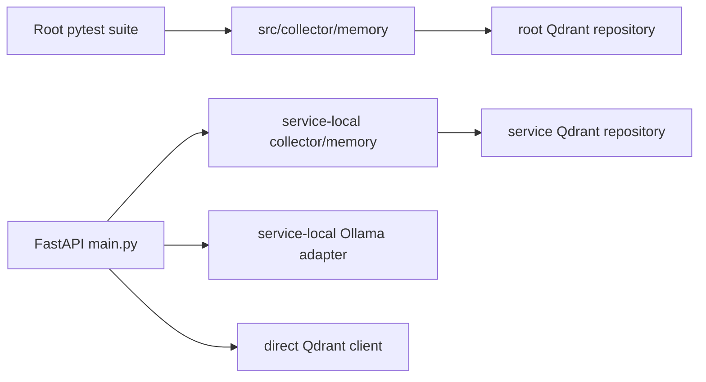
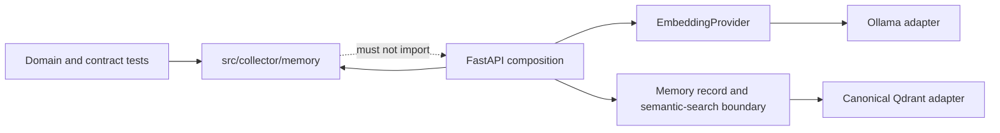
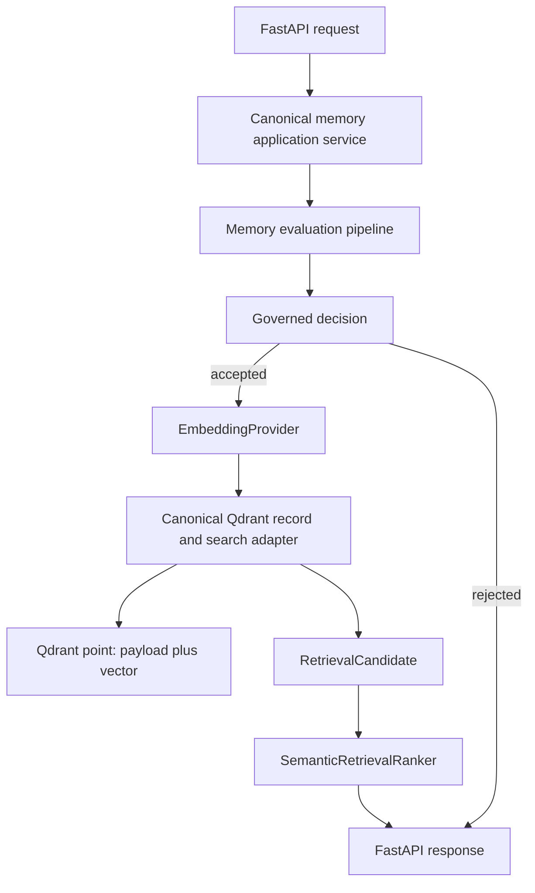

# Sprint 005 Architecture Review Packet and Implementation Plan

**Subject:** Memory architecture consolidation

**Status:** Quality Control corrections complete; final validation blocked

**Review disposition:** Approved for implementation after the mandatory
ownership, Qdrant authority, embedding identity, and legacy-vector decisions
were resolved in accepted ADRs 0002 through 0004.

**Implementation state:** Completed on
`agent/sprint-005-memory-consolidation`; Quality Control corrections applied,
uncommitted, and unmerged

**Deployment state:** Not authorized

## Purpose

Sprint 005 consolidates the existing Jebediah memory architecture before new
capabilities are added. It selects one canonical memory domain, removes the
service-local shadow implementation after compatibility is proven, and places
Qdrant and embeddings behind explicit, tested boundaries.

This packet provides the accepted decisions and phased execution plan for the
authorized repository implementation. It does not authorize deployment,
live-data changes, a commit, a pull request, or a merge.

## Implementation review requested

Confirm that the implementation conforms to the accepted direction:

1. `src/collector/memory/` is the only implementation of the
   `collector.memory` domain.
2. `services/jebediah-memory/` is a composition and deployment boundary,
   not a second domain source tree.
3. Qdrant option A is implemented: one canonical adapter temporarily uses Qdrant
   as both the durable operational memory-record store and semantic index.
4. Ollama `nomic-embed-text:v1.5`, pinned to manifest digest
   `sha256:0a109f422b47e3a30ba2b10eca18548e944e8a23073ee3f3e947efcf3c45e59f`,
   is the explicit embedding persistence and compatibility contract.
5. All consolidation remains behavior-preserving at the API boundary and
   makes no live-data change.

## Architectural invariants

- Qdrant payloads temporarily own the durable operational record of what the
  Memory Service accepted. Their vectors remain derived semantic indexes.
- The memory service does not become authoritative for the truth of source
  content.
- Embedding identity is content-addressed; mutable tags are not compatibility
  identities.
- Existing API request fields, response fields, and status meanings remain
  compatible.
- Existing `collector.memory.*` imports remain compatible.
- Retrieval remains semantic-only.
- Lifecycle remains data representation only.
- Verification remains explicit metadata and defaults to `unverified`.
- No live collection is recreated, rewritten, or backfilled in Sprint 005.
- The [Definition of Done](DEFINITION_OF_DONE.md) and
  [ADR process](adr/README.md) remain binding.

## Evidence and uncertainty

### Verified facts

- The root project packages `src/collector` through `pyproject.toml`.
- The root test suite imports `collector` from that packaged `src/` tree.
- The service image currently copies only
  `services/jebediah-memory/app/`, which contains its own `collector` package.
- Running the service from its app directory causes `collector.memory` imports
  to resolve to the service-local copy rather than the root package.
- The two memory trees contain 29 corresponding Python files. Twenty-five are
  byte-identical and four differ.
- `intelligence/__init__.py`, `intelligence/governor.py`, and
  `pipeline/memory_pipeline.py` differ only in formatting, export ordering, or
  documentation; their intended behavior is aligned.
- The two `persistence/qdrant_repository.py` files differ materially.
- `services/jebediah-memory/app/main.py` contains a third Qdrant write and
  search path that bypasses both repository adapters.
- The service currently evaluates intelligence once in `main.py` and again in
  the memory pipeline.
- The pipeline defaults to an in-memory persistence write before the API makes
  a separate Qdrant write.
- The root package requires Python 3.12 or newer; the service Dockerfile uses
  Python 3.11.
- The current service embedding path uses Ollama,
  `nomic-embed-text:latest`, 768-dimensional vectors, and no application-level
  vector normalization.
- The merged Sprint 004 baseline has 66 passing tests.

### Reported but unverified facts

- The project materials report a local Qdrant and Ollama environment.
- Repository evidence does not verify a deployed collection, its schema,
  point count, vectors, payloads, persistence, backup, or current consumers.
- Repository evidence does not identify which model artifact is installed in
  the reported local Ollama environment.

### Working assumptions

- The FastAPI path is the compatibility target because it is the tracked
  executable service path.
- Existing root and service Qdrant repository tests use isolated clients and
  do not prove live-data compatibility.
- Application memory IDs and Qdrant point IDs are separate identities in the
  current FastAPI runtime path.
- Consolidation can proceed without deployment or live-data migration.

### Open questions and gates

| Question | Consequence | Resolution gate |
| --- | --- | --- |
| Does a live `jebediah_memory` collection exist, and what vector/payload layout does it use? | A code-compatible adapter could still be data-incompatible. | Sanitized inventory before any future deployment or data migration |
| Does the reported Ollama environment contain the pinned ADR 0004 manifest digest? | The service must not become ready or write vectors against a different artifact. | Sanitized local model inventory before deployment |
| Are duplicate payload `memory_id` values present? | Random Qdrant point IDs do not make repeat writes idempotent. | Separate identity/idempotency decision; not Sprint 005 |
| What HTTP error contract should represent embedding or Qdrant failure? | Consolidation must not accidentally create a breaking API change. | Characterization tests and ADR review before cutover |

### Known documentation inconsistency

The current status, architecture, and component registry describe an
implemented Collector and memory-service candidate. The glossary still uses
earlier future or unapproved wording for Collector and Qdrant. Sprint 005 must
reconcile those canonical statements before implementation depends on them.

## 1. Canonical Memory Domain Decision

### Recommended decision

Make `src/collector/memory/` the canonical memory domain and the only source of
the `collector.memory` Python package.

This is the smallest consolidation because the root build already packages
`src/collector`, the test suite already imports it, and the service already
uses the same `collector.memory` import namespace. The service can consume the
root package without a public namespace rename once its local shadow package
is removed and the canonical package is installed normally.

### Current dependency direction



The same import name resolves to different files based on execution context.
This is accidental dependency inversion: the deployable service owns a copied
domain implementation, while the packaged domain and its primary tests are
elsewhere.

### Target dependency direction



The dependency rules are:

- The FastAPI service may import the canonical memory domain and boundary
  interfaces.
- The memory domain must not import FastAPI, service request models, Docker
  configuration, or the service application module.
- External adapters implement canonical interfaces and are constructed at the
  service composition root.
- Tests import the same canonical package used by the service.
- No `PYTHONPATH`, path injection, bind mount, or duplicate source tree may be
  required to select the implementation.

### Runtime ownership

| Responsibility | Owner after consolidation |
| --- | --- |
| Memory models, governance, policy, intelligence, and retrieval signals | `src/collector/memory/` |
| Evaluation and result contracts | `src/collector/memory/` |
| Persistence and semantic-index interfaces | `src/collector/memory/` |
| Canonical Qdrant adapter | `src/collector/memory/persistence/` |
| Accepted Memory Service record and attached semantic vector | Qdrant through the canonical adapter, temporarily under ADR 0003 |
| Embedding provider interface and canonical Ollama adapter | `src/collector/embeddings/` |
| HTTP request parsing and response rendering | `services/jebediah-memory/app/main.py` |
| Dependency construction and environment wiring | `services/jebediah-memory/app/` |
| Container build and composition | `services/jebediah-memory/` |
| Domain tests | `tests/collector/memory/` |
| Service/API tests | `tests/services/jebediah_memory/` |

### Packaging considerations

- The service build must install the root project or an immutable wheel built
  from the reviewed commit.
- The service Python version must satisfy the root package requirement of
  Python 3.12 or newer before the local copy is removed.
- The Docker build needs repository-root context or a reviewed build artifact;
  copying only `app/` cannot provide the canonical package.
- Dependency declarations must have one owner for shared constraints. The
  service may retain runtime-only dependencies, but it must not independently
  select conflicting versions of shared dependencies.
- The lock file must remain reproducible for local tests and the selected
  container installation path.
- An import-origin smoke test must prove that the service loads
  `src/collector/memory/` rather than a local or globally installed copy.

### Why the service becomes composition and deployment only

The service owns HTTP and process lifecycle concerns. It does not need a
separate definition of memory identity, governance, intelligence, persistence
contracts, or retrieval ranking. Keeping those definitions under the service:

- makes identical imports resolve to different implementations
- requires manual synchronization
- allows test and runtime behavior to diverge
- couples reusable memory behavior to one deployment shape
- obscures which repository and adapter are authoritative

After consolidation, the service remains independently deployable while the
domain has one review, packaging, and test path.

### Alternatives considered

| Alternative | Assessment |
| --- | --- |
| Make the service-local memory tree canonical | Rejected because it leaves reusable domain code inside a deployment tree and conflicts with the existing package/test layout |
| Create `src/jebediah_memory/` | Deferred because it requires a broad import migration without solving an additional current problem |
| Keep both trees synchronized | Rejected because synchronization is the drift mechanism Sprint 005 must remove |
| Keep direct Qdrant calls in `main.py` | Rejected because it leaves storage schema and failure behavior outside the owned adapter contract |

## 2. Migration Architecture

### Current duplicate paths

- `src/collector/memory/`
- `services/jebediah-memory/app/collector/memory/`

The canonical destination for every domain module is
`src/collector/memory/<relative-module>`. The service-local file may be removed
only after its row-specific compatibility and removal criteria pass.

### Module-by-module migration map

| Relative module | Canonical destination | Migration action | Compatibility considerations | Removal criteria for service copy |
| --- | --- | --- | --- | --- |
| `__init__.py` | `src/collector/memory/__init__.py` | Keep root exports; reconcile ordering only | Preserve all exported names and `collector.memory` imports | Export-set and service import-origin tests pass |
| `consolidation/__init__.py` | Same relative root path | Keep byte-identical root file | Preserve import surface | Consolidation imports pass from installed package |
| `consolidation/engine.py` | Same relative root path | Keep root behavior | Preserve promotion, rejection, duplicate, score, and provenance-source behavior | Existing and characterization engine tests pass |
| `consolidation/models.py` | Same relative root path | Keep byte-identical root file | Preserve enum values and result fields | Model equality and serialization tests pass |
| `governance.py` | Same relative root path | Keep root file as sole serializer/deserializer | Preserve legacy defaults, enum values, evidence references, and ISO time handling | Governance and legacy payload tests pass in service context |
| `integration/__init__.py` | Same relative root path | Keep byte-identical root file | Preserve integration exports | Bridge imports pass from installed package |
| `integration/collector_memory_bridge.py` | Same relative root path | Keep root behavior | Preserve event-to-memory mapping and pipeline invocation | Bridge tests pass without local package |
| `integration/events.py` | Same relative root path | Keep root event contracts | Preserve fields and defaults | Event construction tests pass |
| `intelligence/__init__.py` | Same relative root path | Normalize export ordering in root only if needed | Preserve exact exported symbol set | Public import test matches both former trees |
| `intelligence/confidence.py` | Same relative root path | Keep byte-identical root behavior | Preserve source mapping, score values, and reasons | Confidence characterization tests pass |
| `intelligence/deduplication.py` | Same relative root path | Keep byte-identical root behavior | Preserve normalization and duplicate decisions | Deduplication regression tests pass |
| `intelligence/governor.py` | Same relative root path | Keep root implementation; adopt documentation changes only if useful | Preserve one evaluation result for the same inputs | Governor characterization and interaction-count tests pass |
| `intelligence/models.py` | Same relative root path | Keep byte-identical root file | Preserve retention, confidence, and score fields | Model tests pass |
| `intelligence/scoring.py` | Same relative root path | Keep byte-identical root behavior | Preserve thresholds and retention classifications | Boundary-value scoring tests pass |
| `models.py` | Same relative root path | Keep root model | Preserve `MemoryType`, including `milestone`, constructor defaults, provenance, and lifecycle | Constructor and round-trip tests pass in service context |
| `persistence/__init__.py` | Same relative root path | Export canonical record and semantic-index contracts | Preserve existing repository imports through reviewed aliases where needed | No service-local persistence imports remain |
| `persistence/memory_repository.py` | Same relative root path | Keep in-memory reference repository | Preserve `save`, `find`, `contains`, governance defaults, and return types | Shared record-repository contract tests pass |
| `persistence/qdrant_repository.py` | Same relative root path | Replace root behavior with ADR 0003's combined durable-record and semantic-search implementation; do not copy either adapter unchanged | Preserve a legacy class import temporarily if needed; adopt actual vectors, completed acknowledgement, and canonical payload behavior | Qdrant schema, round-trip, acknowledgement, legacy, failure, recovery, and search tests pass; API has no direct Qdrant path |
| `persistence/repository.py` | Same relative root path | Preserve logical record and search capabilities while allowing one Qdrant adapter to implement both under option A | The in-memory repository remains test/reference only and never establishes API durable success | Both logical contracts have consumer and canonical-adapter tests |
| `pipeline/__init__.py` | Same relative root path | Keep canonical exports | Preserve import surface | Service and domain imports pass |
| `pipeline/memory_pipeline.py` | Same relative root path | Make evaluation behavior canonical and remove overlapping runtime persistence during service cutover | Preserve accept/reject decisions, intelligence metadata, reason, and public result fields | One-evaluation/one-write tests and all pipeline regressions pass |
| `pipeline/result.py` | Same relative root path | Keep result contract | Preserve `memory`, `accepted`, `consolidated`, `stored`, and `reason` | API compatibility tests prove unchanged rendering |
| `policy.py` | Same relative root path | Keep byte-identical root policy | Preserve decision thresholds and result semantics | Policy tests pass |
| `retrieval/__init__.py` | Same relative root path | Keep root exports | Preserve retrieval imports | Service imports canonical package |
| `retrieval/models.py` | Same relative root path | Keep storage-independent candidate mapping | Preserve missing-signal behavior and legacy lifecycle default | Candidate tests cover complete and legacy payloads |
| `retrieval/ranking.py` | Same relative root path | Keep semantic-only ranker unchanged | No confidence, importance, recency, or lifecycle weighting | Explicit semantic-only tests pass |
| `runtime/__init__.py` | Same relative root path | Keep canonical exports | Preserve runtime import surface | Service loads canonical runtime package |
| `runtime/memory_service.py` | Same relative root path | Refactor into the single application orchestration path defined by the ADR | Preserve policy outcome, governed memory, stored flag, and failure honesty | Accepted requests write once; rejected and failed requests write zero times |
| `runtime/result.py` | Same relative root path | Keep result model | Preserve field names and meanings | Runtime and API tests pass |

### Migration rule

An identical file is not copied again. The root copy remains, the service is
made to consume it, and the shadow file is deleted after the required tests
pass. A behaviorally different file requires characterization and an explicit
ADR decision before removal.

## 3. Service Boundary Design

### Files and responsibilities that remain in `services/jebediah-memory/`

```text
services/jebediah-memory/
├── Dockerfile
├── docker-compose.yml
├── requirements.txt or reviewed runtime dependency manifest
└── app/
    ├── main.py
    └── service-owned configuration or HTTP modules, if later justified
```

The service boundary retains:

- FastAPI application creation
- route definitions and Pydantic request models
- HTTP response rendering and status mapping
- environment configuration loading
- construction and injection of the memory application service, embedding
  provider, semantic index, and ranker
- health endpoint composition
- process startup and container configuration

### Responsibilities that move to or remain canonical under `src/`

`src/collector/memory/` owns:

- memory types and domain state
- provenance and lifecycle representation
- confidence, importance, retention, and duplicate evaluation
- consolidation and memory policy
- evaluation pipeline
- runtime result contracts
- repository and semantic-index boundaries
- Qdrant payload conversion and retrieval-candidate mapping
- semantic-only ranking

`src/collector/embeddings/` owns:

- the provider interface
- the canonical Ollama implementation after compatibility validation
- embedding response validation shared by service consumers

### Service code prohibited after cutover

After the duplicate-removal checkpoint, the service must not contain:

- `app/collector/`
- copied memory models, policy, governance, intelligence, or ranking code
- Qdrant `PointStruct`, filter, collection-schema, payload, or query logic in
  `main.py`
- a second Ollama embedding implementation
- separate intelligence evaluation outside the canonical orchestration path
- hidden persistence through a default in-memory repository

The FastAPI service may translate between HTTP models and canonical domain
objects. Translation is not permission to duplicate domain decisions.

### Target runtime flow



An accepted store request must produce one intelligence evaluation, one
embedding call, and one semantic-index write. A rejected request must perform
no embedding or index write.

## 4. Qdrant Consolidation Plan

### Selected architecture and source of truth

[ADR 0003](adr/0003-qdrant-repository-collection-and-payload-consolidation.md)
selects option A. Qdrant temporarily serves both as:

- the durable operational record of memories accepted by the Memory Service
- the semantic search index for those records

The Qdrant payload is authoritative only for what the Memory Service accepted
and stored. The originating source remains authoritative for the truth or
meaning of the represented claim. The vector, confidence, lifecycle, and
retrieval signals remain derived information.

Option B, in which a separate durable `MemoryRepository` owns records and
Qdrant is derived only, is deferred because no such durable store is currently
implemented. Adding one would introduce a new persistence feature and
dual-write consistency problem outside this consolidation sprint.

### Authoritative adapter

`src/collector/memory/persistence/qdrant_repository.py` becomes the sole
Qdrant source file. Its existing one-dimensional implementation is not
accepted unchanged.

The canonical adapter implements the record and semantic-search capabilities
through one Qdrant client path. A temporary class alias may preserve internal
imports during migration, but no second repository implementation or direct
FastAPI Qdrant path may remain after cutover.

The compatibility target is the current valid runtime behavior:

- actual approved embeddings
- 768 dimensions
- cosine distance
- random Qdrant storage UUID
- application memory ID in payload
- payload-filtered application-ID lookup
- semantic `query_points` search

### Current adapter differences

| Concern | Root adapter | Service adapter | FastAPI direct path |
| --- | --- | --- | --- |
| Vector size | 1 | 768 | 768 |
| Stored vector | Importance value | All zeros | Actual Ollama embedding |
| Point ID | Application memory ID | Random UUID | Random UUID |
| Payload `memory_id` | Missing | Present | Present |
| Lookup | Point-ID retrieve | Payload-filtered scroll | No owned lookup abstraction |
| Search | Missing | Missing | Direct `query_points` |

Neither repository adapter is authoritative as written. The canonical adapter
combines the FastAPI runtime's actual-vector behavior, the service adapter's
application-ID lookup, Sprint 004 governance serialization, and the explicit
success and recovery rules in ADR 0003.

### Repository contracts

The canonical Qdrant boundary defines:

- `save` or `index(memory, vector, embedding_identity) -> memory_id`
- `find(memory_id) -> MemoryItem | None`
- `contains(memory_id) -> bool`
- `search(query_vector, embedding_identity, limit) -> sequence of RetrievalCandidate`

The boundary owns vector validation, collection compatibility, storage IDs,
payload conversion, Qdrant errors, durable acknowledgement, unknown-outcome
handling, and mapping results to storage-independent candidates.

Collection compatibility is not a permanent cached authorization. The
canonical adapter rescans the current vector-space contract before each index
and search operation because Sprint 005 does not establish enforceable
exclusive collection ownership. Each semantic result is also returned with
its vector and must independently prove an exact non-null approved
`embedding_identity` and valid non-placeholder geometry before candidate
mapping. This result-level check closes the race between a completed scan and
the semantic query.

The in-memory `MemoryRepository` remains a deterministic test/reference
implementation. It is not a second durable write and does not establish
stored success in the FastAPI runtime.

### Collection schema

| Property | Required Sprint 005 value |
| --- | --- |
| Collection name | Existing configurable name; default `jebediah_memory` |
| Vector kind | One unnamed dense vector |
| Vector dimensions | 768 |
| Distance | Cosine |
| Point ID | Adapter-generated UUID string |
| Application ID | Required payload field `memory_id` |

When absent, the adapter may create the collection with exactly this schema.
When present, it must inspect the collection and must not silently recreate,
resize, or change the distance metric. A dimension or distance mismatch is a
stop condition.

### Payload schema

Newly indexed points use:

| Field | Type | Requirement |
| --- | --- | --- |
| `memory_id` | string | Required application memory identifier |
| `source_identity` | string | Required stable source identifier |
| `content` | string | Required memory content |
| `memory_type` | string enum | Required existing memory type |
| `importance` | number | Required existing importance value |
| `created_at` | ISO 8601 string | Required memory creation time |
| `metadata` | object | Required; empty object allowed |
| `provenance.source` | string | Required origin category |
| `provenance.creator` | string or null | Optional creator |
| `provenance.creation_context` | string or null | Optional bounded context |
| `provenance.confidence_basis` | string or null | Optional explanation |
| `provenance.verification_state` | `unverified`, `verified`, or `disputed` | Required; defaults to `unverified` |
| `provenance.supporting_evidence` | array of strings | Required; empty allowed |
| `lifecycle.state` | `active`, `reinforced`, `superseded`, or `archived` | Required; defaults to `active` |
| `lifecycle.reinforcement_count` | integer | Required; defaults to zero |
| `lifecycle.superseded_by` | string or null | Optional application memory ID |
| `lifecycle.changed_at` | ISO 8601 string or null | Optional transition time |
| `embedding_model` | string | Preserve field; new writes use `nomic-embed-text:v1.5` |
| `embedding_identity.provider` | string | Required value `ollama` |
| `embedding_identity.model` | string | Required value `nomic-embed-text:v1.5` |
| `embedding_identity.manifest_digest` | string | Required pinned ADR 0004 digest |
| `embedding_identity.dimensions` | integer | Required value 768 |
| `embedding_identity.normalization` | string | Required value `none` |
| `service` | string | Preserve current `jebediah-memory` value |

Unknown additive payload fields remain available in retrieval metadata and do
not cause legacy reads to fail unless they conflict with a required field.

### Point ID strategy

Qdrant point IDs remain adapter-generated UUIDs. Application memory IDs remain
in the `memory_id` payload field and are used for application lookup.

Sprint 005 does not change write idempotency. A deterministic point-ID or
upsert policy would change identity behavior and requires separate approval.
Characterization tests must record current repeated-write behavior so
consolidation does not change it accidentally.

### Write success, failure, and consistency

An accepted memory is `stored` only after one Qdrant point containing its
payload and vector is acknowledged as completed with `wait=true` or the
client equivalent. A pipeline in-memory save, generated vector, queued write,
or partial response is not durable success.

- Rejected memories do not embed or write.
- Embedding failures do not write or return stored success.
- Collection incompatibility fails before a write.
- Qdrant rejection does not return stored success.
- A timeout or lost acknowledgement is an unknown outcome.
- Unknown outcomes are reconciled by payload `memory_id` before any
  operator-authorized retry.
- Random point IDs mean no blind automatic retry is permitted.

Payload and vector share one Qdrant point operation. Sprint 005 introduces no
second durable system and no distributed transaction.

### Vector strategy

- Store only the actual vector returned by the approved embedding provider.
- Require exactly 768 finite numeric values.
- Do not substitute importance, zeros, truncation, padding, or a fallback
  vector.
- Do not normalize vectors in application code during Sprint 005.
- Continue using Qdrant cosine distance.
- Reject the write before Qdrant if the vector is empty, malformed,
  non-finite, or has the wrong dimension.

### Compatible legacy payload migration

The canonical reader supports:

- payloads with `memory_id`
- root-adapter legacy points whose point ID is the application ID
- missing provenance with `unverified` verification defaults
- missing lifecycle with the `active` default
- missing optional governance fields
- missing embedding identity represented as legacy/unknown
- additional unknown fields

These are payload-reading rules only. They do not rewrite the stored point or
establish vector compatibility.

### Incompatible vector geometry migration

The repository contains code capable of producing one-dimensional importance
vectors and 768-dimensional zero vectors. It does not prove those vectors
exist in a live collection.

Payload compatibility does not make different vector dimensions compatible.
A one-dimensional collection cannot be queried using a 768-dimensional query
vector, and a 768-dimensional zero vector is not a semantic embedding.

Sprint 005 must not automatically repair or re-embed them. Before any future
deployment:

1. Inspect the collection configuration through a sanitized process.
2. Count dimension-compatible, zero-norm, and model-identified vectors without
   publishing memory contents.
3. If one-dimensional or zero placeholder vectors exist, stop deployment.
4. Create a separate re-embedding plan using approved source content,
   backup/rollback, and a new or isolated destination collection.

Placeholder vectors must never be presented as valid migrated semantic
embeddings.

### Qdrant rollback strategy

- Sprint 005 changes repository code only and does not modify live points.
- Keep the service on the current path until the canonical adapter passes all
  isolated contract tests.
- If the cutover fails before merge, restore the prior service-local path from
  Git.
- If a later deployment fails without a data write, deploy the prior reviewed
  service artifact.
- After an outcome-unknown write, reconcile by application `memory_id` before
  retry or repair.
- A supported live deployment requires sanitized snapshot and restore proof
  because Qdrant temporarily owns the only durable Memory Service record.
- If any future migration writes data, rollback requires an isolated backup or
  source collection and is outside Sprint 005.

## 5. Embedding Architecture Decision

### Provider boundary

`src/collector/embeddings/EmbeddingProvider` is the canonical provider
interface. The canonical Ollama implementation remains under
`src/collector/embeddings/` and is injected into the memory application
service.

The service-local `app/embeddings/` adapter is removed after the canonical
provider passes API and container compatibility tests. The memory domain may
depend on the provider interface but must not construct an Ollama client.

### Runtime provider and model

| Property | Sprint 005 decision |
| --- | --- |
| Provider | `ollama` through the canonical adapter |
| Model reference | `nomic-embed-text:v1.5` |
| Manifest digest | `sha256:0a109f422b47e3a30ba2b10eca18548e944e8a23073ee3f3e947efcf3c45e59f` |
| Vector dimensions | 768 |
| Application normalization | `none`; preserve the raw provider vector |
| Qdrant distance | `cosine` |

[ADR 0004](adr/0004-embedding-model-identity-and-vector-compatibility.md)
makes this tuple the persistence and collection-compatibility contract.
Mutable tags, including `:latest`, are not permitted as configured or
persisted compatibility identities. The service must verify the full local
manifest digest before it becomes ready or accepts a write.

Ollama's `/api/tags` response supplies a bare 64-character hexadecimal digest.
The adapter validates that shape, canonicalizes it to the exact lowercase
`sha256:<hex>` persistence representation, and then compares it to the
approved identity. Missing, malformed, incorrectly sized, or different
digests fail before embedding generation.

Readiness is verified for every embedding operation. A successful startup or
health check is not cached as permanent authorization because the versioned
model tag can resolve to a different installed artifact later. Digest drift
fails before generation and therefore before any Qdrant write; no fallback,
retry, or mutable identity is introduced.

Every new payload retains `embedding_model`, set to the versioned reference,
and adds `embedding_identity` containing the provider, model, full manifest
digest, dimensions, and normalization behavior. Compatibility uses the full
identity tuple rather than the model-name string alone.

### Normalization behavior

The current implementation returns the provider vector unchanged. Sprint 005
must not introduce L2 normalization, rounding, quantization, clipping, or
dimension conversion. Qdrant cosine distance remains responsible for
similarity calculation.

The adapter validates shape and numeric finiteness; validation is not vector
normalization.

### Compatible legacy payload behavior

- Legacy payloads may be read using Sprint 004 governance defaults.
- Missing embedding identity remains legacy/unknown and is not rewritten to
  the pinned identity.
- A readable payload does not prove that its vector is compatible with a new
  query.

### Incompatible vector migration behavior

- Only vectors with the exact provider, model, manifest digest, 768
  dimensions, and `none` normalization contract are guaranteed compatible.
- Equal dimensions alone do not prove compatibility.
- One-dimensional and zero placeholder vectors are never automatically
  migrated.
- A model, dimension, or normalization change requires a new versioned or
  isolated collection, re-embedding from approved source content,
  side-by-side validation, and explicit cutover and rollback.
- Incompatible or unknown vector spaces must not be mixed in one collection.

### Embedding failure handling

If Ollama is unavailable, the pinned model is missing, the local digest does
not match, or the provider returns an empty, non-numeric, non-finite, or
wrong-dimension vector:

- no Qdrant index write occurs
- no successful `stored` response is returned
- the original dependency failure remains available for diagnosis without
  exposing sensitive content
- the API uses the characterized and reviewed failure response
- no importance or zero-vector fallback is attempted
- no automatic retry is added

Context-query embedding failure similarly returns a visible dependency failure
rather than a fabricated empty result set.

## 6. Test Strategy

### Required pre-migration evidence

Before structural changes:

- run and record the complete 66-test baseline
- record import origins for root tests and service subprocess tests
- characterize exact API request and response key sets
- characterize accepted and rejected store behavior
- characterize current governor, embedding, and Qdrant call counts
- capture current payload serialization and legacy deserialization
- capture collection size/distance expectations and point-ID behavior
- capture raw embedding length and absence of application normalization
- record the selected ADR 0004 manifest digest and the unverified local-model
  deployment gate
- confirm lifecycle and verification remain representation only

### Characterization tests

Characterization tests freeze behavior that consolidation must preserve:

- `MemoryItem` constructor and enum values
- consolidation decisions and reason strings where they are API-visible
- confidence and retention outputs
- pipeline result fields
- invalid memory-type fallback
- default request provenance source of `user`
- application memory ID generation behavior
- repeated store behavior without redefining idempotency
- exact service import origin

These tests must be added before deleting or rewiring the implementation they
characterize.

### API compatibility tests

Cover:

- legacy store request using only the original required fields
- store request with Sprint 004 provenance fields
- accepted response key set and nested pipeline/intelligence fields
- rejected response key set and no embedding/index interaction
- context response key set, payload passthrough, result limit, and descending
  semantic score order
- health response shape
- embedding and Qdrant failure behavior
- one evaluation, one embedding, and one index write per accepted request

### Governance regression tests

Cover:

- source, creator, creation context, confidence basis, and evidence references
- `unverified`, `verified`, and `disputed` representation
- `active`, `reinforced`, `superseded`, and `archived` representation
- legacy defaults
- serialization round trips
- invalid enum and malformed payload failure
- proof that no transition or verification automation is called

### Persistence round-trip tests

Run the shared contracts against controlled implementations:

- `MemoryRepository` against the in-memory implementation
- the combined canonical Qdrant record/search contract against Qdrant's
  isolated in-memory client

Verify:

- actual 768-dimensional vector preservation
- application-ID/storage-ID separation
- lookup by payload application ID
- payload schema and governance round trip
- missing record behavior
- search candidate mapping
- dependency and invalid-vector failures
- no write after embedding failure
- `stored` only after completed Qdrant acknowledgement
- outcome-unknown failure without blind automatic retry
- payload and vector written through one point operation

### Legacy payload tests

Fixtures must cover:

- pre-Sprint 004 payload without provenance or lifecycle
- root-adapter payload without `memory_id`
- service/API payload with `memory_id`
- missing `embedding_model` and `embedding_identity`
- extra unknown fields
- invalid required field or enum
- proof that compatible payload defaults do not imply vector compatibility

Fixtures remain synthetic and contain no live memory contents.

### Embedding migration tests

Cover:

- canonical provider receives the configured model identity
- exact pinned manifest digest passes readiness
- the actual bare `/api/tags` digest is canonicalized to the exact approved
  `sha256:<hex>` persistence identity
- missing or different manifest digest fails readiness
- malformed, non-hexadecimal, and incorrectly sized digests fail before
  generation or persistence
- a model digest change after an earlier successful readiness check causes
  the next embedding operation to fail before generation or persistence
- `:latest` is rejected as a configured or persisted compatibility identity
- provider response is returned without application normalization
- exactly 768 finite numeric values are accepted
- empty, non-numeric, non-finite, short, and long vectors are rejected
- the full embedding identity is stored with new points
- unknown legacy model identity remains unknown
- incompatible model, digest, normalization, or dimension requires an isolated
  migration path
- a one-dimensional collection cannot accept or query a 768-dimensional vector
- placeholder vectors cannot pass as valid embeddings

### Mutable-collection regression tests

Cover:

- a point added after a successful collection scan with no
  `embedding_identity`
- a post-scan point with a different digest
- a post-scan point with a different normalization policy
- a post-scan point with the wrong vector dimensions
- a post-scan point containing a zero placeholder vector
- result-level validation that catches an incompatible point inserted between
  the fresh scan and the semantic query

Every case must fail visibly before a semantic candidate is returned. A
one-time cached scan is insufficient while exclusive collection ownership is
not enforceably established.

### Packaging and service tests

- Prove service imports resolve to the reviewed root package.
- Build the container with a supported Python version.
- Start an import-only or dependency-injected smoke path without live network
  dependencies.
- Prove removal of `app/collector/` and `app/embeddings/` does not change API
  imports.
- Prove no direct Qdrant calls remain in the FastAPI module.

### Required validation at each checkpoint

The complete owned checklist is
[Sprint 005 Validation Requirements](SPRINT_005_VALIDATION_REQUIREMENTS.md).
At minimum, each implementation checkpoint runs:

- focused affected tests
- `uv run --frozen pytest -q`
- Python compilation validation
- container build/import smoke validation when packaging changes begin
- `python scripts/validate_docs.py`
- `uv lock --check`
- `git diff --check`
- secret and private-data review
- complete diff inspection

The test count must not decrease unless a removed test is demonstrably
duplicative and equal or stronger coverage exists at the canonical boundary.

## 7. Required ADRs

The required ADRs are accepted and authoritative for this bounded Sprint 005
implementation. Merge remains subject to review of the actual artifacts.

### [ADR 0002: Canonical Memory Domain and Dependency Direction](adr/0002-canonical-memory-domain-and-dependency-direction.md)

**Level:** System

**Decision:** `src/collector/memory/` is the only `collector.memory`
implementation. FastAPI depends on the installed canonical package; the
domain never depends on the service. The service-local shadow tree is removed
only after normal packaging, import-origin, API, and governance proof.

**Alternatives considered:** service-local canonical domain, new top-level
memory package, synchronized copies, and retaining the current layout.

**Consequences:** one owner and test path; Docker and package migration;
Python-version alignment; reversible cutover risk.

### [ADR 0003: Qdrant Repository, Collection, and Payload Consolidation](adr/0003-qdrant-repository-collection-and-payload-consolidation.md)

**Level:** System

**Decision:** Select option A. Qdrant temporarily owns the durable operational
Memory Service record and the attached semantic index. One acknowledged point
write establishes stored success. The source remains authoritative for claim
truth; no second durable store or distributed transaction is introduced.

**Alternatives considered:** option B with a separate durable record store,
the root one-dimensional repository, the service zero-vector repository,
direct FastAPI access, and a new live collection.

**Consequences:** one schema and success owner; Qdrant backup and recovery
become required for deployment; random point IDs prohibit blind retry after an
unknown outcome; live inventory remains a deployment gate.

### [ADR 0004: Embedding Model Identity and Vector Compatibility](adr/0004-embedding-model-identity-and-vector-compatibility.md)

**Level:** System

**Decision:** Use Ollama `nomic-embed-text:v1.5` pinned to manifest digest
`sha256:0a109f422b47e3a30ba2b10eca18548e944e8a23073ee3f3e947efcf3c45e59f`.
Persist the full identity with 768 dimensions and `none` normalization.
Mutable tags are forbidden as compatibility identities.

**Alternatives considered:** `:latest`, a versioned tag without digest
verification, service-local provider ownership, normalization, dimension
conversion, fallback vectors, and in-place mixed-model migration.

**Consequences:** reproducible model identity and safe failure; deployment
requires the pinned local artifact; legacy unknown vectors are not presumed
compatible; model changes require isolated migration.

### ADR sequencing

ADR 0002 establishes ownership and dependency direction. ADR 0003 defines the
storage/index boundary within that direction. ADR 0004 defines the vector
identity accepted by ADR 0003. All three must be accepted before dependent
cutover code begins.

## 8. Cutover and Rollback

### Phase 0: Architecture decisions and documentation baseline

**State:** Complete

**Work:**

- Verify accepted ADRs 0002 through 0004 remain internally consistent.
- Reconcile sprint, status, architecture, repository standards, component
  registry, glossary, roadmap, and changelog statements.
- Record the exact baseline commit, tests, import origins, and unresolved live
  data facts.

**Checkpoint:** All three ADRs are accepted and canonical documents agree.

**Rollback point:** Documentation-only changes can be revised or rejected;
there is no runtime impact.

### Phase 1: Compatibility characterization

**State:** Complete

**Work:** Add characterization, API, governance, persistence, legacy, and
embedding tests before moving implementation.

**Checkpoint:** The existing implementation passes the expanded tests, and
every intended compatibility behavior has an owned assertion.

**Rollback point:** Remove or revise only incorrect new tests; no production
path changes.

### Phase 2: Canonical packaging and embedding boundary

**State:** Complete

**Work:**

- Align the service with Python 3.12 or newer.
- Install the root package in the service build.
- Reconcile dependency ownership.
- Make the service use the canonical embedding provider with ADR 0004's
  versioned model reference, pinned manifest digest, and readiness check.
- Add container/import smoke tests.

**Checkpoint:** Root tests and service/container imports pass without a path
hack. No memory-domain file has been removed yet.

**Rollback point:** Restore the prior Dockerfile, dependency manifest, and
service-local embedding adapter.

### Phase 3: Canonical Qdrant record and semantic-index adapter

**State:** Complete

**Work:**

- Define the record and semantic-search capabilities owned by the one Qdrant
  adapter.
- Implement the canonical combined adapter in the root package.
- Add schema, vector, payload, durable-acknowledgement, unknown-outcome,
  legacy, search, and failure contract tests.
- Do not wire it into the FastAPI service yet.

**Checkpoint:** The adapter passes isolated tests and rejects incompatible
vectors/collections without modifying live state.

**Rollback point:** Remove the unused canonical adapter changes; runtime still
uses the prior path.

### Phase 4: Service orchestration cutover

**State:** Complete

**Work:**

- Wire the service to the canonical application, embedding, Qdrant
  record/search, and ranker boundaries.
- Remove direct Qdrant model/query construction from `main.py`.
- Remove duplicate intelligence evaluation and default in-memory runtime
  storage.
- Preserve API responses and pipeline result meanings.

**Checkpoint:** All interaction-count, API compatibility, focused integration,
and failure tests pass.

**Rollback point:** Restore the prior service composition while retaining the
new unused canonical adapter for diagnosis, or revert the phase together.

### Phase 5: Duplicate removal and test relocation

**State:** Complete

**Work:**

- Remove `services/jebediah-memory/app/collector/`.
- Remove `services/jebediah-memory/app/embeddings/` after canonical provider
  proof.
- Move service/API tests to `tests/services/jebediah_memory/`.
- Verify all service imports resolve to `src/`.

**Checkpoint:** Exactly one memory domain, one embedding implementation, and
one Qdrant record/search adapter remain.

**Rollback point:** Restore removed service files from the previous reviewed
commit and revert service packaging/import changes together.

### Phase 6: Final validation and review

**State:** Blocked pending the mandatory container build/import smoke. The
Quality Control corrections and all other available repository, package, and
clean-install checks pass.

**Work:**

- Run every required validation.
- Inspect the exact diff for feature behavior or live-data operations.
- Update final architecture and current-state documents.
- Submit actual artifacts to Chief Architect review.

**Checkpoint:** The formal decision is `APPROVED TO MERGE`, required checks
pass, and the Definition of Done is satisfied.

**Rollback point:** Keep the branch unmerged and address review findings. No
deployment occurs in Sprint 005.

### Conditions for stopping migration

Stop before the next phase when any of the following occurs:

- a required ADR is not accepted
- baseline or checkpoint tests fail
- an API request, response, status, or ranking behavior changes unexpectedly
- service imports do not resolve to the reviewed root package
- the service cannot build on the approved Python version
- a Qdrant collection has an incompatible dimension or distance metric
- placeholder vectors are found in a live collection
- the local Ollama model does not match ADR 0004's full manifest digest
- a target collection's vectors cannot prove the ADR 0004 compatibility key
- an accepted request could write twice or a rejected request could write once
- an outcome-unknown Qdrant write could be retried blindly
- lifecycle or verification automation appears in the diff
- direct Qdrant domain logic remains in FastAPI after cutover
- unrelated Collector, agent, n8n, or feature work enters the change
- live data, secrets, or private operational details would be required

### Post-merge and deployment rollback

The normal Git revert path is sufficient for the source-only consolidation
because Sprint 005 performs no live migration. Deployment is a separate future
decision. If a later deployment writes or migrates Qdrant data, it requires a
separate backup, restore, forward-recovery, and cutover plan; reverting source
alone is not an adequate data rollback.

## 9. Sprint 005 Scope Control

Sprint 005 does not include:

- **Collector 1.0:** no change to Collector ingestion models, normalization,
  identity, adapters, source authorization, or storage policy outside the
  minimum packaging boundary required to consume `collector.memory`.
- **Agents:** no agent runtime, agent framework, tool authority, delegation,
  or autonomous behavior.
- **n8n orchestration:** no workflow creation, import, export, trigger,
  credential, or deployment change.
- **Autonomous verification:** no process may mark a claim verified, disputed,
  reinforced, superseded, or archived automatically.
- **Intelligent reranking:** no confidence, importance, recency, lifecycle,
  learned, or weighted retrieval formula. Ranking remains semantic relevance
  descending only.

Sprint 005 also excludes:

- lifecycle transition APIs or jobs
- knowledge graph or relationship inference
- memory backfill, deletion, retention enforcement, or live re-embedding
- memory identity or idempotency redesign
- model replacement
- new external service or deployment topology
- live Docker, Qdrant, Ollama, or home-lab changes
- performance optimization unrelated to consolidation
- general formatting or cleanup outside affected files

Any of these requires its own approved scope after consolidation is merged and
validated.

## Implementation review acceptance criteria

The implementation is review-ready when reviewers can answer:

- Which package owns memory behavior?
- Which direction may dependencies point?
- Which files remain service-owned?
- How does every duplicate module leave the service tree?
- Which Qdrant schema, IDs, vectors, and payloads are canonical?
- How are legacy and placeholder vectors treated?
- Which embedding identity and compatibility rules apply?
- Which tests prove behavior before and after cutover?
- Which ADRs must be accepted first?
- At which checkpoint can each phase stop or roll back?
- Which feature areas are explicitly excluded?

Commit, pull-request, merge, deployment, and live migration approval remain
withheld until the exact implementation artifacts receive the formal review
and separate authorization required by the project workflow.
