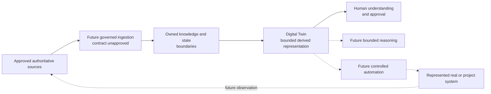

# Digital Twin Position

**Status:** Active conceptual position

## Purpose

This document defines what “Digital Twin” means for Project Jebediah, what it
explicitly excludes, how it relates to other conceptual capabilities, and what
must be decided before implementation.

It preserves useful design intent without turning an attractive label into an
unbounded replica, an accidental source of truth, or an autonomous control
system.

## Position

Project Jebediah's future Digital Twin is a bounded, time-aware, provenance-rich
representation of selected real or project-system entities and state for
approved understanding, comparison, planning, and decision support.

It represents only what an approved use case requires. Its state is derived
from identified sources and remains visibly connected to authority, freshness,
uncertainty, and observation time.

The Digital Twin is not implemented, specified, or assigned to a technology.

## Evidence and uncertainty

### Verified facts

- The Digital Twin is a named future capability in the approved roadmap.
- The repository contains no Digital Twin schema, service, data, workflow, or
  implementation.
- Data authority categories and ownership requirements are defined by
  [Data Ownership](../DATA_OWNERSHIP.md).
- The Digital Twin follows stable knowledge and information boundaries in the
  roadmap.

### Reported facts

Bootstrap material names the Digital Twin as a future subsystem and reports a
local environment involving n8n, Qdrant, Ollama, Docker, an Ubuntu virtual
machine, Proxmox, and a Dell PowerEdge R420. Those products are not verified
Digital Twin components.

### Working assumptions

- Useful twin state will be narrower than all data available to the project.
- Some represented state will change over time and require explicit
  observation, effective, and freshness semantics.
- Future reasoning, user experience, and controlled automation may consume
  twin state under separate authority.
- The first useful twin may represent Project Jebediah's own approved
  operational or knowledge state, but its subject is not yet selected.

### Open questions

| Question | Why it matters | Resolution gate |
| --- | --- | --- |
| What subject and decisions will the first twin support? | Scope, entities, state, and success cannot be defined without a use case. | Future Digital Twin specification |
| Which fields come from which authoritative sources? | Conflict, freshness, and recovery depend on ownership. | JCS, source, and component specifications |
| How are identity and relationships represented? | Reconciliation and history require stable identity. | Knowledge Graph and Digital Twin decisions |
| What lag or uncertainty is acceptable for each use? | Stale state may mislead reasoning or unsafe action. | Use-case risk assessment |
| May any twin state be written back to an authoritative source? | Writeback crosses the observation-to-control boundary. | System ADR and explicit action authority |
| Which data may models, users, or automations access? | Privacy and least privilege depend on classification. | Security and access-control design |

## Intended value

A future Digital Twin may support approved capabilities such as:

- Explaining the known state of selected entities at a stated time
- Comparing observed state with an approved desired or expected state
- Showing provenance, freshness, uncertainty, and unresolved conflict
- Exploring bounded what-if scenarios without changing real systems
- Supporting human planning and diagnosis
- Supplying validated context to future reasoning
- Informing controlled automation after a separate action-authority decision

These are possible value categories, not committed features.

## Explicit exclusions

The Digital Twin is not:

- A complete replica of every server, document, person, workflow, model, or
  event
- The automatic authoritative source for the real-world facts it represents
- A synonym for the Knowledge Graph, vector store, database, dashboard, asset
  inventory, configuration management database, or observability platform
- A collection pipeline or substitute for source authorization and provenance
- An AI persona, model memory, conversation transcript, or user profile
- A simulation engine by default
- A control plane or permission to change real systems
- A guarantee of real-time state
- A reason to retain data without purpose, classification, consent, or
  deletion rules
- A product, service, schema, protocol, or deployment choice during Phase 0

If a future proposal needs one of these capabilities, it defines and reviews
that responsibility separately.

## Relationship to information authority

Digital Twin state is presumptively **derived information** under
[Data Ownership](../DATA_OWNERSHIP.md). It references authoritative sources
and may contain cached source values, derived relationships, computed
conditions, or explicitly labeled hypotheses.

- The twin does not resolve a source conflict merely by storing one value.
- A derived value does not become authoritative because it appears in a twin.
- Human validation may create a separate authoritative correction only through
  the approved information owner.
- Making a twin field authoritative requires a System ADR, owned write path,
  conflict policy, recovery design, and updated data ownership mapping.
- Missing, stale, conflicting, and uncertain state remains representable.

Information authority and action authority remain separate.

## Conceptual relationship

The dotted Automation-to-Reality relationship requires separate action
authority. The diagram expresses conceptual responsibility and governance. It
does not approve a runtime flow, feedback loop, interface, or deployment.

## Relationship to named capabilities

### JCS

JCS remains undefined. It may later own or coordinate information required by
a Digital Twin, but this position assigns it no responsibility or interface.

### Collector Engine

Collectors may eventually observe approved sources and preserve provenance.
Collection does not decide what belongs in the twin, make observations
authoritative, or define twin identity.

### Knowledge Graph

A Knowledge Graph may represent entities and relationships used by a Digital
Twin. The concepts are not interchangeable: a graph focuses on knowledge
representation, while a twin focuses on bounded, time-aware state for named
subjects and decisions. Their actual relationship requires a System ADR.

### Qdrant

Qdrant is a reported vector database. A vector index may support retrieval of
related information, but it is not the Digital Twin and is not an
authoritative state store by default.

### Reasoning Engine

A future Reasoning Engine may consume twin state as evidence. It must observe
provenance, freshness, uncertainty, permissions, and failure behavior. Model
output does not rewrite twin or source authority automatically.

### Automation

Automation may consume twin state only within an approved action boundary.
Observation, recommendation, simulation, approval, and execution are distinct
steps. Sensitive or irreversible action remains human-approved unless an
accepted ADR defines a narrower safe boundary.

### User experience

Future interfaces should expose scope, observation time, freshness,
uncertainty, conflict, and provenance when those affect interpretation. A
polished view must not make incomplete state look certain.

## Required state semantics

A future specification defines for every represented entity or state item:

- Subject and stable identity
- Approved use case and decision supported
- Included and excluded attributes
- Authoritative source and information owner
- Observation, effective, processed, updated, and expiration time as
  applicable
- Provenance and transformation history
- Freshness threshold and stale behavior
- Confidence, uncertainty, and conflict representation
- Historical versus current-state behavior
- Classification, access, retention, deletion, and model-use constraints
- Reconciliation and correction path
- Backup, rebuild, restore, migration, and rollback expectations
- Consumers and their failure behavior

Absent semantics are not safe defaults.

## Desired state and simulation

Observed state, desired state, predicted state, and simulated state must remain
distinct:

- **Observed state** reports what an approved source indicated.
- **Desired state** records an approved target or policy.
- **Predicted state** is a derived forecast with model and uncertainty.
- **Simulated state** exists inside a bounded scenario and cannot be mistaken
  for current reality.

A comparison may produce a derived divergence or recommendation. It does not
authorize correction of the represented system.

## Freshness and failure behavior

- Twin state exposes when it was observed and when it became stale.
- A failed source or collector cannot silently preserve the appearance of
  freshness.
- Partial refresh identifies affected entities and fields.
- Conflicting sources remain visible until an owned rule reconciles them.
- Derived state invalidates when required inputs or transformation versions
  change.
- Consumers define whether they stop, degrade, warn, or request approval when
  state is missing, stale, or uncertain.
- Recovery distinguishes rebuildable twin state from unique authoritative
  corrections stored elsewhere.

## Security and privacy

- Represent only the minimum state required for an approved use case.
- Apply source classification and access restrictions to twin representations,
  indexes, prompts, exports, backups, and logs.
- Do not expose private topology, personal data, or sensitive operational state
  in public documentation.
- Separate viewing, simulation, correction, approval, and execution
  privileges.
- Treat source content, model output, and imported relationships as untrusted
  until validated.
- Record access and sensitive actions at a level appropriate to consequence.

## Entry gates for specification

A concrete Digital Twin specification may begin only after:

1. A bounded subject and use case are approved.
2. Required source authority and data classification are known.
3. JCS and relevant collection contracts are stable enough to supply the use
   case.
4. Entity identity and relationship responsibilities are defined.
5. Freshness, uncertainty, retention, and recovery needs are measurable.
6. Security and human-approval boundaries are understood.
7. Success and failure criteria can be tested.

Implementation begins only after the specification and triggered ADRs are
accepted.

## Specification acceptance questions

Reviewers must be able to answer:

- What exactly is being twinned, for whom, and for which decision?
- What is explicitly excluded?
- Which source owns every represented fact?
- How old, incomplete, uncertain, or conflicting can state be?
- Can the twin be rebuilt without losing authority?
- What happens when sources disagree or disappear?
- Who may view, correct, simulate, approve, or act?
- How are private data and topology protected?
- What evidence shows the twin is useful and not misleading?
- What safely removes or replaces it?

If these answers are unavailable, the proposal is not ready for
implementation.

## Maintenance

This position changes only through a System or Foundational ADR with Chief
Architect review. Future specifications refine one bounded use case and must
link here rather than broadening “Digital Twin” silently.
